<!-- wp:paragraph -->

The [**Report Abuse (CERT) Portal**](https://msrc.microsoft.com/report/abuse) and [**Report Abuse API**](https://msrc.microsoft.com/report/developer) have played a significant role in MSRC’s response to suspected cyberattacks, privacy issues, and abuse originating from Microsoft Online Services. With the contributions from our wonderful community of reporters, we continue to gain insightful perspectives into the various types of attacks that threaten our online services, our cloud, and our customers.

<!-- /wp:paragraph -->

<!-- wp:paragraph -->

To further commit to MSRC’s mission of responding to and defending against these types of security incidents, our team has been working on some new changes to both the Report Abuse Portal and the Report Abuse API that we are very excited to share with you.

<!-- /wp:paragraph -->

<!-- wp:paragraph -->

Check it out at [**https://msrc.microsoft.com/report/abuse**](https://msrc.microsoft.com/report/abuse).

<!-- /wp:paragraph -->

<!-- wp:heading {"level":3} -->

### Summary

<!-- /wp:heading -->

<!-- wp:paragraph -->

We have updated our Report Abuse Portal and API to include more granular and up-to-date reportable security incidents, empowering our community to provide more accurate and relevant insights.

<!-- /wp:paragraph -->

<!-- wp:paragraph -->

**Report Abuse Portal updates:**

<!-- /wp:paragraph -->

<!-- wp:list -->

- Modernized user interface and user experience
- New fields like _Incident Type_ and _Attack Method_ capturing the type of security incident and the sub-context of the incident
- Refined list of reportable security incidents
- Removed Traffic Light Protocol

<!-- /wp:list -->

<!-- wp:group -->

<!-- wp:paragraph -->

**Report Abuse API updates:**

<!-- /wp:paragraph -->

<!-- /wp:group -->

<!-- wp:list -->

- Updated Report Abuse API endpoint
- New API developer page
- Updated API data schema
- New properties like _incidentType_ and _attackMethod_
- Refined list of reportable security incidents
- Validation providing responses to any formatting issues or incorrect entries

<!-- /wp:list -->

<!-- wp:heading {"level":3} -->

### What do I need to do?

<!-- /wp:heading -->

<!-- wp:paragraph -->

Whether you engage with MSRC via our Report Abuse Portal or API, please review and familiarize yourself with the refined [list of reportable security incidents](https://msrc.microsoft.com/report/developer), as it is vital that both MSRC and our reporting community are aligned.

<!-- /wp:paragraph -->

<!-- wp:paragraph -->

If you engage with MSRC via the Report Abuse Portal, please ensure that you take the necessary steps to update your reporting processes and procedures, to align with the updated Portal.

<!-- /wp:paragraph -->

<!-- wp:paragraph -->

If you engage with MSRC programmatically via the Report Abuse API, please review the detailed changes in the "What’s new with the API?” section below. Upon review, please ensure you make any necessary updates in your code and processes, to align with the new API.

<!-- /wp:paragraph -->

<!-- wp:paragraph -->

If you _do not_ report abuse or engage with MSRC via the Report Abuse API, there is no action to be taken.

<!-- /wp:paragraph -->

<!-- wp:heading {"level":3} -->

### What's new with the Portal?

<!-- /wp:heading -->

<!-- wp:paragraph -->

While much of the Report Abuse Portal remains the same, we have revamped the form’s user interface to provide a more modernized look and feel when reporting.

<!-- /wp:paragraph -->

<!-- wp:paragraph -->

On the first look of the Report Abuse Portal, you will notice the completely updated user interface:

<!-- /wp:paragraph -->

<!-- wp:image {"id":12648,"width":768,"height":474,"sizeSlug":"large","linkDestination":"none"} -->

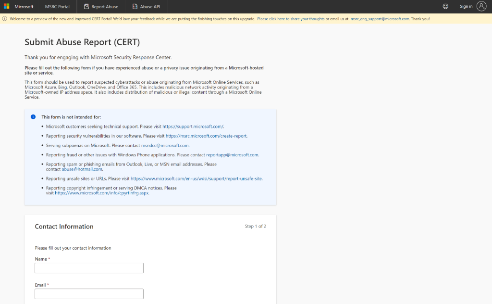

<!-- /wp:image -->

<!-- wp:paragraph -->

Within the navigation bar, there is a tab for “MSRC Portal” which will redirect you back to the [MSRC website](https://www.microsoft.com/msrc); a “Report Abuse” tab directing to the current form; and the “Abuse API” which redirects to our documentation and data schema for the new Report Abuse API, as mentioned in the following section.

<!-- /wp:paragraph -->

<!-- wp:paragraph -->

From there, we have our informational and instructional content that should be read prior to reporting to ensure that you are reporting in the correct place and using the correct form.

<!-- /wp:paragraph -->

<!-- wp:paragraph -->

The “Contact Information” section is the first step when reporting abuse – this includes all the same fields that you know from our current Report Abuse Portal.

<!-- /wp:paragraph -->

<!-- wp:image {"id":12649,"width":768,"height":458,"sizeSlug":"large","linkDestination":"none"} -->

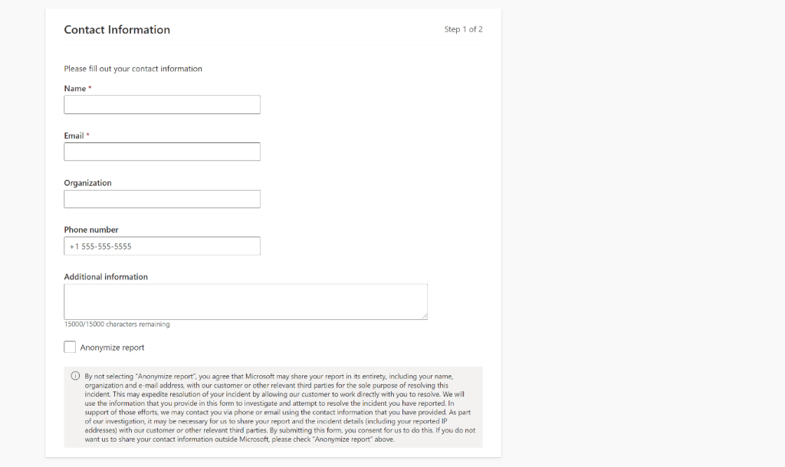

<!-- /wp:image -->

<!-- wp:paragraph -->

We then have an updated “Report Details” section:

<!-- /wp:paragraph -->

<!-- wp:image {"id":12650,"width":768,"height":374,"sizeSlug":"large","linkDestination":"none"} -->

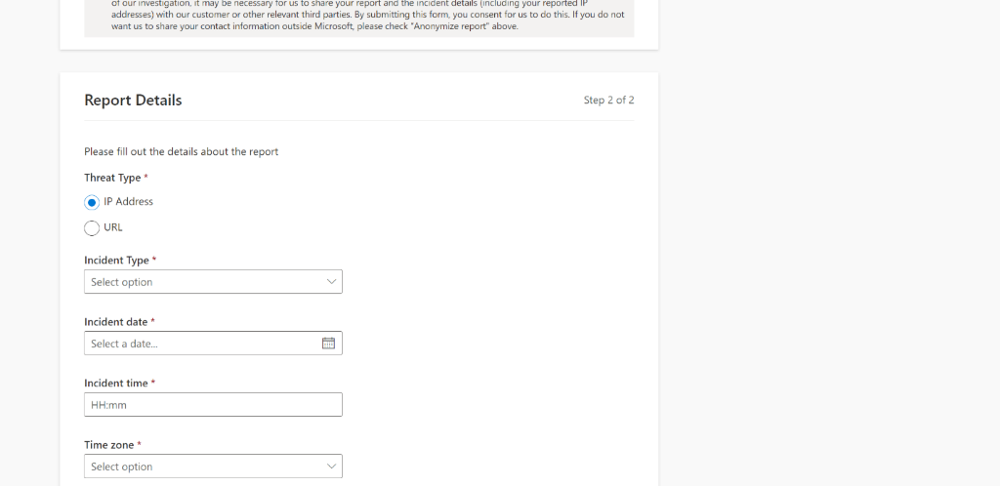

<!-- /wp:image -->

<!-- wp:paragraph -->

This includes new choice options for “Threat Type” and a new “Incident Type” field with a list of up-to-date, reportable security incidents. Each Threat Type has its own list of Incident Types. For example, if URL is chosen as the Threat Type, your options for Incident Type are:

<!-- /wp:paragraph -->

<!-- wp:image {"id":12651,"width":768,"height":392,"sizeSlug":"large","linkDestination":"none"} -->

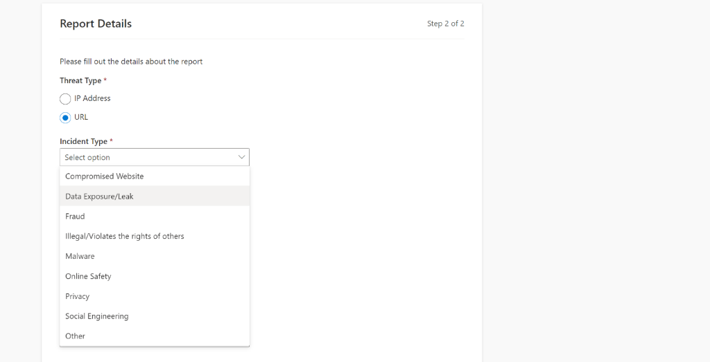

<!-- /wp:image -->

<!-- wp:paragraph -->

Similarly, if “IP Address” is chosen as the Threat Type, some of the available Incident Type options will be:

<!-- /wp:paragraph -->

<!-- wp:image {"id":12652,"width":768,"height":402,"sizeSlug":"large","linkDestination":"none"} -->

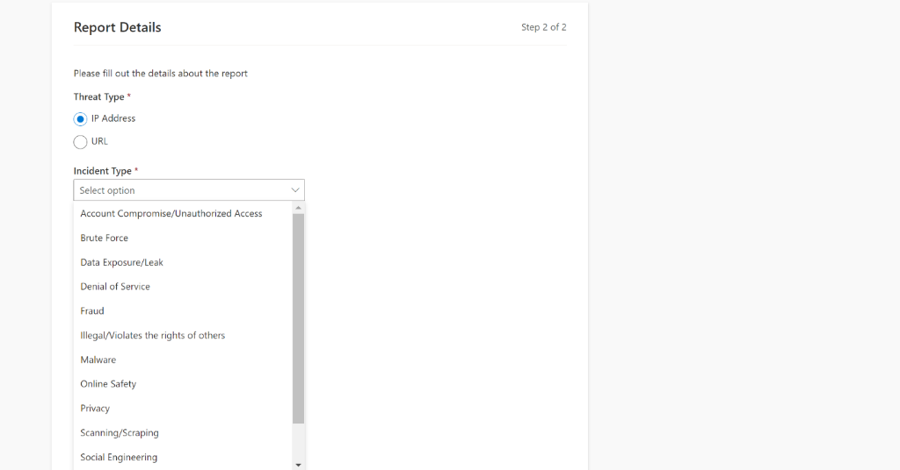

<!-- /wp:image -->

<!-- wp:paragraph -->

Once a Threat Type and Incident Type have been chosen, a new field may be added to the form called “Attack Method”\_. \_Options for Attack Method are dependent on the Threat Type and Incident Type chosen. Attack Methods allow the reporter to provide sub-context into the threat being reported.

<!-- /wp:paragraph -->

<!-- wp:paragraph -->

For example, if reporting an “Account Compromise/Unauthorized Access” incident, the available options for an Attack Method will be:

<!-- /wp:paragraph -->

<!-- wp:image {"id":12653,"width":768,"height":338,"sizeSlug":"large","linkDestination":"none"} -->

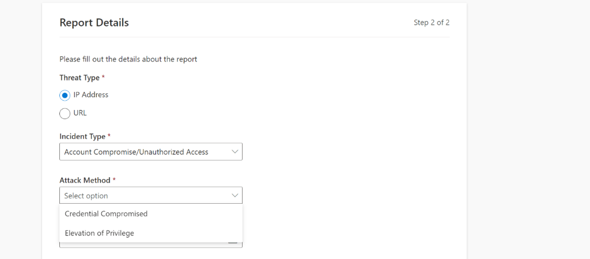

<!-- /wp:image -->

<!-- wp:paragraph -->

However, not all Incident Types will have an Attack Method. To familiarize yourself with our list of Incident Types, their definitions, and their valid Attack Methods, please review our [Incident Type Documentation](https://msrc.microsoft.com/report/developer).

<!-- /wp:paragraph -->

<!-- wp:paragraph -->

The remainder of the “Report Details” section maintains much of the same fields in our current Report Abuse Portal, like: date and time fields; malicious IP Address or URL fields; additional and optional fields; a free text field to include additional information into the incident; and a file attachment.

<!-- /wp:paragraph -->

<!-- wp:image {"id":12654,"width":768,"height":579,"sizeSlug":"large","linkDestination":"none"} -->

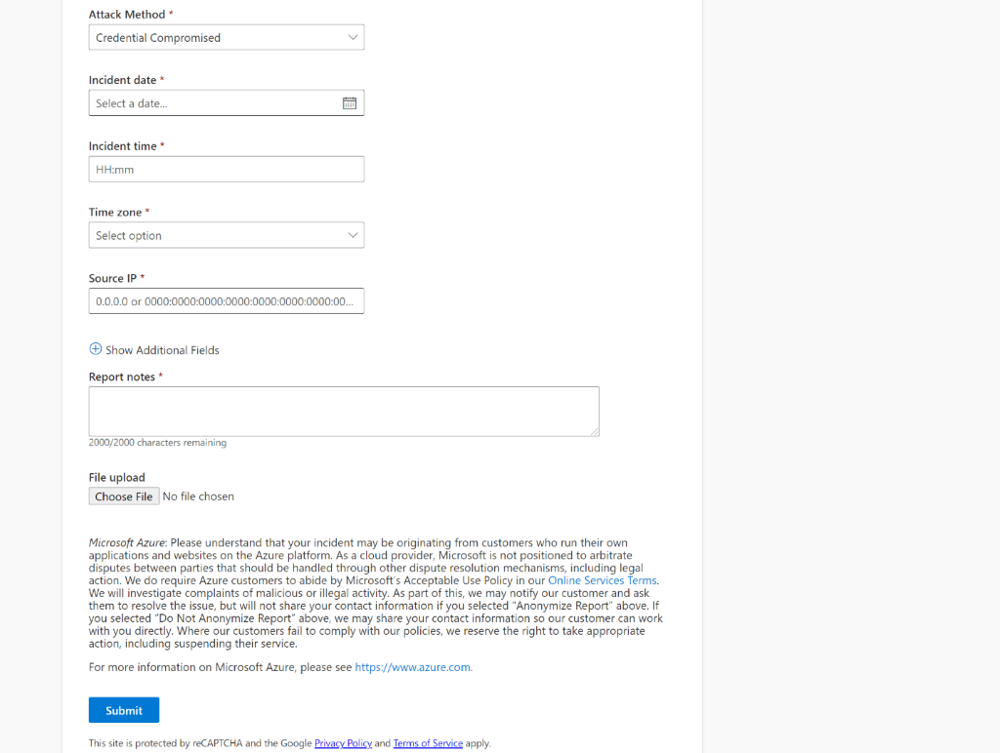

<!-- /wp:image -->

<!-- wp:paragraph -->

The goal of the new Report Abuse Portal shown above is to provide a more modernized reporting experience while encouraging even greater insights, and we cannot wait to share this with the community.

<!-- /wp:paragraph -->

<!-- wp:quote -->

> You can view the new Report Abuse Portal at <https://msrc.microsoft.com/report/abuse>

<!-- /wp:quote -->

<!-- wp:heading {"level":3} -->

### What's new with the API?

<!-- /wp:heading -->

<!-- wp:paragraph -->

To ensure a consistent MSRC reporting experience, we have also extended much of the reporting changes shown above, in the Portal, to the API. If you engage with MSRC via our Report Abuse API, please review the updates below:

<!-- /wp:paragraph -->

<!-- wp:paragraph -->

**Updated Data Schema**

<!-- /wp:paragraph -->

<!-- wp:paragraph -->

While much of the logic and schema of the API remains the same, we did introduce new properties like _incidentType \_and \_attackMethod_, as well as a refined list of valid values. Please review our [API documentation](https://msrc.microsoft.com/report/developer) for the new property names, data types, requirements, and property descriptions.

<!-- /wp:paragraph -->

<!-- wp:paragraph -->

**Threat Type, Incident Type, and Attack Methods**

<!-- /wp:paragraph -->

<!-- wp:paragraph -->

Similar to the changes made in the Report Abuse Portal, and to simplify terminology, the new values that are valid for threatType are “IP Address” and “URL”.

<!-- /wp:paragraph -->

<!-- wp:paragraph -->

Additionally, the new _incidentType_ and \_attackMethod \_properties are also available in the API; allowing for more granular, accurate abuse reports.

<!-- /wp:paragraph -->

<!-- wp:paragraph -->

Given these updates, it is important to align yourself with the types of security incidents that are reportable through the API, what their attack methods are, and whether they are URL or IP Address based. Please review our [API documentation](https://msrc.microsoft.com/report/developer/) for the definitions and refined list of valid values.

<!-- /wp:paragraph -->

<!-- wp:paragraph -->

**Developer Page**

<!-- /wp:paragraph -->

<!-- wp:paragraph -->

As mentioned above, the navigation bar of the Report Abuse Portal includes a tab for the “Abuse API”. Upon clicking, you will be redirected to the API Developer Page, visualizing the new updates to the API.

<!-- /wp:paragraph -->

<!-- wp:image {"id":12655,"width":768,"height":461,"sizeSlug":"large","linkDestination":"none"} -->

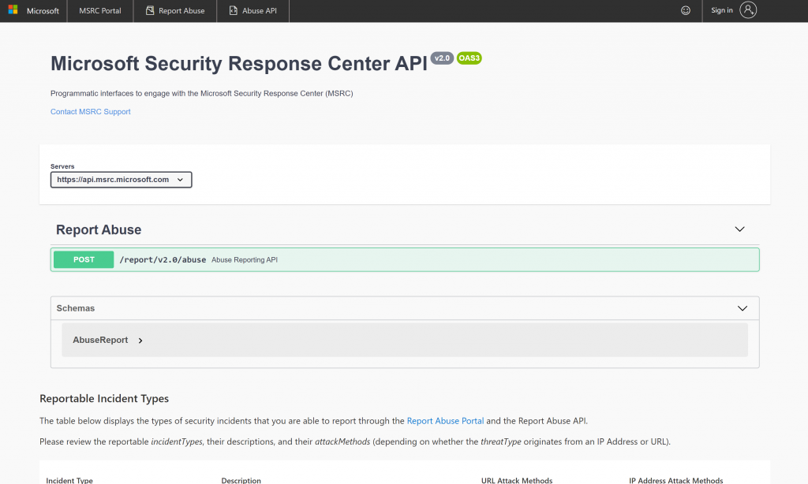

<!-- /wp:image -->

<!-- wp:paragraph -->

In the “Abuse Reporting API” dropdown, you will find the request body type, responses, and examples.

<!-- /wp:paragraph -->

<!-- wp:paragraph -->

In the “Schemas” dropdown, you will find the property keys, data types, requirements, and property descriptions.

<!-- /wp:paragraph -->

<!-- wp:paragraph -->

Lastly, you will see a table of "Reportable Incident Types", their descriptions, and their URL or IP Address based Attack Methods.

<!-- /wp:paragraph -->

<!-- wp:quote -->

> You can view the Developer Page at: <https://msrc.microsoft.com/report/developer>

<!-- /wp:quote -->

<!-- wp:paragraph -->

**API Validation Responses**

<!-- /wp:paragraph -->

<!-- wp:paragraph -->

With the introduction of new properties and values, the Report Abuse API needs to ensure that the reports being sent meet any necessary requirements, logic, or formatting. To support this, the API has validation in place and will provide a verbose response upon any needed modifications to the JSON POST request body. Please review the "Examples" section below, for more information.

<!-- /wp:paragraph -->

<!-- wp:paragraph -->

**Examples**

<!-- /wp:paragraph -->

<!-- wp:paragraph -->

Below are some examples of various reports and the resulting API response:

<!-- /wp:paragraph -->

<!-- wp:paragraph -->

Example 1: A Social Engineering incident regarding a Phishing email, originating from an IP Address, is reported.

<!-- /wp:paragraph -->

<!-- wp:image {"id":12656,"width":289,"height":229,"sizeSlug":"large","linkDestination":"none"} -->

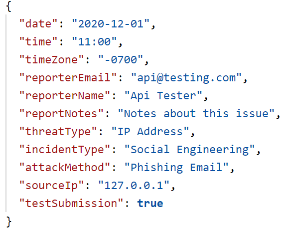

<!-- /wp:image -->

<!-- wp:paragraph -->

Since this submission contained the required data points (and was set to test), the API will respond with:

<!-- /wp:paragraph -->

<!-- wp:image {"id":12658,"width":512,"height":39,"sizeSlug":"large","linkDestination":"none"} -->

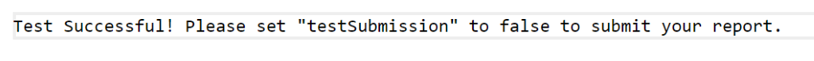

<!-- /wp:image -->

<!-- wp:paragraph -->

Example 2: A Social Engineering incident from a Phishing website, originating from an IP Address, is reported.

<!-- /wp:paragraph -->

<!-- wp:image {"id":12659,"sizeSlug":"large","linkDestination":"none"} -->

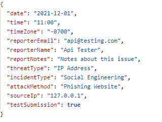

<!-- /wp:image -->

<!-- wp:paragraph -->

Since a non-valid URL _attackMethod_ (Phishing Website) was reported under IP Address , the API will respond with:

<!-- /wp:paragraph -->

<!-- wp:image {"id":12660,"width":512,"height":44,"sizeSlug":"large","linkDestination":"none"} -->

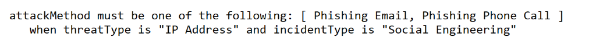

<!-- /wp:image -->

<!-- wp:paragraph -->

Example 3: An Account Compromise, originating from an IP Address, is reported.

<!-- /wp:paragraph -->

<!-- wp:image {"id":12661,"width":395,"height":238,"sizeSlug":"large","linkDestination":"none"} -->

<!-- /wp:image -->

<!-- wp:paragraph -->

Given the incorrect date format, the API responds with:

<!-- /wp:paragraph -->

<!-- wp:image {"id":12662,"width":696,"height":38,"sizeSlug":"large","linkDestination":"none"} -->

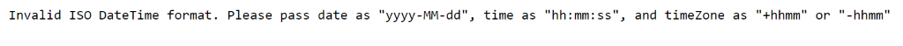

<!-- /wp:image -->

<!-- wp:paragraph -->

These are are just some scenarios that our API validation covers. There is additional validation and messaging for incorrect _sourceIp_ or _sourceUrl_ formatting, empty _reporterName_, incorrect _reporterEmail_ formatting, and more. To test these different scenarios when interacting with our API, it is recommended that you set _testSubmission_ to `true`.

<!-- /wp:paragraph -->

<!-- wp:paragraph -->

**Report Abuse API Endpoint**

<!-- /wp:paragraph -->

<!-- wp:quote -->

> The API can now be reached at <https://api.msrc.microsoft.com/report/v2.0/abuse>

<!-- /wp:quote -->

<!-- wp:heading {"level":3} -->

### What's next?

<!-- /wp:heading -->

<!-- wp:paragraph -->

As of today, the all new [Report Abuse Portal](https://msrc.microsoft.com/report/abuse) and the updated [Report Abuse API](https://msrc.microsoft.com/report/developer) are now live!

<!-- /wp:paragraph -->

<!-- wp:paragraph -->

While the new API aims to provide significant impact to MSRC’s security response, we wanted to minimize the effort needed to adopt it. We will continue to support the old version of the Report Abuse API until March 1st, 2021, allowing our developer community to make the necessary changes needed to adapt to the updated API.

<!-- /wp:paragraph -->

<!-- wp:paragraph -->

We hope these exciting, new changes not only improve the quality of MSRC’s security response but also empower our community of reporters to continue sharing their insights into the ongoing and emerging threats across the cloud.

<!-- /wp:paragraph -->

<!-- wp:heading {"level":3} -->

### Questions or Feedback?

<!-- /wp:heading -->

<!-- wp:paragraph -->

For questions or feedback, please either contact us at [msrc_eng_support@microsoft.com](mailto:msrc_eng_support@microsoft.com) or share your thoughts at <https://aka.ms/msrc-report-abuse-feedback>.

<!-- /wp:paragraph -->

<!-- wp:paragraph -->

_Justin Powell, Program Manager, Microsoft Security Response Center_

<!-- /wp:paragraph -->
