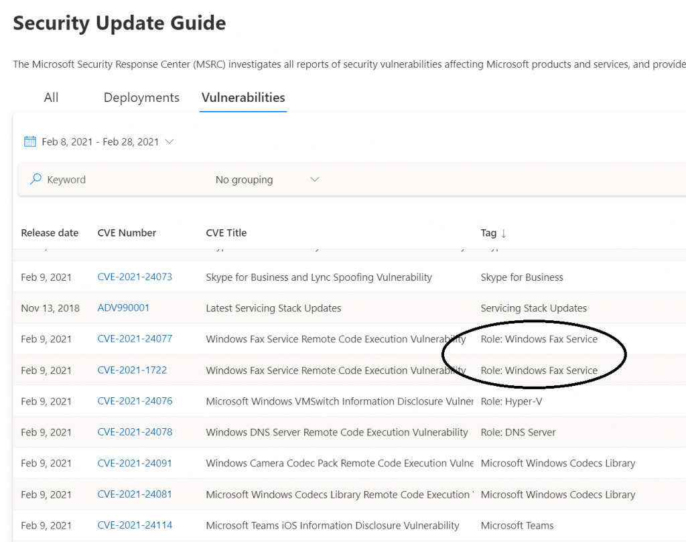
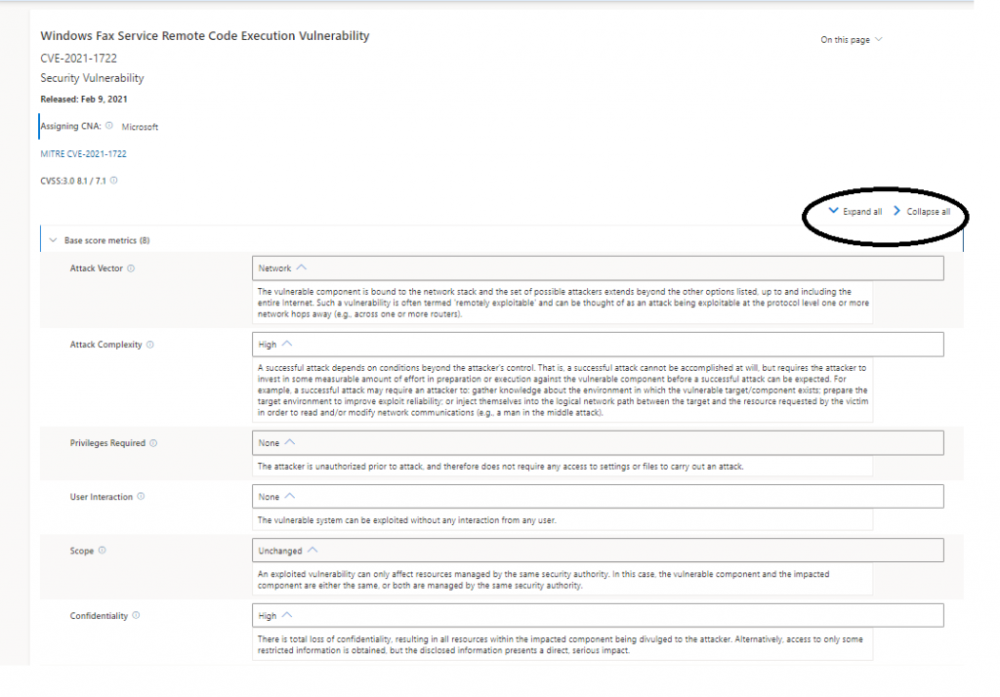
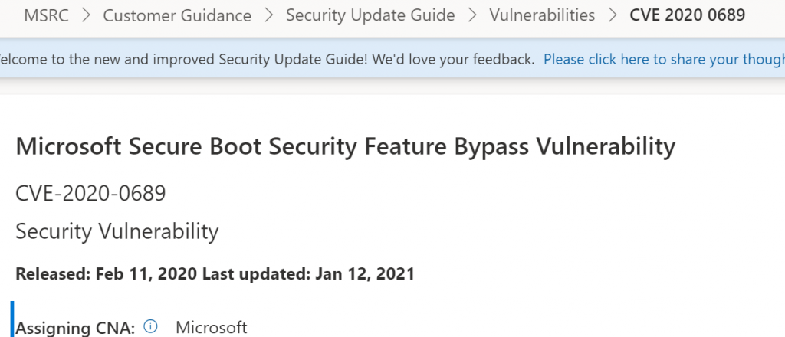

<!-- wp:paragraph -->

Based on user feedback we have simplified programmatic access to the security update data by removing the authentication and API-Key requirements when using the CVRF API. You will no longer have to log in to obtain a personal API key to access the data. We're happy to make this valuable public information more freely available and accessible. For the latest information on the API, please visit our [interactive documentation page](https://api.msrc.microsoft.com/cvrf/v2.0/swagger/index) and [sample code repository on GitHub](https://github.com/microsoft/MSRC-Microsoft-Security-Updates-API).

<!-- /wp:paragraph -->

<!-- wp:paragraph -->

If you have existing scripts or programs that use the API Key, you don’t need to take it out. The API will account for its existence but won’t use it.

<!-- /wp:paragraph -->

<!-- wp:paragraph -->

If you haven’t used the API before, it’s a great tool for creating custom reports designed for your individual needs. For example, if you want to create a report that shows all the information in a release you can put the following into a PowerShell ISE window.

<!-- /wp:paragraph -->

<!-- wp:group -->

<!-- wp:paragraph -->

`Install-Module MSRCSecurityUpdates -Force Import-Module MSRCSecurityUpdates $cvrfDoc = Get-MsrcCvrfDocument -ID 2021-Feb $CVRFDoc | Get-MsrcVulnerabilityReportHtml | Out-File -FilePath Feb21.html`

<!-- /wp:paragraph -->

<!-- wp:paragraph -->

This will place a file in your current directory with all the interesting information about the CVEs in the month of February. MSRCSecurityUpdates is a module in the GitHub repository for people to contribute to and use.

<!-- /wp:paragraph -->

<!-- wp:paragraph -->

The API can be used to create mini reports highlighting different things:

<!-- /wp:paragraph -->

<!-- wp:list -->

- A list of FAQs, Workarounds, and Mitigations for the release.
- A list of Revisions made to CVEs in the last month.
- A list of CVEs that were public or known to be exploited.

<!-- /wp:list -->

<!-- wp:paragraph -->

There are a couple of things to make this easier. There is a picture of how the CVRF data is laid out on this ICASI website: [CVRF-mindmap-1.1.pdf (icasi.org)](https://www.icasi.org/wp-content/uploads/2015/06/CVRF-mindmap-1.1.pdf). Some of information is identified by Types. Here are some of the types that identify helpful information:

<!-- /wp:paragraph -->

<!-- wp:list -->

- Vulnerability: Remediation Type 0 is a Workaround
- Vulnerability: Remediation Type 1 is a Mitigation
- Vulnerability: Notes: Type 2 is a Description
- Vulnerability: Notes: Type 4 is an FAQ
- Vulnerability: Remediation: Type 5 is a Known Issue
- Vulnerability: Notes: Type 7 is a Tag
- Vulnerability: Notes: Type 8 is an Issuing CNA

<!-- /wp:list -->

<!-- /wp:group -->

<!-- wp:paragraph -->

**A Word about Tags**

<!-- /wp:paragraph -->

<!-- wp:paragraph -->

After a release, the MSRC often gets questions like: “If my server is not configured as a Hyper-V server is it still vulnerable to this vulnerability?” To facilitate the answer more easily, we are now putting that information into the Tag. The February release has some examples of this new labelling. For example, to be vulnerable to CVE-2021-20447 and CVE-2021-1722, the Windows Fax and Scan feature needs to be enabled, and the Fax service needs to be running. For these two CVEs we’ve set the Tag to Role: Windows Fax Service.

<!-- /wp:paragraph -->

<!-- wp:image {"id":12724,"sizeSlug":"large","linkDestination":"none"} -->

<!-- /wp:image -->

<!-- wp:paragraph -->

**A Couple Small but Handy New Features**

<!-- /wp:paragraph -->

<!-- wp:paragraph -->

There are now two buttons above the CVSS Score table. **Expand all** opens all the Help Text for the scores and **Collapse all** removes the help text.

<!-- /wp:paragraph -->

<!-- wp:image {"id":12725,"sizeSlug":"large","linkDestination":"none"} -->

<!-- /wp:image -->

<!-- wp:paragraph -->

We’ve also added the date of the last time that the CVE was revised to the top of the CVE:

<!-- /wp:paragraph -->

<!-- wp:image {"id":12726,"sizeSlug":"large","linkDestination":"none"} -->

<!-- /wp:image -->

<!-- wp:paragraph -->

We do hope that these changes are helpful. Thank you so much for the feedback and we’ll keep listening.

<!-- /wp:paragraph -->

<!-- wp:paragraph -->

\_Lisa Olson, Senior Security Program Manager, \_Microsoft Security Response Center\_\_

<!-- /wp:paragraph -->
