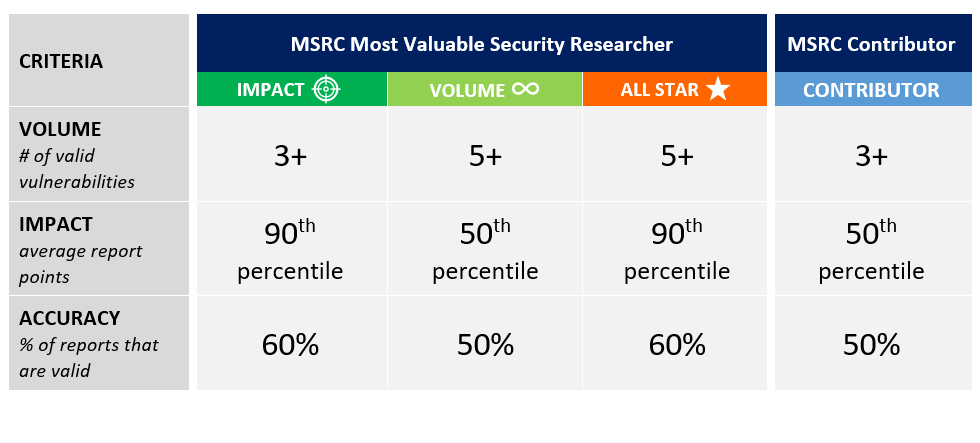

<!-- wp:paragraph -->

Wondering how to get into the 2021 MSRC Most Valuable Security Researcher list and get recognized during the Black Hat USA this August? Read on to learn more about the different paths you can take to get into the top researcher tiers.

<!-- /wp:paragraph -->

<!-- wp:paragraph -->

The **MSRC Most Valuable Security Researcher (MVR) **and** MSRC Contributor** are tiers in the [Researcher Recognition Program](https://www.microsoft.com/en-us/msrc/researcher-recognition-program) which annually recognize researchers for impactful contributions, considering report impact, accuracy and volume. We are excited to announce that new to the MVR tier for 2021 is a brand-new category, the **ALL-STAR**.

<!-- /wp:paragraph -->

<!-- wp:heading {"level":3} -->

### Choose Your Own Path to MSRC Top Researcher Tiers

<!-- /wp:heading -->

<!-- wp:image {"id":12765,"width":912,"height":412,"sizeSlug":"large","linkDestination":"none"} -->

<!-- /wp:image -->

<!-- wp:heading -->

##

<!-- /wp:heading -->

<!-- wp:heading {"level":3} -->

### 2021 MSRC Most Valuable Security Researcher

<!-- /wp:heading -->

<!-- wp:heading {"level":4} -->

#### _How do I qualify?_

<!-- /wp:heading -->

<!-- wp:paragraph -->

**NEW **for 2021, we are introducing the **ALL-STAR** category, which recognizes researchers who rise to meet our toughest challenge to date and awards researchers with additional points in the final ranking. Below, we break down each category, to help you identify which path is right for you:

<!-- /wp:paragraph -->

<!-- wp:columns -->

<!-- wp:column {"width":"100%"} -->

<!-- wp:list -->

- **_IMPACT_** (recognizes a smaller body of higher-impact work)

  - **Volume**: at least **_three_** valid vulnerabilities during the evaluation period

  - **Impact**: average points of valid vulnerability reports is at or above the **_90th percentile_** for report impact

  - **Accuracy:** at least **_50%_** of your reports are valid (How do I calculate [my accuracy score](https://www.microsoft.com/en-us/msrc/researcher-recognition-program)?)  

* **_VOLUME_** (recognizes a larger body of work)

  - **Volume:** at least **_five_** valid vulnerabilities during the evaluation period

  - **Impact:** the average points of your valid vulnerability reports put you at or above the **_50th percentile_** for report impact

  - **Accuracy:** at least **_50%_** of your reports are valid (How do I calculate [my accuracy score](https://www.microsoft.com/en-us/msrc/researcher-recognition-program)?)  

- **_ALL-STAR _**(recognizes a larger amount of high impact work)

  - **Volume:** Minimum of **_five_** valid, qualifying vulnerabilities reported during the evaluation period

  - **Impact:** the average points of your valid vulnerability reports put you at or above the **_90th percentile_** for report impact

  - **Accuracy:** at least **_60_**_%_ of your reports are valid (How do I calculate [my accuracy score](https://www.microsoft.com/en-us/msrc/researcher-recognition-program)?)

<!-- /wp:list -->

<!-- /wp:column -->

<!-- /wp:columns -->

<!-- wp:heading {"level":4} -->

#### _How are rankings determined in the Most Valuable Security Researcher List?_

<!-- /wp:heading -->

<!-- wp:paragraph -->

Meeting the criteria for either the IMPACT, VOLUME or ALL-STAR category can get you into the 2021 MSRC Most Valuable Security Researcher tier. Once you’re in, your ranking will depend on the total points you’ve earned.

<!-- /wp:paragraph -->

<!-- wp:paragraph -->

Researchers who reach the **ALL-STAR** category will get a 1.5X bonus multiplier for the total points earned in the final ranking. For example, a researcher who earned a total of 500 points and reached the ALL-STAR category will get 500 x 1.5 = 750 points in the final ranking.

<!-- /wp:paragraph -->

<!-- wp:heading {"level":4} -->

#### _What do I get?_

<!-- /wp:heading -->

<!-- wp:paragraph -->

As a 2021 MSRC Most Valuable Security Researcher, you will be eligible for several benefits during the forthcoming twelve months, which may include but not be limited to:

<!-- /wp:paragraph -->

<!-- wp:list -->

- Annual recognition on the MSRC’s Most Valuable Security Researcher list announced during Black Hat USA
- Limited edition SWAG designed exclusively for Most Valuable Researchers
- Access to Microsoft products and services for research purposes
- Access to invitation-only MSRC events
- Invitation to private MSRC programs

<!-- /wp:list -->

<!-- wp:paragraph -->

<!-- /wp:paragraph -->

<!-- wp:heading {"level":3} -->

### 2021 MSRC Contributor

<!-- /wp:heading -->

<!-- wp:heading {"level":4} -->

#### _How do I get in?_

<!-- /wp:heading -->

<!-- wp:paragraph -->

MSRC Contributor is the next tier in our [Researcher Recognition Program](https://msrc-blog.microsoft.com/2019/07/29/the-way-we-recognize-our-security-researchers/). This tier recognizes researchers who are on the way to qualifying for the MVR tier. The criteria for this program are:

<!-- /wp:paragraph -->

<!-- wp:list -->

- **Volume**: you reported at least **_three_** valid vulnerabilities during the evaluation period
- **Impact:** the average points of valid vulnerability reports put you at or above the **_50th percentile_** for report impact
- **Accuracy**: at least **_50%_** of your reports are valid (How do I calculate [my accuracy score](https://www.microsoft.com/en-us/msrc/researcher-recognition-program)?)

<!-- /wp:list -->

<!-- wp:heading {"level":4} -->

#### _What do I get?_

<!-- /wp:heading -->

<!-- wp:paragraph -->

If you are identified as a 2021 MSRC Contributor, you’re eligible for, including but not limited to:

<!-- /wp:paragraph -->

<!-- wp:list -->

- Special SWAG box for MSRC Contributors
- Access to invitation-only MSRC events

<!-- /wp:list -->

<!-- wp:paragraph -->

<!-- /wp:paragraph -->

<!-- wp:heading {"level":3} -->

### What is the period of time for program consideration?

<!-- /wp:heading -->

<!-- wp:paragraph -->

To qualify for both the 2021 Most Valuable Security Researcher and MSRC Contributor recognition, cases must fall into either of these categories:

<!-- /wp:paragraph -->

<!-- wp:list -->

- Reported and assessed by the MSRC team between July 1, 2020 and June 30, 2021
- Reported between July 1, 2019 and June 30, 2020 (the [previous program period](https://msrc-blog.microsoft.com/2020/08/05/announcing-2020-msrc-most-valuable-security-researchers/)), but assessed by the MSRC team after July 1, 2020.

<!-- /wp:list -->

<!-- wp:paragraph -->

<!-- /wp:paragraph -->

<!-- wp:heading {"level":3} -->

### What can you do next?

<!-- /wp:heading -->

<!-- wp:paragraph -->

We are under six months away until the end of the program period. Here are some tips to help you get into the top tier:

<!-- /wp:paragraph -->

<!-- wp:list -->

- **Start with a solid base:** Not all vulnerabilities are equal in impact. By focusing your research on Critical and Important vulnerabilities, you start with the highest base points possible. Check the [MSRC Researcher Recognition Program](https://www.microsoft.com/en-us/msrc/researcher-recognition-program) page for a breakdown of the base points you can earn for different Severity and Security Impact ratings.

- **Multiply your impact:** Review the [MSRC Researcher Recognition Program page](http://www.microsoft.com/en-us/msrc/researcher-recognition-program) for research areas with the highest multipliers (e.g. [Azure](https://azure.microsoft.com/en-us/services/) and [Identity](https://www.microsoft.com/en-us/msrc/bounty-microsoft-identity)) for the biggest boost.

- **Additional resources:**

  - [Directory of Azure Services](https://azure.microsoft.com/en-us/services/)
  - [Example of High-Quality Reports](https://www.microsoft.com/en-us/msrc/bounty-example-report-submission?rtc=1)
  - [Security Update Severity Rating System](https://www.microsoft.com/en-us/msrc/security-update-severity-rating-system)
  - [MSRC Research & Defense Blog](https://blogs.technet.microsoft.com/srd/)
  - [HackerOne’s Hacker101 training](https://www.hackerone.com/hacker101)
  - [Bugcrowd University](https://www.bugcrowd.com/hackers/bugcrowd-university/)
  - [Microsoft Documentation for end users, developers, and IT professionals](https://docs.microsoft.com/en-us/)

<!-- /wp:list -->

<!-- wp:paragraph -->

Ready to submit your next vulnerability report? Submit it today via our MSRC Researcher Portal [aka.ms/secure-at](https://msrc.microsoft.com/create-report).

<!-- /wp:paragraph -->

<!-- wp:paragraph -->

_Sylvie Liu, Security Program Manager, Microsoft Security Response Center_

<!-- /wp:paragraph -->
