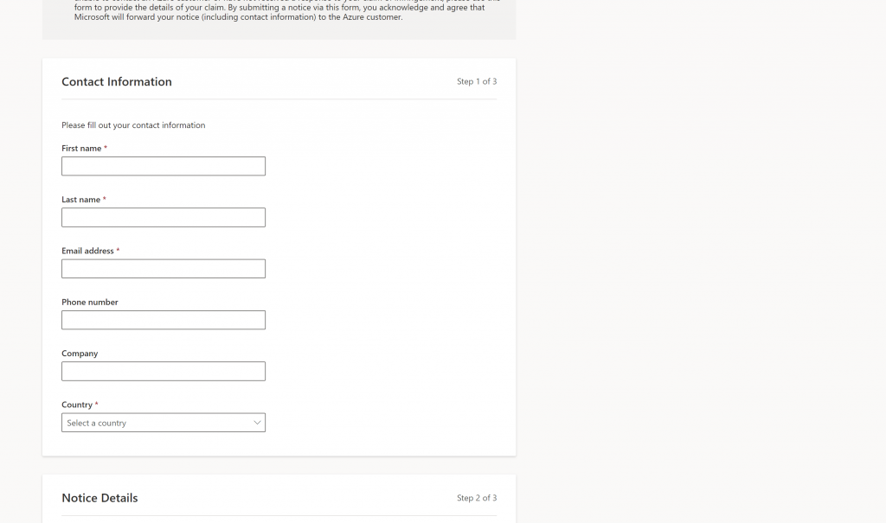

<!-- wp:paragraph -->

The [Notice of Copyright or Trademark Infringement Portal](https://msrc.microsoft.com/report/infringement) has helped protect Microsoft's users and customers from intellectual property infringement across online services like Microsoft Azure, Office, Outlook, Skype, Stream, Microsoft News, Sway, Hotmail, NuGet, and Yammer. Microsoft's response to claims of intellectual property infringement is driven by the reports you send us. To further enhance your reporting experience, we are introducing some new updates to the form and are excited to share those with you!

<!-- /wp:paragraph -->

<!-- wp:heading -->

## Summary

<!-- /wp:heading -->

<!-- wp:paragraph -->

We are introducing some new changes to the [Notices of Infringement report form](https://msrc.microsoft.com/report/infringement), enhancing the reporting experience, and allowing reporters to provide further details into their report.

<!-- /wp:paragraph -->

<!-- wp:paragraph -->

**The new Notice of Infringement Portal includes:**

<!-- /wp:paragraph -->

<!-- wp:list -->

- A new, modernized user interface and user experience
- New and updated fields allowing for additional details into your copyright or trademark infringement report

<!-- /wp:list -->

<!-- wp:paragraph -->

These changes impact those who wish to report copyright or trademark infringement of their intellectual property, occurring on Microsoft Services like Microsoft Azure, Office, Outlook, Skype, Stream, Microsoft News, Sway, Hotmail, NuGet, and Yammer.

<!-- /wp:paragraph -->

<!-- wp:paragraph -->

If you report notices of copyright or trademark infringement on any services that are not listed above, these changes should not impact you in any way.

<!-- /wp:paragraph -->

<!-- wp:heading -->

## What do I need to do?

<!-- /wp:heading -->

<!-- wp:paragraph -->

While the updated Notice of Infringement portal may have a new look, we sought to maintain a consistent and familiar reporting experience, minimizing the effort needed to migrate to the new portal. Other than reviewing the changes outlined below, we do not expect there to be any additional required effort from our reporters.

<!-- /wp:paragraph -->

<!-- wp:heading -->

## What's new with the portal?

<!-- /wp:heading -->

<!-- wp:paragraph -->

**A new, modernized look**

<!-- /wp:paragraph -->

<!-- wp:paragraph -->

Upon first look you will notice an entirely updated user interface:

<!-- /wp:paragraph -->

<!-- wp:image {"id":12812,"sizeSlug":"large","linkDestination":"none"} -->

<!-- /wp:image -->

<!-- wp:paragraph -->

The screenshot above shows the updated informational section; outlining important things to know, prior to submitting your notice of infringement.

<!-- /wp:paragraph -->

<!-- wp:paragraph -->

From there, the next step of the form is to enter your Contact Information:

<!-- /wp:paragraph -->

<!-- wp:image {"id":12813,"sizeSlug":"large","linkDestination":"none"} -->

<!-- /wp:image -->

<!-- wp:paragraph -->

Upon entering your Contact Information, the next step is to provide Notice Details of the alleged infringement:

<!-- /wp:paragraph -->

<!-- wp:image {"id":12814,"sizeSlug":"large","linkDestination":"none"} -->

<!-- /wp:image -->

<!-- wp:paragraph -->

_Note_: the above screenshot shows the form at a default state. The form may react to your inputs by displaying additional fields not shown in this screen shot.

<!-- /wp:paragraph -->

<!-- wp:paragraph -->

Lastly, once the details of the infringement have been captured, the last step to reporting your notice of infringement is acknowledging the required statements and providing a digital signature:

<!-- /wp:paragraph -->

<!-- wp:image {"id":12815,"sizeSlug":"large","linkDestination":"none"} -->

<!-- /wp:image -->

<!-- wp:paragraph -->

**New fields**

<!-- /wp:paragraph -->

<!-- wp:paragraph -->

The new Notices of Infringement Portal introduces new and updated fields, allowing reporters to capture additional information, helping Microsoft further our mission in responsibly responding to claims of copyright or trademark infringement.

<!-- /wp:paragraph -->

<!-- wp:paragraph -->

**Notice Type** provides reporters with the interactive option to choose whether their “Copyright” or “Trademark” is alleged to be infringed. Depending on the notice type, additional fields may appear on the form.

<!-- /wp:paragraph -->

<!-- wp:paragraph -->

If “Trademark” is selected, the form will add two new fields: **Trademark Registration Number** and **Jurisdiction where registered or used**. These fields allow reporters to include more specific information related to their Trademark.

<!-- /wp:paragraph -->

<!-- wp:paragraph -->

Additionally, the form also provides the reporter with the interactive option to choose the **Location of \*\***i\***\*nfringement**. This choice field allows the reporter to specify whether their copyright or trademark is alleged to be infringed upon at an **IP Address** or a **URL(s).**

<!-- /wp:paragraph -->

<!-- wp:paragraph -->

Lastly, if the copyright or trademark is alleged to be infringed upon at an IP Address, the form will allow the reporter to specify the **Infringement date**, the **Infringement time**, and the **Infringement time zone**.

<!-- /wp:paragraph -->

<!-- wp:heading -->

## What’s next?

<!-- /wp:heading -->

<!-- wp:paragraph -->

As of today, the all new Notices of Infringement Portal is live!

<!-- /wp:paragraph -->

<!-- wp:quote -->

> The new Notices of Infringement Portal can now be reached at: <https://msrc.microsoft.com/report/infringement>

<!-- /wp:quote -->

<!-- wp:paragraph -->

We hope these new changes not only improve the infringement notice experience for our users, but further Microsoft’s mission in our response to claims of infringement across online services.

<!-- /wp:paragraph -->

<!-- wp:heading -->

## Questions or Feedback?

<!-- /wp:heading -->

<!-- wp:paragraph -->

For questions or feedback, please either contact us at [msrc_eng_support@microsoft.com](mailto:msrc_eng_support@microsoft.com) or share your thoughts at <https://aka.ms/infringement-portal-feedback>

<!-- /wp:paragraph -->

<!-- wp:paragraph -->

_Justin Powell, Program Manager, Microsoft Security Response Center_

<!-- /wp:paragraph -->
