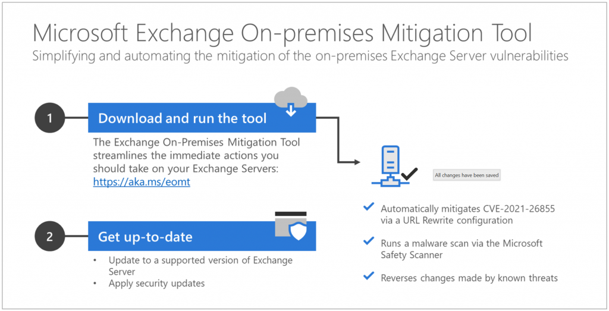

<!-- wp:paragraph -->

We have been actively working with customers through our customer support teams, third-party hosters, and partner network to help them secure their environments and respond to associated threats from the [recent Exchange Server on-premises attacks](https://www.microsoft.com/security/blog/2021/03/12/protecting-on-premises-exchange-servers-against-recent-attacks/). Based on these engagements we realized that there was a need for a simple, easy to use, automated solution that would meet the needs of customers using both current and out-of-support versions of on-premises Exchange Server.

<!-- /wp:paragraph -->

<!-- wp:paragraph -->

_Microsoft has released a new, [one-click mitigation tool](https://aka.ms/eomt), Microsoft Exchange On-Premises Mitigation Tool to help customers who do not have dedicated security or IT teams to apply these security updates._ We have tested this tool across Exchange Server 2013, 2016, and 2019 deployments. This new tool is designed as an interim mitigation for customers who are unfamiliar with the patch/update process or who have not yet applied the on-premises Exchange security update.

<!-- /wp:paragraph -->

<!-- wp:paragraph -->

By downloading and running this tool, which includes the latest [Microsoft Safety Scanner](https://docs.microsoft.com/en-us/windows/security/threat-protection/intelligence/safety-scanner-download), customers will automatically mitigate CVE-2021-26855 on any Exchange server on which it is deployed. This tool is not a replacement for the Exchange security update but is the fastest and easiest way to mitigate the highest risks to internet-connected, on-premises Exchange Servers prior to patching.  
We recommend that all customers who have not yet applied the on-premises Exchange security update:

<!-- /wp:paragraph -->

<!-- wp:list -->

- Download this [tool](https://aka.ms/eomt).
- Run it on your Exchange servers immediately.
- Then, follow the more detailed guidance [here](https://msrc-blog.microsoft.com/2021/03/02/multiple-security-updates-released-for-exchange-server/) to ensure that your on-premises Exchange is protected.
- If you are already using [Microsoft Safety Scanner](https://docs.microsoft.com/en-us/windows/security/threat-protection/intelligence/safety-scanner-download), it is still live and we recommend keeping this running as it can be used to help with additional mitigations.

<!-- /wp:list -->

<!-- wp:image {"id":12990,"width":840,"height":429,"sizeSlug":"large","linkDestination":"none"} -->

<!-- /wp:image -->

<!-- wp:paragraph -->

Once run, the [Run EOMT.ps1](https://aka.ms/eomt) tool will perform three operations:

<!-- /wp:paragraph -->

<!-- wp:paragraph -->

Mitigate against current known attacks using CVE-2021-26855 using a URL Rewrite configuration.  
Scan the Exchange Server using the [Microsoft Safety Scanner](https://docs.microsoft.com/en-us/windows/security/threat-protection/intelligence/safety-scanner-download).  
Attempt to reverse any changes made by identified threats.

<!-- /wp:paragraph -->

<!-- wp:paragraph -->

Before running the tool, you should understand:

<!-- /wp:paragraph -->

<!-- wp:list -->

- The Exchange On-premises Mitigation Tool is effective against the attacks we have seen so far, but is not guaranteed to mitigate all possible future attack techniques. **This tool should only be used as a temporary mitigation until your Exchange servers can be fully updated as outlined in our previous guidance.**
- **We recommend this script over the previous ExchangeMitigations.ps1 script as it tuned based on the latest threat intelligence.** If you have already started with the other script, it is fine to switch to this one.
- This is a recommended approach for Exchange deployments with Internet access and for those who want to attempt automated remediation.
- Thus far, we have not observed any impact to Exchange Server functionality when these mitigation methods are deployed.

<!-- /wp:list -->

<!-- wp:paragraph -->

For more technical information, examples, and guidance please review the [GitHub](https://github.com/microsoft/CSS-Exchange/blob/main/Security/) documentation.

<!-- /wp:paragraph -->

<!-- wp:paragraph -->

Microsoft is committed to helping customers and will continue to offer guidance and updates that can be found at <https://aka.ms/exchangevulns>.

<!-- /wp:paragraph -->

<!-- wp:paragraph -->

MICROSOFT MAKES NO WARRANTIES, EXPRESS, IMPLIED, OR STATUTORY, AS TO THE INFORMATION IN THIS GUIDANCE. The Exchange On-premises Mitigation Tool is available through the MIT License, as indicated in the GitHub Repository where it is offered.

<!-- /wp:paragraph -->
