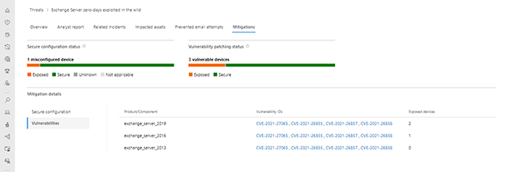

<!-- wp:paragraph -->

This guidance will help customers address threats taking advantage of the recently disclosed Microsoft Exchange Server on-premises vulnerabilities CVE-2021-26855, CVE-2021-26858, CVE-2021-26857, and CVE-2021-27065, which are being exploited. We strongly urge customers to immediately update systems. Failing to address these vulnerabilities can result in compromise of your on-premises Exchange Server and, potentially, other parts of your internal network.

<!-- /wp:paragraph -->

<!-- wp:paragraph -->

Mitigating these vulnerabilities and investigating whether an adversary has compromised your environment should be done in parallel. Applying the [March 2021 Exchange Server Security Updates](https://techcommunity.microsoft.com/t5/exchange-team-blog/released-march-2021-exchange-server-security-updates/ba-p/2175901) is critical to prevent (re)infection, but it will not evict an adversary who has already compromised your server. Based on your investigation, remediation may be required. This guide will help you answer these questions:

<!-- /wp:paragraph -->

<!-- wp:list -->

- [How does the attack work?](#How_does_the_attack_work)
- [Am I vulnerable to this threat?](#Am_I_vulnerable_to_this_threat)
- [How do I mitigate the threat?](#How_do_I_mitigate_the_threat)
- [Have I been compromised?](#Have_I_been_compromised)
- [What remediation steps should I take?](#What_remediation_steps_should_I_take)
- [How can I better protect myself and monitor for suspicious activity?](#How_can_I_better_protect_myself)

<!-- /wp:list -->

<!-- wp:paragraph -->

Watch this video to gain better understanding of the risks associated with these vulnerabilities and get relevant mitigation, investigation, and remediation guidance:

<!-- /wp:paragraph -->

<!-- wp:embed {"url":"https://www.youtube.com/watch?v=w-L3gi4Cexo","type":"video","providerNameSlug":"youtube","responsive":true,"className":"wp-embed-aspect-16-9 wp-has-aspect-ratio"} -->

https://www.youtube.com/watch?v=w-L3gi4Cexo

<!-- /wp:embed -->

<!-- wp:paragraph -->

Microsoft will continue to monitor these threats and provide updated tools and investigation guidance to help organizations defend against, identify, and remediate associated attacks. We will update this guidance with new details and recommendations as we continue to expand our knowledge of these threats and the threat actors behind them, so come back to this page for updates.

<!-- /wp:paragraph -->

<!-- wp:heading -->

## How does the attack work?

<!-- /wp:heading -->

<!-- wp:paragraph -->

Microsoft [released](https://techcommunity.microsoft.com/t5/exchange-team-blog/released-march-2021-exchange-server-security-updates/ba-p/2175901) security updates for four different on premises Microsoft Exchange Server zero-day vulnerabilities (CVE-2021-26855, CVE-2021-26858, CVE-2021-26857, and CVE-2021-27065). These vulnerabilities can be used in combination to allow unauthenticated remote code execution on devices running Exchange Server. Microsoft has also observed subsequent web shell implantation, code execution, and data exfiltration activities during attacks. This threat may be exacerbated by the fact that numerous organizations publish Exchange Server deployments to the internet to support mobile and work-from-home scenarios.

<!-- /wp:paragraph -->

<!-- wp:paragraph -->

In many of the observed attacks, one of the first steps attackers took following successful exploitation of CVE-2021-26855, which allows unauthenticated remote code execution, was to establish persistent access to the compromised environment via a web shell. A web shell is a piece of malicious code, often written in typical web development programming languages (e.g., ASP, PHP, JSP), that attackers implant on web servers to provide remote access and code execution to server functions. Web shells allow adversaries to execute commands and to steal data from a web server or use the server as launch pad for further attacks against the affected organization. Therefore, it is critical to not only immediately mitigate the vulnerabilities, but also remove any additional backdoors, such as web shells that attackers may have created.

<!-- /wp:paragraph -->

<!-- wp:heading -->

## Am I vulnerable to this threat?

<!-- /wp:heading -->

<!-- wp:paragraph -->

**If you are running Exchange Server 2010, 2013, 2016, or 2019 you must apply the March 2021 Security Update to protect yourself against these threats.**

<!-- /wp:paragraph -->

<!-- wp:paragraph -->

To determine if your Exchange Servers are vulnerable to this attack, the following methods can be used:

<!-- /wp:paragraph -->

<!-- wp:list -->

- Using Microsoft Defender for Endpoint
- Scanning your Exchange servers using Nmap

<!-- /wp:list -->

<!-- wp:heading {"level":3} -->

### Microsoft Defender for Endpoint

<!-- /wp:heading -->

<!-- wp:paragraph -->

Microsoft Defender for Endpoint customers can use the [threat analytics article](https://security.microsoft.com/threatanalytics3/4ef1fbc5-5659-4d9b-b32e-97a694475955/analystreport) in Microsoft 365 security center to understand their risk. This requires your Exchange Servers to be onboarded to Microsoft Defender for Endpoint. See [instructions](https://docs.microsoft.com/en-us/windows/security/threat-protection/microsoft-defender-atp/configure-server-endpoints) for onboarding servers that are not currently monitored.

<!-- /wp:paragraph -->

<!-- wp:image {"id":13002,"sizeSlug":"large","linkDestination":"none"} -->

<!-- /wp:image -->

<!-- wp:heading {"level":3} -->

### Scanning using Nmap script

<!-- /wp:heading -->

<!-- wp:paragraph -->

For servers not onboarded to Microsoft Defender for Endpoint, use this Nmap script to scan a URL/IP to determine vulnerability: _[http-vuln-cve2021-26855.nse](https://github.com/microsoft/CSS-Exchange/tree/main/Security#http-vuln-cve2021-26855nse)_.

<!-- /wp:paragraph -->

<!-- wp:heading -->

## How do I mitigate the threat?

<!-- /wp:heading -->

<!-- wp:paragraph -->

The best and most complete mitigation for these threats is to update to a supported version of Exchange Server and ensure it is fully updated. If it’s not possible to immediately move to the current Exchange Server Cumulative Update and apply security updates, additional strategies for mitigation are provided below. These lesser mitigation strategies are only a temporary measure while you install the latest Cumulative Update and Security Updates.

<!-- /wp:paragraph -->

<!-- wp:heading {"level":3} -->

### Immediate temporary mitigations

<!-- /wp:heading -->

<!-- wp:paragraph -->

The following mitigation options can help protect your Exchange Server until the necessary Security Updates can be installed. These solutions should be considered temporary, but can help enhance safety while additional mitigation and investigation steps are being completed.

<!-- /wp:paragraph -->

<!-- wp:list -->

- Run [_EOMT.ps1_](https://aka.ms/eomt) (**Recommended**) – The Exchange On-premises Mitigation Tool (_EOMT.ps1_) mitigates CVE-2021-26855 and attempts to discover and remediate malicious files. When run, it will first check if the system is vulnerable to CVE-2021-26855 and, if so, installs a mitigation for it. It then automatically downloads and runs Microsoft Safety Scanner (MSERT). This is the preferred approach when your Exchange Server has internet access.
- Run _[ExchangeMitigations.ps1](https://github.com/microsoft/CSS-Exchange/tree/main/Security#exchangemitigationsps1) _– The ExchangeMitigations.ps1 script applies mitigations but doesn’t perform additional scanning. This is an option for Exchange Servers without internet access or for customers who do not want Microsoft Safety Scanner to attempt removing malicious activity it finds.

<!-- /wp:list -->

<!-- wp:heading {"level":3} -->

### Applying the current Exchange Server Cumulative Update

<!-- /wp:heading -->

<!-- wp:paragraph -->

The best, most complete mitigation is to get to a current Cumulative Update and apply all Security Updates. **This is the recommended solution providing the strongest protection against compromise**.

<!-- /wp:paragraph -->

<!-- wp:list -->

- See installation instructions at [Released: March 2021 Exchange Server Security Updates](https://techcommunity.microsoft.com/t5/exchange-team-blog/released-march-2021-exchange-server-security-updates/ba-p/2175901).

<!-- /wp:list -->

<!-- wp:paragraph -->

Watch the following video for guidance on applying security updates:

<!-- /wp:paragraph -->

<!-- wp:embed {"url":"https://www.youtube.com/watch?v=7gtO2G6Zack","type":"video","providerNameSlug":"youtube","responsive":true,"className":"wp-embed-aspect-16-9 wp-has-aspect-ratio"} -->

https://www.youtube.com/watch?v=7gtO2G6Zack

<!-- /wp:embed -->

<!-- wp:heading {"level":3} -->

### Apply security hotfixes to older Cumulative Updates

<!-- /wp:heading -->

<!-- wp:paragraph -->

To assist organizations that may require additional time and planning to get to a supported Cumulative Update, security hotfixes have been made available. It’s important to note that applying these security hotfixes to older Cumulative Updates will mitigate against these specific Exchange vulnerabilities, but it will not address other potential security risks your Exchange Server may be vulnerable to. This approach is only recommended as a temporary solution while you move to a supported Cumulative Update.

<!-- /wp:paragraph -->

<!-- wp:list -->

- See installation instructions at [March 2021 Exchange Server Security Updates for older Cumulative Updates of Exchange Server](https://techcommunity.microsoft.com/t5/exchange-team-blog/march-2021-exchange-server-security-updates-for-older-cumulative/ba-p/2192020).

<!-- /wp:list -->

<!-- wp:heading {"level":3} -->

### Isolation of your Exchange Server

<!-- /wp:heading -->

<!-- wp:paragraph -->

To reduce the risk of exploitation of the vulnerabilities, the Exchange Server can be isolated from the public internet by blocking inbound connections over port 443.

<!-- /wp:paragraph -->

<!-- wp:list -->

- Blocking port 443 from receiving inbound internet traffic provides temporary protection until Security Updates can be applied, but it reduces functionality as it could inhibit work-from-home or other non-VPN remote work scenarios and does not protect against adversaries who may already be present in your internal network.
- The most comprehensive way to complete this is to use your perimeter firewalls that are currently routing inbound 443 traffic to block this traffic. You can use [Windows Firewall](https://docs.microsoft.com/en-us/windows/security/threat-protection/windows-firewall/windows-firewall-with-advanced-security) to accomplish this, but you will have to remove all inbound 443 traffic rules prior to blocking the traffic.

<!-- /wp:list -->

<!-- wp:heading -->

## Have I been compromised?

<!-- /wp:heading -->

<!-- wp:paragraph -->

To determine if your Exchange Servers have been compromised due to these vulnerabilities, multiple options have been made available:

<!-- /wp:paragraph -->

<!-- wp:list -->

- Microsoft Defender for Endpoint
- Publicly available tools published by Microsoft

<!-- /wp:list -->

<!-- wp:paragraph -->

If Microsoft Defender for Endpoint is not running, skip directly to the publicly available tools section. If it is running, we recommend that you follow both methods.

<!-- /wp:paragraph -->

<!-- wp:heading {"level":3} -->

### Microsoft Defender for Endpoint

<!-- /wp:heading -->

<!-- wp:paragraph -->

Microsoft Defender for Endpoint enables you to understand your posture, investigate threats, and take remediation actions against attacks that leverage these vulnerabilities. Watch the following video for guidance on using Microsoft Defender for Endpoint:

<!-- /wp:paragraph -->

<!-- wp:embed {"url":"https://www.youtube.com/watch?v=bitgE0CCmV4","type":"video","providerNameSlug":"youtube","responsive":true,"className":"wp-embed-aspect-16-9 wp-has-aspect-ratio"} -->

https://www.youtube.com/watch?v=bitgE0CCmV4

<!-- /wp:embed -->

<!-- wp:list -->

- Check the [threat analytics](https://security.microsoft.com/threatanalytics3/4ef1fbc5-5659-4d9b-b32e-97a694475955/overview) article in Microsoft 365 security center to determine if any indications of exploitation are observed. The Analyst report tab in the Microsoft 365 Security Center threat analytics article contains a continuously updated detailed description of the threat, actor, exploits, and TTPs. On the Overview page, the Impacted assets section lists all impacted devices. The Related incidents section shows any alerts for detected exploitation or post-exploitation activity.

<!-- /wp:list -->

<!-- wp:image {"id":13003,"sizeSlug":"large","linkDestination":"none"} -->

<!-- /wp:image -->

<!-- wp:list -->

- If you have devices that are flagged as impacted (see Impacted assets section) and have active alerts and incidents, click the incidents to further understand the extent of the attack.

<!-- /wp:list -->

<!-- wp:image {"id":13004,"sizeSlug":"large","linkDestination":"none"} -->

<!-- /wp:image -->

<!-- wp:list -->

- Microsoft Defender for Endpoint blocks multiple components of this threat and has additional detections for associated malicious behaviors. These are raised as alerts in the Microsoft Defender Security Center. Additionally, Microsoft Defender for Endpoint prevents some critical behaviors observed in attacks, such as attempts to exploit the CVE-2021-27065 post-authentication file-write vulnerability that can be combined with CVE-2021-26855 to elevate privileges.

<!-- /wp:list -->

<!-- wp:image {"id":13005,"sizeSlug":"large","linkDestination":"none"} -->

<!-- /wp:image -->

<!-- wp:list -->

- Microsoft Defender for Endpoint also detects post-exploitation activity, including some techniques that attackers use to maintain persistence on the machine. Note that alerts marked “Blocked” indicate that the detected threat is also remediated. Alerts marked “Detected” require security analyst review and manual remediation.

<!-- /wp:list -->

<!-- wp:image {"id":13006,"sizeSlug":"large","linkDestination":"none"} -->

<!-- /wp:image -->

<!-- wp:list -->

- You can use advanced hunting to search for unexpected files dropped or executing in Exchange folders, which could be web shells or other attacker artifacts. See more advanced hunting queries relevant to this threat in the [Analyst report in Threat Analytics](https://security.microsoft.com/threatanalytics3/4ef1fbc5-5659-4d9b-b32e-97a694475955/overview) and in our [GitHub queries repository.](https://github.com/microsoft/Microsoft-365-Defender-Hunting-Queries)

<!-- /wp:list -->

<!-- wp:image {"id":13007,"sizeSlug":"large","linkDestination":"none"} -->

<!-- /wp:image -->

<!-- wp:heading {"level":3} -->

### Publicly available tools published by Microsoft

<!-- /wp:heading -->

<!-- wp:paragraph -->

The following tools have been made available by Microsoft to aid customers in investigating whether their Microsoft Exchange Servers have been compromised. We recommend customers to run both tools as part of their investigation:

<!-- /wp:paragraph -->

<!-- wp:heading {"level":4} -->

#### Exchange On-premises Mitigation Tool

<!-- /wp:heading -->

<!-- wp:paragraph -->

[Download](https://aka.ms/eomt) and run _EOMT.ps1_ as an administrator on your Exchange Server to automatically run the latest version of Microsoft Safety Scanner (MSERT). MSERT discovers and remediates [web shells](https://www.microsoft.com/security/blog/2020/02/04/ghost-in-the-shell-investigating-web-shell-attacks/), which are backdoors that adversaries use to maintain persistence on your server. Watch the following video for guidance on how to use the Exchange On-premises Mitigation Tool:

<!-- /wp:paragraph -->

<!-- wp:embed {"url":"https://www.youtube.com/watch?v=BE_MO0xwjFI","type":"video","providerNameSlug":"youtube","responsive":true,"className":"wp-embed-aspect-16-9 wp-has-aspect-ratio"} -->

https://www.youtube.com/watch?v=BE_MO0xwjFI

<!-- /wp:embed -->

<!-- wp:list -->

- After completing the scan, EOMT.ps1 reports any malicious files it discovers and removes. If malicious files are discovered and removed by the tool, follow the [web shell remediation workflow](#What_remediation_steps_should_I_take). If no malicious files are found, it will report “No known threats detected.”

<!-- /wp:list -->

<!-- wp:image {"id":13008,"sizeSlug":"large","linkDestination":"none"} -->

<!-- /wp:image -->

<!-- wp:list -->

- If this initial scan does not find evidence of malicious files, a full scan can be run via “_.\\EOMT.ps1 -RunFullScan_”. This may take a few hours or days, depending on your environment and the number of files on the Exchange Server.
- If the script is unable to download Microsoft Safety Scanner (MSERT), you can download and copy [MSERT](https://docs.microsoft.com/en-us/windows/security/threat-protection/intelligence/safety-scanner-download) manually to your Exchange Server. Run this executable directly as an administrator. Follow the on-screen instructions to run a Quick or Full scan. A new version of MSERT should be downloaded each time it is run to ensure it contains the latest protections. Watch the following video for guidance on how to run Microsoft Safety Scanner:

<!-- /wp:list -->

<!-- wp:embed {"url":"https://www.youtube.com/watch?v=BClIOXku5UM","type":"video","providerNameSlug":"youtube","responsive":true,"className":"wp-embed-aspect-16-9 wp-has-aspect-ratio"} -->

https://www.youtube.com/watch?v=BClIOXku5UM

<!-- /wp:embed -->

<!-- wp:heading {"level":4} -->

#### Test-ProxyLogon script

<!-- /wp:heading -->

<!-- wp:paragraph -->

Run the [Test-ProxyLogon.ps1](https://github.com/microsoft/CSS-Exchange/tree/main/Security#test-proxylogonps1) script as administrator to analyze Exchange and IIS logs and discover potential attacker activity. Watch the following video for guidance on how to use the Test-ProxyLogon script:

<!-- /wp:paragraph -->

<!-- wp:embed {"url":"https://www.youtube.com/watch?v=FZm3uekVHL8","type":"video","providerNameSlug":"youtube","responsive":true,"className":"wp-embed-aspect-16-9 wp-has-aspect-ratio"} -->

https://www.youtube.com/watch?v=FZm3uekVHL8

<!-- /wp:embed -->

<!-- wp:paragraph -->

**IMPORTANT**: We recommend re-downloading this tool at a minimum of once per day if your investigation efforts span multiple days, as we continue to make updates to improve its usage and output.

<!-- /wp:paragraph -->

<!-- wp:paragraph -->

Watch the following video for guidance on how to examine the results of the Test-ProxyLogon script:

<!-- /wp:paragraph -->

<!-- wp:embed {"url":"https://www.youtube.com/watch?v=bHX2CrHhcS4","type":"video","providerNameSlug":"youtube","responsive":true,"className":"wp-embed-aspect-16-9 wp-has-aspect-ratio"} -->

https://www.youtube.com/watch?v=bHX2CrHhcS4

<!-- /wp:embed -->

<!-- wp:paragraph -->

Step 1 - Review script output to determine risk:

<!-- /wp:paragraph -->

<!-- wp:list -->

- If the script does not find attacker activity, it outputs the message **Nothing suspicious detected**

  - Continue to the [scan remediation workflow](https://msrc-blog.microsoft.com/wp-admin/post.php?post=13000&action=edit#What_remediation_steps_should_I_take).

- If attacker activity was found, the script reports the vulnerabilities for which it found evidence of use and collects logs that it stores in the specified output path in the _Test-ProxyLogonLogs_ directory. Continue following these steps for remediation. Below is an example of the output:

<!-- /wp:list -->

<!-- wp:paragraph -->

<!-- /wp:paragraph -->

<!-- wp:image {"id":13009,"sizeSlug":"large","linkDestination":"none"} -->

<!-- /wp:image -->

<!-- wp:paragraph -->

Step 2 - Investigate CVE-2021-27065:

<!-- /wp:paragraph -->

<!-- wp:list -->

- If CVE-2021-27065 is detected, then investigate the logs specified for lines containing _Set-OabVirtualDirectory_. This indicates that a file was written to the server.

- Investigate web server directories for new or recently modified .aspx files or other file types that may contain unusual _&lt;script>_ blocks.

  - This indicates an adversary may have dropped a web shell file. Below is an example of such a _&lt;script>_ block.
  - If yes, continue to continue to the [web shell remediation workflow](https://msrc-blog.microsoft.com/2021/03/16/guidance-for-responders-investigating-and-remediating-on-premises-exchange-server-vulnerabilities/#What_remediation_steps_should_I_take).

<!-- /wp:list -->

<!-- wp:paragraph -->

<!-- /wp:paragraph -->

<!-- wp:image {"id":93149} -->

<!-- /wp:image -->

<!-- wp:paragraph -->

Step 3 - Investigate CVE-2021-26857:

<!-- /wp:paragraph -->

<!-- wp:list -->

- If CVE-2021-26857 is detected, then investigate the collected logs labeled _&lt;servername>Cve-2021-26857.csv_.

  - This indicates an adversary may have run arbitrary code as SYSTEM.
  - If yes, continue to continue to the [web shell remediation workflow](https://msrc-blog.microsoft.com/2021/03/16/guidance-for-responders-investigating-and-remediating-on-premises-exchange-server-vulnerabilities/#What_remediation_steps_should_I_take).

<!-- /wp:list -->

<!-- wp:paragraph -->

Step 4 - Investigate CVE-2021-26858:

<!-- /wp:paragraph -->

<!-- wp:list -->

- If CVE-2021-26858 is detected, then investigate the collected logs labeled _&lt;servername>Cve-2021-26858.log_.

- Does the tool output any path other than _\*\\Microsoft\\ExchangeServer\\V15\\ClientAccess\\OAB\\Temp\\\*_?

  - This indicates an attacker may have written an arbitrary file.
  - If yes, continue to continue to the [web shell remediation workf](#What_remediation_steps_should_I_take)[low](https://msrc-blog.microsoft.com/wp-admin/post.php?post=13000&action=edit#What_remediation_steps_should_I_take).

<!-- /wp:list -->

<!-- wp:paragraph -->

Step 5 - Investigate CVE-2021-26855:

<!-- /wp:paragraph -->

<!-- wp:list -->

- If CVE-2021-26855 is detected, then investigate the collected logs labeled &lt;servername>Cve-2021-26855.csv.

- Does the tool output for AnchorMailbox contain _Autodiscover.xml_ ONLY?

  - This indicates an attacker is scanning your infrastructure as a precursor to additional compromise.
  - If yes, continue to the [scan remediation workflow](#What_remediation_steps_should_I_take).

- Does the tool output for AnchorMailbox contain _/ews/exchange.asmx_?

  - This indicates an attacker may be exfiltrating your email.
  - If yes, inspect the Exchange web services (EWS) logs in _\\V15\\Logging\\EWS_ to verify if the adversary accessed a mailbox, and then proceed to the corresponding [remediation workflow](https://msrc-blog.microsoft.com/wp-admin/post.php?post=13000&action=edit#What_remediation_steps_should_I_take).

<!-- /wp:list -->

<!-- wp:heading -->

## What remediation steps should I take?

<!-- /wp:heading -->

<!-- wp:list -->

- The steps in [Have I been compromised?](#Have_I_been_compromised) section help establish the scope of possible exploitation: scanning, unauthorized email access, establishment of persistence via web shells, or post-exploitation activity.

  - Decide between restoring your Exchange Server or moving your mail services to the cloud. You can engage with [FastTrack](https://www.microsoft.com/fasttrack/fasttrack-data-migration) for data migration assistance for Office 365 customers with tenants of 500+ [eligible](https://docs.microsoft.com/fasttrack/eligibility) licenses.

- Follow applicable remediation workflows:

  - Was post-compromise activity related to credential harvesting or lateral movement detected by Microsoft Defender for Endpoint or during manual investigation?

    - Engage your incident response plan. Share the investigation details to your incident response team.
    - If you are engaging with CSS Security or Microsoft Detection and Response Team (DART), and you are a Microsoft Defender for Endpoint customer, see [instructions](https://docs.microsoft.com/en-us/windows/security/threat-protection/microsoft-defender-atp/configure-server-endpoints) for onboarding Windows Server to Microsoft Defender for Endpoint.

  - Were web shells detected?

    - Clean and restore your Exchange Server:

      - Preserve forensic evidence if your organization requires evidence preservation.
      - Disconnect the Exchange Server from the network, either physically or virtually via firewall rules.
      - Restart Exchange Server.
      - Stop W3WP services.
      - Remove any malicious ASPX files identified via the investigation steps above.
      - Delete all temporary ASP.NET files on the system using the following script:

<!-- /wp:list -->

<!-- wp:paragraph -->

`iisreset /stop $tempAspDir = "$env:Windir\Microsoft.NET\Framework64\$([System.Runtime.InteropServices.RuntimeEnvironment]::GetSystemVersion())\Temporary ASP.NET Files" mkdir 'C:\forensicbackup' Copy-Item -Recurse -Path $tempAspDir -Destination 'C:\forensicbackup' rm -r -Force $tempAspDir iisreset /start`

<!-- /wp:paragraph -->

<!-- wp:list -->

- - - - Run a full [_EOMT.ps1_](https://aka.ms/eomt) scan via “_.\\EOMT.ps1 -RunFullScan_”. See [Have I been compromised?](#Have_I_been_compromised) for additional instructions for running _EOMT.ps1_.
      - Apply Security Updates. See [How do I mitigate the threat?](#Am_I_vulnerable_to_this_threat)
      - Reset administrator credentials.
      - Consider submitting suspected malicious files to Microsoft for analysis following this guidance: [Submit files for analysis by Microsoft](https://docs.microsoft.com/en-us/windows/security/threat-protection/intelligence/submission-guide) and include the string “ExchangeMarchCVE” in the Additional Information text box of the submission form.

  - Was mailbox access and exfiltration detected?

    - Disconnect Exchange Server from the network.
    - Apply Security Updates.
    - Run a full _[EOMT.ps1](https://aka.ms/eomt)_ scan via “_.\\EOMT.ps1 -RunFullScan_”. [Have I been compromised?](#Have_I_been_compromised) for additional instructions for running _EOMT.ps1_.
    - Resume operation.

  - Was scan-only adversary behavior detected?

    - Disconnect Exchange Server from the network.
    - Apply Security Updates.
    - Resume operation.

<!-- /wp:list -->

<!-- wp:heading -->

## How can I better protect myself and monitor for suspicious activity?

<!-- /wp:heading -->

<!-- wp:list -->

- Additional protection and investigation capabilities are available if Microsoft Defender Antivirus and Microsoft Defender for Endpoint are running on the Exchange Server. If neither are yet installed, installing both now can provide additional protection moving forward and is strongly advised.
- If you are an existing Microsoft Defender for Endpoint customer but have Exchange servers that are not onboarded, see [instructions](https://docs.microsoft.com/en-us/windows/security/threat-protection/microsoft-defender-atp/configure-server-endpoints) for onboarding Windows Server to Microsoft Defender for Endpoint.
- If you are not an existing Microsoft Defender for Endpoint customer, Microsoft is making publicly available a 90-day Microsoft Defender for Endpoint trial offer exclusively [to support commercial on-premises Exchange Server customers](https://signup.microsoft.com/create-account/signup?products=6033e4b5-c320-4008-a936-909c2825d83c&pc=e6e206e8-7fe0-44b8-aa68-ab315528739d&ali=1) that require continuous investigation and additional post-compromise security event detection beyond what MSERT offers. Next, follow the steps for [setting up Microsoft Defender for Endpoint](https://docs.microsoft.com/en-us/windows/security/threat-protection/microsoft-defender-atp/production-deployment) and [onboarding your Exchange Server](https://docs.microsoft.com/en-us/windows/security/threat-protection/microsoft-defender-atp/configure-server-endpoints).

<!-- /wp:list -->

<!-- wp:paragraph -->

**Microsoft’s Detection and Response Team (DART)  
Microsoft 365 Defender Team**  
**CSS Security Incident Response**

<!-- /wp:paragraph -->

<!-- wp:paragraph -->

This blog and its contents are subject to the [Microsoft Terms of Use](https://www.microsoft.com/en-us/legal/intellectualproperty/copyright). All code and scripts are subject to the applicable terms on Microsoft’s GitHub Repository (e.g., the MIT License).

<!-- /wp:paragraph -->
