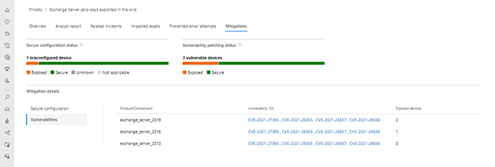
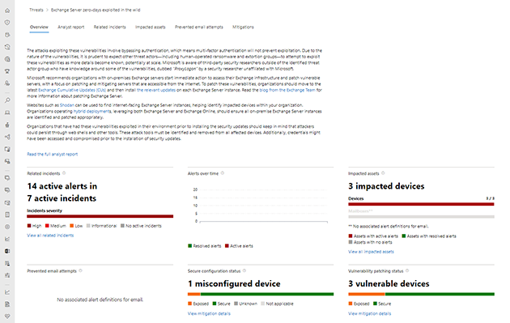
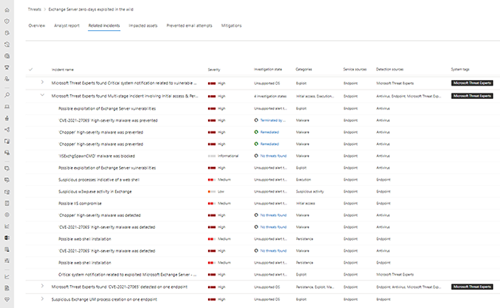
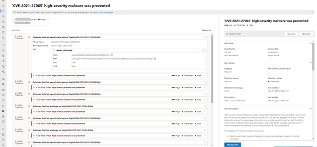
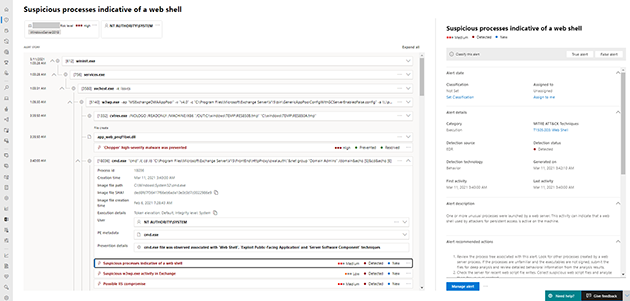
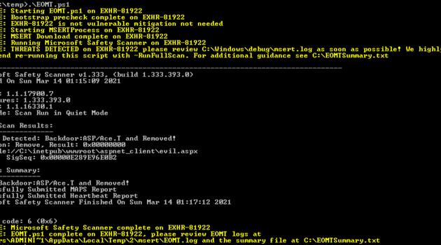
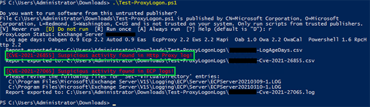
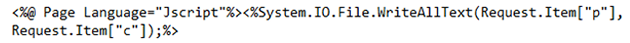

「[Guidance for responders: Investigating and remediating on-premises Exchange Server vulnerabilities](https://msrc-blog.microsoft.com/2021/03/16/guidance-for-responders-investigating-and-remediating-on-premises-exchange-server-vulnerabilities/#Have_I_been_compromised)」の日本語抄訳です。

最近一般に公開され、既に攻撃が確認されているオンプレミスの Exchange Server の脆弱性、CVE-2021-26855/CVE-2021-26858/CVE-2021-26857/CVE-2021-27065 を利用した脅威に対応するお客様のために、このガイダンスを公開します。これらの脆弱性への対応が正しく実施されない場合、お客様の Exchange 環境や、社内ネットワークの他の箇所へ侵害される可能性があります。

これらの脆弱性の緩和と、攻撃者が自社環境を侵害しているかの調査は、並行して実施してください。[3 月に公開した Exchange のセキュリティ更新プログラム](https://techcommunity.microsoft.com/t5/exchange-team-blog/released-march-2021-exchange-server-security-updates/ba-p/2175901)を適用することは、(再)感染を防ぐために重要ですが、既にサーバーを侵害した攻撃者を取り除くことはできません。調査の結果、改善策が必要な場合があります。下記の質問を確認するために、このガイダンスを利用できます。

・どのように攻撃が実行されるのか？

・自組織はこの脅威に対して脆弱なのか？

・どのように脅威を緩和するのか？

・自組織は侵害されているのか？

・どの回復策を選択すればよいのか？

・どのように自組織はこの脅威から守ればよいのか？どのように疑わしい動きを監視すればよいのか？

マイクロソフトはこれらの脅威を監視し続け、組織が一連の攻撃を特定して修復し攻撃から保護できるように最新のツールや調査ガイダンスを提供していきます。これらの脅威やその背後に潜む脅威アクターに関する知識を深め、新たな詳細情報や推奨事項がある場合には、このガイダンスを更新します。更新があるか定期的にこのページをご確認ください。

## どのように攻撃が実行されるのか？

マイクロソフトは、オンプレミスの Exchange Server に影響する、4 つのゼロデイの脆弱性 (CVE-2021-26855/CVE-2021-26858/CVE-2021-26857/CVE-2021-27065) に対するセキュリティ更新プログラムを[公開](https://techcommunity.microsoft.com/t5/exchange-team-blog/released-march-2021-exchange-server-security-updates/ba-p/2175901)しました。これらの脆弱性は組み合わせで利用され、Exchange Server が稼働しているデバイス上での認証されていないリモートでのコード実行を許してしまいます。マイクロソフトでは、その後の攻撃中に Web シェルの植え込みやコード実行、データ抽出行為なども確認しています。多くの組織がモバイルやリモートワークでの利用のために Exchange Server をインターネットに展開していることが、この脅威による状況をさらに悪化させています。

多くの確認されている攻撃では、最初のステップとして、認証されていないリモートでのコード実行を許してしまう CVE-2021-26855 への攻撃を成功させ、Web シェルを通じて侵害された環境への永続的なアクセスを確立します。Web シェルは悪意あるコードの一部で、ASP や PHP、JSP といった Web 開発のプログラミング言語で書かれることが多いです。攻撃者は Web サーバーに Web シェルを植え込み、サーバー機能へのリモートアクセスやコード実行ができるようにします。Web シェルを使って攻撃者はコマンドの実行や Web サーバーからデータを搾取すること、また対象の組織に対してさらなる攻撃を仕掛ける踏み台としてそのサーバーを利用します。そのため、早急に脆弱性を緩和するだけではなく、攻撃者が作成した Web シェルといった、あらゆるバックドアを取り除くことも重要となります。

## 自組織はこの脅威に対して脆弱なのか？

**Exchange Server 2010/2013/2016/2019 をお使いの場合は、これらの脅威から保護するために 3 月に公開したセキュリティ更新プログラムを適用してください。**

ご利用の Exchange Server がこの攻撃に対して脆弱なのかを見極めるには、下記の手法が利用できます。

・Microsoft Defender for Endpoint を使う

・Nmap を使って Exchange Server をスキャンする

### Microsoft Defender for Endpoint

Microsoft Defender for Endpoint をお使いのお客様は、これらのリスクを理解するために、Microsoft 365 セキュリティ センターにある[脅威分析レポート](https://security.microsoft.com/threatanalytics3/4ef1fbc5-5659-4d9b-b32e-97a694475955/analystreport)を参照することができます。これには Exchange Server が Microsoft Defender for Endpoint に登録されている必要があります。現在監視下にないサーバーを登録する方法はこちらの [Docs 記事](https://docs.microsoft.com/ja-jp/windows/security/threat-protection/microsoft-defender-atp/configure-server-endpoints)をご参照ください。

### Nmap を使ってスキャン

Microsoft Defender for Endpoint に登録できないサーバーに対しては、Nmap スクリプトを使って URL や IP をスキャンすることで脆弱であるかを確認することができます。[_http-vuln-cve2021-26855.nse_](https://github.com/microsoft/CSS-Exchange/tree/main/Security#http-vuln-cve2021-26855nse) をご利用ください。

## どのように脅威を緩和するのか？

本脆弱性を緩和する最適かつ完全な方法は、サポート対象のバージョンに Exchange をアップデートし、最新の状態になっているかを確認することです。すぐにサポート対象の Exchange Server の CU にアップデートしてセキュリティ更新プログラムを適用することが難しい場合は、下記の追加の緩和策をご確認ください。これらの方法は最新の CU やセキュリティ更新プログラムを適用するまでの暫定的な緩和策です。

### 暫定的な緩和策を早急に適用

下記の緩和オプションは必要なセキュリティ更新プログラムを適用するまで Exchange Server を保護することができます。これらの解決策は暫定的な措置として考慮するべきですが、追加の緩和や調査が完了するまで安全性を強化する策として役立ちます。

・(**推奨**) [_EOMT.ps1_](https://aka.ms/eomt) の実行 - オンプレミス Exchange 緩和ツール (EOMT.ps1) は CVE-2021-26855 を緩和し、悪意あるファイルを発見し修復しようとします。このツールを実行すると、最初に CVE-2021-26855 に対してシステムが脆弱性であるかを確認し、その場合は緩和策をインストールします。そして Microsoft Safety Scanner (MSERT) を自動でダウンロードし実行します。Exchange Server がインターネットに接続されている場合に最適な方法となります。

・[_ExchangeMitigations.ps1_](https://github.com/microsoft/CSS-Exchange/tree/main/Security#exchangemitigationsps1) の実行 - ExchangeMitigations.ps1 のスクリプトは緩和策を適用しますが、追加のスキャンは実行しません。Exchange Server がインターネットに接続できない場合や、発見された悪意ある活動を削除するために Microsoft Safety Scanner を使用したくないお客様へのオプションとなります。

### サポート対象の Exchange Server の CU を適用

本脆弱性を緩和する最適かつ完全な方法は、サポート対象のバージョンに Exchange をアップデートし、すべてのセキュリティ更新プログラムを適用することです。**これは侵害に対して最も強力な保護を実現する推奨の解決策です。**詳しくは「[Released: March 2021 Exchange Server Security Updates](https://techcommunity.microsoft.com/t5/exchange-team-blog/released-march-2021-exchange-server-security-updates/ba-p/2175901)」、もしくは下記のガイダンスビデオをご参照ください。

https://youtu.be/7gtO2G6Zack

### 過去の CU にセキュリティ修正 (hotfix) を適用

サポート対象の CU にアップデートするために追加の時間や計画が必要な組織向けに、個別のセキュリティ修正 (hotfix) が利用可能となっています。これらのセキュリティ修正 (hotfix) を過去の CU に適用することは、本脆弱性に対しては有効ですが、他の脆弱性のセキュリティ リスクに対応することにはなりません。サポート対象の CU にアップデートするまでの暫定的な解決策としてのみ推奨します。詳しくは「[March 2021 Exchange Server Security Updates for older Cumulative Updates of Exchange Server](https://techcommunity.microsoft.com/t5/exchange-team-blog/march-2021-exchange-server-security-updates-for-older-cumulative/ba-p/2192020)」をご参照ください。

### Exchange Server を隔離

脆弱性が悪用されるリスクを軽減するために、443 ポートからの受信方向の接続をブロックし、パブリック インターネットから孤立させます。

・セキュリティ更新プログラムを適用するまで、受信方向のインターネットトラフィックからの 443 ポートをブロックすることで暫定的に保護することができますが、それにより在宅勤務や、他の VPN を使わないリモートワークへの影響が考えられ、機能性の低下につながります。また既に社内ネットワークに侵入した攻撃者への保護にはなりません。

・この策を実現する最も包括的な方法は、現在受信方向の 443 のトラフィックをルーティングしているファイヤーウォールを使ってトラフィックをブロックすることです。Windows Firewall を使って実現することができますが、トラフィックをブロックする前に、すべての受信方向の 443 トラフィックのルールを削除する必要があります。

## 自組織は侵害されているのか？

本脆弱性によってご利用の Exchange Server が侵害されているかを見極めるにはいくつかのオプションが利用可能となっています。

・Microsoft Defender for Endpoint

・マイクロソフトが一般に公開したツール

Microsoft Defender for Endpoint が実行されていない場合は、マイクロソフトが公開したツールのセクションに移動してください。もし実行されている場合は、両方の方法を実施することをお勧めします。

### Microsoft Defender for Endpoint

Microsoft Defender for Endpoint を利用することで、Security Posture を理解することやや脅威を調査すること、本脆弱性を利用した攻撃に対する復旧策を取ることができます。Microsoft Defender for Endpoint を使ったガイダンスは下記のビデオをご参照ください。

https://youtu.be/bitgE0CCmV4

・Microsoft 365 セキュリティセンターの[脅威レポート](https://security.microsoft.com/threatanalytics3/4ef1fbc5-5659-4d9b-b32e-97a694475955/overview)を確認し、攻撃の兆候 (IOC) がないかを確認します。Microsoft 365 セキュリティセンターの脅威レポートの分析レポートには、この脅威やアクター、攻撃、TTP の詳細情報が絶えず更新されています。概要ページでは、Impacted assets セクションにすべての影響を受けたデバイスが表示されます。Related incidents セクションでは検出された攻撃や攻撃が成功した後の活動に対する警告が表示されます。

・Impacted assets セクションにて impacted (影響あり) と評価されたデバイスがあり、有効なアラートやインシデントがある場合には、インシデントをクリックして攻撃の拡がりを理解してください。

・Microsoft Defender for Endpoint は、この脅威のいくつかのコンポーネントをブロックし、関連した悪意ある活動をさらに検出することができます。これらに関しては Microsoft Defender セキュリティセンターで警告が上がります。Microsoft Defender for Endpoint は、CVE-2021-26855 とともに特権昇格のために利用される、認証成功後のファイル書き込みの脆弱性 CVE-2021-27065 への攻撃の試みなど、今回の攻撃で確認されている重要な活動を未然に防ぎます。

・Microsoft Defender for Endpoint は、攻撃者がマシン上での永続的な侵入のために利用するいくつかのテクニックを含め、攻撃が成功した後の活動も検出します。”Blocked” と表示された警告は検出された脅威は修復までされたことを示唆しています。”Detected” と表示された警告はセキュリティ分析者のレビューや手動での修復が必要となります。

・Web シェルや他の攻撃ツールによる、Exchange フォルダへの予期しないファイルドロップや実行の可能性を検索するのために、Advanced hunting を利用することができます。この脅威に関連した高度なハンディング技術は、「[Analyst report in Threat Analytics](https://security.microsoft.com/threatanalytics3/4ef1fbc5-5659-4d9b-b32e-97a694475955/overview)」や「[GitHub queries repository](https://github.com/microsoft/Microsoft-365-Defender-Hunting-Queries)」をご参照ください。

### マイクロソフトが一般に公開したツール

下記のマイクロソフトが公開したツールは、Exchange Server が侵害されていないかを調査する際に役に立ちます。調査の一部として両方のツールを実行することをお勧めします。

#### オンプレミス Exchange 緩和ツール

Exchange Server の管理者として EOMT.ps1 を[ダウンロード](https://aka.ms/eomt)し実行することで、最新バージョンの Microsoft Safety Scanner (MSERT) が自動的に実行されます。MSERT は、攻撃者が永続的にサーバーに侵入するために利用するバックドアとなる [Web シェル](https://www.microsoft.com/security/blog/2020/02/04/ghost-in-the-shell-investigating-web-shell-attacks/)を発見し修復します。オンプレミス Exchange 緩和ツールの使い方のガイダンスは下記のビデオをご参照ください。

https://youtu.be/BE_MO0xwjFI

・スキャンが完了すると、EOMT.ps1 は発見し除去した悪意あるファイルを表示します。このツールによって悪意あるファイルが発見され除去された場合は「どの改善策を取ればいいのか？」のセクションに移動してください。もし悪意あるファイルが見つからなかった場合は、”No known threats detected” と表示されます。

・もしこの最初のスキャンで悪意あるファイルの証拠が見つからなかった場合は、“_.\\EOMT.ps1 -RunFullScan_” にてフルスキャンを実行することができます。これは、Exchange Server 上のファイル数や環境にも依りますが、数時間から数日かかる場合があります。

・スクリプトが Microsoft Safety Scanner (MSERT) をダウンロードできない場合は、別途ダウンロードし手動にて Exchange Server に [MSERT](https://docs.microsoft.com/en-us/windows/security/threat-protection/intelligence/safety-scanner-download) をコピーすることができます。そして管理者権限で直接実行ファイルを起動します。画面の指示に従い、Quick か Full スキャンを選択してください。MSERT は最新の保護が含まれるよう、実行するごとに、新しいバージョンをダウンロードしてください。Microsoft Safety Scanner を実行する方法のガイダンスは下記のビデオをご参照ください。

https://youtu.be/BClIOXku5UM

#### Test-ProxyLogon.ps1

管理者権限で [Test-ProxyLogon.ps1](https://github.com/microsoft/CSS-Exchange/tree/main/Security#test-proxylogonps1) スクリプトを実行することで、Exchange や IIS のログを分析し、攻撃者の活動の可能性を発見することができます。Test-ProxyLogon スクリプトの使い方のガイダンスは下記のビデオをご参照ください。

https://youtu.be/FZm3uekVHL8

**重要**: このツールは利用方法や出力を改善するためにアップデートされ続けていますので、このツールを使った調査が数日かかる場合は、少なくとも 1 日に 1 回は再ダウンロードしてください。

Test-ProxyLogon スクリプトの出力結果を調査する方法のガイダンスは下記のビデオをご参照ください。

https://youtu.be/bHX2CrHhcS4

ステップ １ - スクリプトの出力結果からリスクを見極めます:

・スクリプトにて攻撃者の活動が見つからなかった場合は、”**Nothing suspicious detected**” と表示されます。この場合は「どの回復策を選択すればよいのか？」のセクションに移動してください。

・もし攻撃者の活動が見つかった場合は、悪用の形跡が見つかった脆弱性を表示し、_Test-ProxyLogonLogs_ ディレクトリで特定された出力パスに保存されたログを収集します。この場合は下記の修復するためのステップを実行します。

出力例)

ステップ 2 - CVE-2021-27065 の調査:

・もし CVE-2021-27065 が表示されたら、_Set-OabVirtualDirectory_ を含んだ行にて特定されたログを調査します。これはサーバーにファイルが書き込まれたことを示唆しています。

・Web サーバーのディレクトリに新規の、または最近変更された aspx ファイルや見慣れない _&lt;script>_ ブロックを含んだ他の形式のファイルがないかを調査します。これは攻撃者が Web シェルのファイルを配置したことを示唆しています。以下はそのような _&lt;script>_ ブロックの例です。この場合は「どの回復策を選択すればよいのか？」のセクションに移動してください。

ステップ 3 - CVE-2021-26857 の調査:

・もし CVE-2021-26857 が表示されたら、_&lt;servername>Cve-2021-26857.csv_. と表示されたログを調査します。これは攻撃者が SYSTEM 権限で任意のファイルを実行したかもしれないことを示唆しています。この場合は「どの回復策を選択すればよいのか？」のセクションに移動してください。

ステップ 4 - CVE-2021-26858 の調査:

・もし CVE-2021-26858 が表示されたら、_&lt;servername>Cve-2021-26858.csv_. と表示されたログを調査します。

・*\*\\Microsoft\\ExchangeServer\\V15\\ClientAccess\\OAB\\Temp\\\* *以外のパスを出力している場合は、攻撃者が任意のファイルを書き込みしたかもしれないことを示唆しています。この場合は「どの改善策を取ればいいのか？」のセクションに移動してください。

ステップ 5 - CVE-2021-26855 の調査:

・もし CVE-2021-26855 が表示されたら、_&lt;servername>Cve-2021-26855.csv_. と表示されたログを調査します。

・_Autodiscover.xml_ だけを含んだ AnchorMailbox が表示された場合は、攻撃者がさらなる侵害の前段としてインフラストラクチャーをスキャンしていることを示唆しています。この場合は「どの回復策を選択すればよいのか？」のセクションに移動してください。

・*/ews/exchange.asmx *を含んだ AnchorMailbox が表示された場合は、攻撃者がメールを密かに取り出そうとしているかもしれないことを示唆しています。この場合は、_\\V15\\Logging\\EWS_ の Exchange web services (EWS) ログを検査し攻撃者がメールボックスにアクセスしていないかを確認してください。そして「どの回復策を選択すればよいのか？」の対応に進んでください。

## どの回復策を選択すればよいのか？

・「自組織は侵害されているのか？」のステップにて、スキャニングや権限のない email へのアクセス、Web シェルによる永続的な侵入、攻撃が成功した後の活動といった攻撃の可能性のスコープが確定されます。

・Exchange Server を復旧するか、メールサービスをクラウドに移行するかを決定します。[対象](https://docs.microsoft.com/fasttrack/eligibility)となるライセンスを 500 以上がある Office 365 テナントをお持ちのお客様は、データ移行支援のために [FastTrack](https://www.microsoft.com/fasttrack/fasttrack-data-migration) を利用することができます。

・該当する改善策を実行します:

・_Microsoft Defender for Endpoint や手動での調査によって、認証情報の収集やラテラルムーブメントに関連した攻撃成功後の活動が確認された場合:_

\-> お客様のインシデント対応計画を実行してください。インシデント対応チームに調査の詳細を共有してください。

\-> CSS セキュリティチームや Microsoft Detection and Response Team (DART) と対応を開始し、Microsoft Defender for Endpoint をお使いの場合は、Windows Server を Microsoft Defender for Endpoint に登録する[手順](https://docs.microsoft.com/en-us/windows/security/threat-protection/microsoft-defender-atp/configure-server-endpoints)をご確認ください。

・_Web シェルが検出された場合:_

\-> 環境を綺麗にして Exchange Server を復旧します。

1. 1. 1. 組織にて証拠保全が必要な場合は、フォレンジック証拠を保存します。
   2. Exchange Server を物理的に、または Firewall ルールで仮想的にネットワークから切断します。
   3. Exchange Server を再起動します。
   4. W3WP サービスを停止します。
   5. 上記の調査にて検出された悪意ある aspx ファイルをすべて除去します。
   6. 下記のスクリプトを使ってシステム上のすべての一時的な ASP.NET ファイルを削除します。

iisreset /stop $tempAspDir = "$env:Windir\\Microsoft.NET\\Framework64\\$(\[System.Runtime.InteropServices.RuntimeEnvironment]::GetSystemVersion())\\Temporary ASP.NET Files" mkdir 'C:\\forensicbackup' Copy-Item -Recurse -Path $tempAspDir -Destination 'C:\\forensicbackup' rm -r -Force \$tempAspDir iisreset /start

1. 1. 7. “_.\\EOMT.ps1 -RunFullScan_” にて [_EOMT.ps1_](https://aka.ms/eomt) をフルスキャンします。_EOMT.ps1_ の実行に関する詳細は「自組織は侵害されているのか？」をご参照ください。
   2. セキュリティ更新プログラムを適用します。詳しくは「自組織は侵害されているのか？」をご参照ください。
   3. 管理者の資格情報をリセットします。
   4. 可能であれば、こちらの[ガイダンス](https://docs.microsoft.com/en-us/windows/security/threat-protection/intelligence/submission-guide)に従って、疑わしい悪意あるファイルをマイクロソフトでの分析のために共有してください。その際に、Additional Information のテキストボックスに “ExchangeMarchCVE” と入力してください。

_・メールボックスへのアクセスや抽出が検出された場合\_\_:_

1. 1. Exchange Server をネットワークから切断します。
   2. セキュリティ更新プログラムを適用します。
   3. “_.\\EOMT.ps1 -RunFullScan_” にて [_EOMT.ps1_](https://aka.ms/eomt) をフルスキャンします。_EOMT.ps1_ の実行に関する詳細は「自組織は侵害されているのか？」をご参照ください。
   4. オペレーションを再開します。

_・攻撃者のスキャンだけの活動が検出された場合\_\_:_

1. 1. Exchange Server をネットワークから切断します。
   2. セキュリティ更新プログラムを適用します。
   3. オペレーションを再開します。

## どのように自組織はこの脅威から守ればよいのか？どのように疑わしい動きを監視すればよいのか？

・Exchange Server 上で Microsoft Defender Antivirus や Microsoft Defender for Endpoint を実行している場合には追加の保護や調査するための機能が利用できます。もしどちらもまだインストールしていない場合は、今後追加の保護を利用できるようにするためにインストールすることを強くお勧めします。

・Microsoft Defender for Endpoint を利用しているが、Exchange Server がまだ登録されていない場合は、Windows Server を Microsoft Defender for Endpoint に登録する[手順](https://docs.microsoft.com/en-us/windows/security/threat-protection/microsoft-defender-atp/configure-server-endpoints)をご確認ください。

・Microsoft Defender for Endpoint を利用していない場合は、Microsoft Defender for Endpoint の 90 日間の試供期間を提供しています。ただし、商業目的の Exchange Server へのサポートは、MSERT での提供範囲を超えた、継続した調査や詳細な攻撃成功後のセキュリティイベントの検出が必要となるため対象外となります。そして、「[setting up Microsoft Defender for Endpoint](https://docs.microsoft.com/en-us/windows/security/threat-protection/microsoft-defender-atp/production-deployment)」や「[onboarding your Exchange Server](https://docs.microsoft.com/en-us/windows/security/threat-protection/microsoft-defender-atp/configure-server-endpoints)」のステップを実行してください。

**Microsoft’s Detection and Response Team (DART) Microsoft 365 Defender Team** **CSS Security Incident Response**

This blog and its contents are subject to the [Microsoft Terms of Use](https://www.microsoft.com/en-us/legal/intellectualproperty/copyright). All code and scripts are subject to the applicable terms on Microsoft’s GitHub Repository (e.g., the MIT License).
