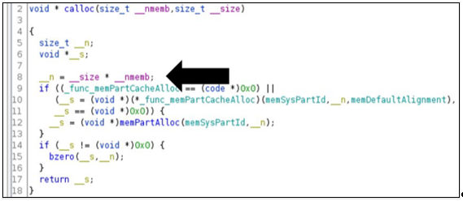

<!-- wp:paragraph -->

Microsoft’s Section 52, the Azure Defender for IoT security research group, recently uncovered a series of critical memory allocation vulnerabilities in IoT and OT devices that adversaries could exploit to bypass security controls in order to execute malicious code or cause a system crash.

These remote code execution (RCE) vulnerabilities cover more than 25 CVEs and potentially affect a wide range of domains, from consumer and medical IoT to Industrial IoT, Operational Technology (OT), and industrial control systems.

The vulnerabilities exist in standard memory allocation functions spanning widely used real-time operating systems (RTOS), embedded software development kits (SDKs), and C standard library (libc) implementations. These findings have been shared with vendors through responsible disclosure led by the Microsoft Security Response Center (MSRC) and the Department of Homeland Security (DHS), enabling these vendors to investigate and patch the vulnerabilities.

For a full list of affected products and CVEs, please visit the DHS website: [ICSA-21-119-04 Multiple RTOS](https://us-cert.cisa.gov/ics/advisories/icsa-21-119-04) .

Given the pervasiveness of IoT and OT devices, these vulnerabilities, if successfully exploited, represent a significant potential risk for organizations of all kinds. To date, Microsoft has not seen any indications of these vulnerabilities being exploited. However, we strongly encourage organizations to patch their systems as soon as possible.

At the same time, we recognize that patching IoT/OT devices can be complex. For devices that cannot be patched immediately, we recommend mitigating controls such as: reducing the attack surface by minimizing or eliminating exposure of vulnerable devices to the internet; implementing network security monitoring to detect behavioral indicators of compromise; and strengthening network segmentation to protect critical assets, as described in the mitigations section at the end of this blog post.

Note that Microsoft Azure RTOS ThreadX is not vulnerable in its default configuration. The [Azure RTOS ThreadX documentation](https://docs.microsoft.com/en-us/azure/rtos/threadx/chapter2) has been updated to state that it is “only safe to disable error checking if the application can absolutely guarantee all input parameters are always valid under all circumstances, including input parameters derived from external input.”

<!-- /wp:paragraph -->

<!-- wp:heading {"level":4} -->

#### **“BadAlloc”: Running malicious code through vulnerable memory functions**

<!-- /wp:heading -->

<!-- wp:paragraph -->

“BadAlloc” is the name assigned by Microsoft’s Section 52 to the family of vulnerabilities discovered in embedded IoT and OT operating systems and software to describe this class of memory overflow vulnerabilities. All of these vulnerabilities stem from the usage of vulnerable memory functions such as malloc, calloc, realloc, memalign, valloc, pvalloc, and more. Our research shows that memory allocation implementations written throughout the years as part of IoT devices and embedded software have not incorporated proper input validations. Without these input validations, an attacker could exploit the memory allocation function to perform a heap overflow, resulting in execution of malicious code on a target device.

The memory allocation vulnerabilities can be invoked by calling the memory allocation function, such as malloc(VALUE), with the VALUE parameter derived dynamically from external input and being large enough to trigger an integer overflow or wraparound. The concept is as follows: When sending this value, the returned outcome is a freshly allocated memory buffer. While the size of the allocated memory remains small due to the wraparound, the payload associated with the memory allocation exceeds the actual allocated buffer, resulting in a heap overflow. This heap overflow enables an attacker to execute malicious code on the target device. The following are “BadAlloc” examples:

<!-- /wp:paragraph -->

<!-- wp:image {"id":13113,"sizeSlug":"large","linkDestination":"none"} -->

<!-- /wp:image -->

<!-- wp:image {"id":13114,"sizeSlug":"large","linkDestination":"none"} -->

<!-- /wp:image -->

<!-- wp:heading {"level":4} -->

#### **Mitigating “BadAlloc” vulnerabilities**

<!-- /wp:heading -->

<!-- wp:paragraph -->

We recommend the following mitigations for organizations with IoT and OT devices:  
• **Patch.** Follow vendor instructions for applying patches to the affected products.  
• **If you can’t patch, monitor**. Since most legacy IoT and OT devices don’t support agents, use an IoT/OT-aware network detection and response (NDR) solution like [Azure Defender for IoT](https://azure.microsoft.com/en-us/services/azure-defender-for-iot/) and SIEM/SOAR solution like [Azure Sentinel](https://azure.microsoft.com/en-us/services/azure-sentinel) to auto-discover and continuously monitor devices for anomalous or unauthorized behaviors, such as communication with unfamiliar local or remote hosts. These are essential elements of implementing a Zero Trust strategy for IoT/OT.  
•** Reduce the attack surface** by eliminating unnecessary internet connections to OT control systems and implementing VPN access with multi-factor authentication (MFA) when remote access is required. The DHS warns that VPN devices may also have vulnerabilities and should be updated to the most current version available.  
•** Segment**. Network segmentation is important for Zero Trust because it limits the attacker’s ability to move laterally and compromise your crown jewel assets, after the initial intrusion. In particular, IoT devices and OT networks should be isolated from corporate IT networks using firewalls.

<!-- /wp:paragraph -->

<!-- wp:image {"id":13104,"sizeSlug":"large","linkDestination":"none"} -->

<!-- /wp:image -->

<!-- wp:heading {"level":4} -->

#### **About Section 52**

<!-- /wp:heading -->

<!-- wp:paragraph -->

Microsoft’s Section 52 is the security research group for [Azure Defender for IoT](https://azure.microsoft.com/en-us/services/azure-defender-for-iot/). The group is comprised of security researchers and data scientists with deep domain expertise in IoT/OT threat hunting, malware reverse engineering, incident response, and data analysis. The group also provides ongoing threat intelligence updates to Azure Defender for IoT, enabling detection and mitigation of the most recent IoT/OT vulnerabilities and threats.

<!-- /wp:paragraph -->

<!-- wp:paragraph -->

**AZ Defender team**

<!-- /wp:paragraph -->
