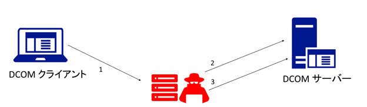

<!-- wp:paragraph -->

2021 年 9 月 27 日：

<!-- /wp:paragraph -->

マイクロソフトは、2021 年 6 月 8 日 (米国時間) に、[分散コンポーネントオブジェクトモデル/Distributed Component Object Model（DCOM）](https://docs.microsoft.com/ja-jp/openspecs/windows_protocols/ms-dcom/4a893f3d-bd29-48cd-9f43-d9777a4415b0) に存在する脆弱性情報[ CVE-2021-26414](https://msrc.microsoft.com/update-guide/vulnerability/CVE-2021-26414) を公開するとともに、脆弱性に対応するためのセキュリティ更新プログラムを公開しました。

この脆弱性から、DCOM が利用される環境を完全に保護するために、DCOM で利用される既定の認証のセキュリティ強化を実施します。DCOM は、Windows デバイスだけではなく、非 Windows のデバイスにおいても実装されています。このため、非 Windows デバイスとの互換性を考慮し、本脆弱性への対処を段階的に実施する予定です。

この脆弱性に対応するためには、企業・組織にて管理している端末に 2021 年 6 月のセキュリティ更新プログラムを展開するだけではなく、追加の対応ステップが必要となる場合があります。また、今後予定されている既定の認証の強化に備え、管理している環境内のクライアントまたはサーバー アプリケーションが、強化の変更を有効にした場合にも期待通り動作するか確認することを推奨しています。

そこで、本ブログでは IT 管理者向けに、本脆弱性の概要と必要となる作業の概要を説明します。

**&lt;注意 >** 本脆弱性の詳細および最新の情報は、下記のセキュリティ更新プログラム ガイドのページ、およびサポート技術情報 (KB) を参照してください。

[Windows DCOM Server セキュリティ機能のバイパス (CVE-2021-26414)](https://msrc.microsoft.com/update-guide/vulnerability/CVE-2021-26414)

[KB5004442 - WINDOWS DCOM Server セキュリティ機能バイパスの変更を管理する (CVE-2021-26414)](https://support.microsoft.com/help/5004442)

### **\[1] 脆弱性の概要**

DCOM は、リモート プロシージャ コール (RPC) を使用してアプリケーション オブジェクトを公開するプロトコルです。DCOM は、ネットワークデバイスのソフトウェア コンポーネント間の通信に使用されます。

今回の DCOM の脆弱性 ([CVE-2021-26414](https://msrc.microsoft.com/update-guide/vulnerability/CVE-2021-26414)) が悪用された場合、セキュリティ機能がバイパスされ、悪意のある攻撃が DCOM サーバーに対して行われるなどの被害を生じる可能性があります。

なお、脆弱性を悪用するためには、攻撃者は特別に細工されたサーバー共有やウェブサイトをホストし、DCOM クライアントを、何かしらの方法でこれらの共有やウェブサイトに接続させる必要があります。

代表的な攻撃シナリオ:

1. 攻撃者はまず DCOM クライアントを、何かしらの方法で特別に細工されたサーバーに接続するよう誘導し脆弱性を悪用する攻撃を行う (例: 電子メールによるフィッシング）
2. 攻撃で得られた情報を用いて DCOM サーバーにアクセスする
3. DCOM サーバーに攻撃を仕掛ける

この脆弱性から、DCOM が利用される環境を完全に保護するためには、クライアントおよびサーバーにて、より強力な認証レベルが利用されている状態にする必要があります。具体的には、DCOM クライアントでより強力な認証レベル ([RPC_C_AUTHN_LEVEL_PKT_INTEGRITY](https://docs.microsoft.com/windows/win32/rpc/authentication-level-constants)) を利用し、また、DCOM サーバーでは強力な認証レベルを利用していない場合は接続を拒否する必要があります。マイクロソフトでは、認証レベルを強化するための措置を段階的に実施する予定です。

### **\[2] 影響を受ける環境**

今回の脆弱性は、すべてのサポートされているバージョンの Windows に影響します。

影響を受ける環境の詳細は、セキュリティ更新プログラムガイド [Windows DCOM Server セキュリティ機能のバイパス (CVE-2021-26414)](https://msrc.microsoft.com/update-guide/vulnerability/CVE-2021-26414) を参照してください。

### **\[3] 段階的な対処のスケジュール**

DCOM は、Windows デバイスだけではなく、非 Windows のデバイスにおいても実装されています。このため、非 Windows デバイスの互換性を考慮し、本脆弱性への対処を段階的に実施する予定です。

|                        |                                                                                                                                                                                                                                                                                                                                                                                                                                                                                                                                                                                                                                                                                                                                                                                                                                       |
| ---------------------- | ------------------------------------------------------------------------------------------------------------------------------------------------------------------------------------------------------------------------------------------------------------------------------------------------------------------------------------------------------------------------------------------------------------------------------------------------------------------------------------------------------------------------------------------------------------------------------------------------------------------------------------------------------------------------------------------------------------------------------------------------------------------------------------------------------------------------------------- |
| 更新プログラムの公開日 | 内容                                                                                                                                                                                                                                                                                                                                                                                                                                                                                                                                                                                                                                                                                                                                                                                                                                  |
| 2021 年 6 月 8 日      | 2021 年 6 月 8 日に公開されたセキュリティ更新プログラムを適用することで、以下の変更が行われます・DCOM クライアントとしての動作: 既定でセキュリティが強化された認証レベルを利用するようになります (RPC_C_AUTHN_LEVEL_PKT_INTEGRITY を利用)・DCOM サーバーとしての動作: セキュリティ強化の変更を有効または無効にできるレジストリキーが追加されます。ただし、既定では無効化されており、動作に変更はありません。今後実施される既定の動作の変更に備え、レジストリ キーを使用して有効にし、組織内のテストを実施することを推奨しています。セキュリティ強化の変更を「有効」にした場合、認証レベルを満たさない接続はエラーが発生します。Windows では、2021 年 6 月 8 日に公開されたセキュリティ更新プログラムを適用することで既定でセキュリティが強化された認証レベルを利用するようになりますが、非 Windows の環境にて検証する必要があります。 |
| 2021 年 9 月 14 日     | 2021 年 9 月 14 日に公開されたセキュリティ更新プログラムを適用することで、セキュリティ強化の変更によらず、強力な認証レベルを利用していない接続を検知した際、ID：10036 イベントが記録されるようになりました。認証レベルを満たさない接続は警告として、下記のようなイベントが記録されます。SYSTEM Event ID：10036 ソース：DistributedCOM 内容： サーバー側の認証レベル ポリシーでは、アドレス XX.XX.XX.XX からのユーザー XXXX SID (S-1-5-XX-XX) が DCOM サーバーのライセンス認証を行うことは、 許可されていません。 クライアント アプリケーションで、ライセンス認証レベルを最低でも RPC_C_AUTHN_LEVEL_PKT_INTEGRITY に上げてください。                                                                                                                                                                                                   |
| 2022 年第 1 四半期     | セキュリティ強化の変更を「有効」に変更します。ただし、レジストリキーで、セキュリティ強化の変更を「無効」に設定することが可能です。                                                                                                                                                                                                                                                                                                                                                                                                                                                                                                                                                                                                                                                                                                    |
| 2022 年第 2 四半期     | セキュリティ強化の変更を「有効」に強制します。認証レベルを満たさない接続はエラーが発生します。レジストリキーで、セキュリティ強化の変更を「無効」に設定することはできません。                                                                                                                                                                                                                                                                                                                                                                                                                                                                                                                                                                                                                                                          |

補足: 新しい更新プログラムがリリースされたときに通知を受け取れるように、マイクロソフト テクニカル セキュリティ通知 (<https://aka.ms/MSTN>) を登録することをお勧めします。

### **\[4] 必要となる作業**

IT 管理者は、次の作業を実施することを推奨します。

(1) マイクロソフトの公式ドキュメントを確認し、脆弱性の詳細、および必要となる対処の詳細を確認し、自組織への影響を評価します。

- [Windows DCOM Server セキュリティ機能のバイパス (CVE-2021-26414)](https://msrc.microsoft.com/update-guide/vulnerability/CVE-2021-26414)
- [KB5004442 - WINDOWS DCOM Server セキュリティ機能バイパスの変更を管理する (CVE-2021-26414)](https://support.microsoft.com/help/5004442)

(2) 2021 年 ８月以降の Windows 用の月例セキュリティ更新プログラムを、自組織内のすべてのデバイスにインストールします。**_(注 1)_**

(3) 自組織の環境を検証するための環境で、８月以降の Windows 用の月例セキュリティ更新プログラムの適用及び、DCOM サーバーとして稼働する端末でセキュリティ強化の変更を有効にします。セキュリティ強化を有効にするために “RequireIntegrityActivationAuthenticationLevel” レジストリキーを変更します。詳細は、[KB5004442 - WINDOWS DCOM Server セキュリティ機能バイパスの変更を管理する (CVE-2021-26414)](https://support.microsoft.com/help/5004442) を参照してください。

(4) 前のステップで用意した環境で、DCOM アプリケーションの機能に影響がないか、テストを実施します。セキュリティ強化の変更を「有効」にした場合、認証レベルを満たさない接続は DCOM アプリケーションでエラーが発生します (エラーハンドリングの詳細はアプリケーション開発元にてご確認ください)。Windows では、2021 年 6 月 8 日に公開されたセキュリティ更新プログラムを適用することで既定でセキュリティが強化された認証レベルを利用するようになりますが、非 Windows の環境にて別途検証する必要があります。テスト中に問題を発見した場合は、マイクロソフトサポートおよびその他の関係する製品ベンダー等に確認してください。

### **\[5] まとめ**

今回の脆弱性に対する保護は、多くの環境で利用されている DCOM の動作に影響することから、互換性による問題を最小限にしたいと考え、段階的な措置を実施することを決めました。IT 管理者のみなさまには、テストの実施などの作業が必要となりますが、脆弱性への対応による問題を最小限にしながら、セキュリティを強化するために、どうかご協力をお願い致します。

また、この脆弱性は[協調的な脆弱性の公開](https://www.microsoft.com/ja-jp/msrc/cvd)の考えを元に、脆弱性の発見者とともに脆弱性を調査し、セキュリティ更新プログラムを公開しています。しかしながら、セキュリティ更新プログラムの公開後にその脆弱性の存在が明らかになると、セキュリティ更新プログラムを適用していない環境を狙い、脆弱性を悪用する可能性が生じます。どの脆弱性にも共通することですが、最新のセキュリティ更新プログラムを適用していない環境の場合は、早急にセキュリティ更新プログラムを適用することを検討してください。

垣内由梨香  
セキュリティ プログラム マネージャ  
セキュリティ レスポンス チーム

---

(注 1) DCOM の脆弱性 (CVE-2021-26414)は、2021 年 6 月の月例セキュリティ更新プログラムで最初に修正が行われました。このため、2021 年 6 月の月例セキュリティ更新プログラム以降の月例セキュリティ更新プログラムを適用することで脆弱性は修正されます。ただし、2021 年 6 月の月例セキュリティ更新プログラムを適用後に、リモートで WMI コマンドを実行した場合エラーになる問題が報告されており、この問題は 2021 年 8 月の月例セキュリティ更新プログラムで修正をしています。以上のことから、2021 年 8 月の月例セキュリティ更新プログラム以降のセキュリティ更新プログラムの適用を推奨しています。

---

更新履歴

2021 年 9 月 7 日： \[4] (2) (3) を更新しました。  
2021 年 9 月 27 日：\[3] 2021 年 9 月 14 日に実施した変更を追記しました。  
2021 年 10 月 20 日：段階的な対処のスケジュール変更に伴い、\[3] を更新しました。
