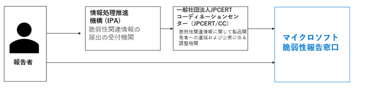
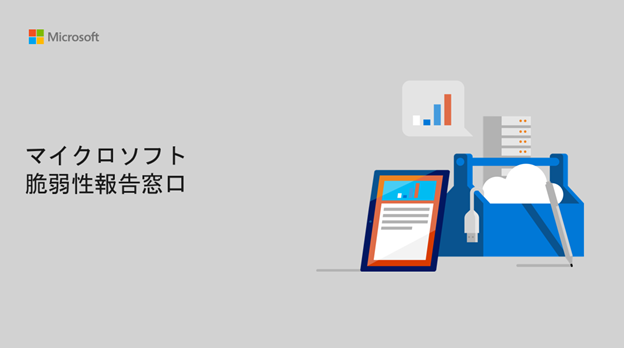

マイクロソフトでは、より安全・安心な製品・サービスを提供するため、[脆弱性報告窓口](https://www.microsoft.com/ja-jp/msrc?rtc=1)および報告者に対する[脆弱性報奨金](https://www.microsoft.com/ja-jp/msrc/bounty?rtc=1)等の報奨プログラムを実施し、マイクロソフト製品やサービスに影響を及ぼすセキュリティの脆弱性を幅広く調査しています。また、より地域に密接し、多くの皆様から脆弱性に関する情報を受け付けるために、[脆弱性の報告を日本語でも受け付け](https://msrc-blog.microsoft.com/2019/10/30/vulnerabilityresponsecenter/)ています。

日本では、ソフトウェア製品およびウェブアプリケーションの脆弱性に関する円滑な情報の流通と対策を図るために、[経済産業省の告示](http://www.meti.go.jp/policy/netsecurity/vul_notification.pdf)に基づき策定された[情報セキュリティ早期警戒パートナーシップガイドライン](https://www.ipa.go.jp/security/ciadr/partnership_guide.html)が運用されています。ソフトウェア製品およびウェブアプリケーションの脆弱性を発見した場合は、このガイドラインに従い、[脆弱性関連情報の届出](https://www.ipa.go.jp/security/vuln/report/)をすることが推奨されています。

こうした背景から、マイクロソフトの脆弱性報告窓口には、時折、この[脆弱性関連情報の届出](https://www.ipa.go.jp/security/vuln/report/)との関係についてご質問をいただくことがあります。例えば「[脆弱性関連情報の届出](https://www.ipa.go.jp/security/vuln/report/)をした場合でもマイクロソフトの脆弱性報告窓口に報告したほうがよいのか？」「[脆弱性関連情報の届出](https://www.ipa.go.jp/security/vuln/report/)と、マイクロソフトの脆弱性報告窓口はどちらに報告するべきか？」といった質問です。

結論から言うと、マイクロソフトが迅速に脆弱性の対応を開始するために、**マイクロソフトの脆弱性報告窓口に直接報告することを了承いただける場合は、直接マイクロソフトの\*\***[脆弱性報告窓口](https://www.microsoft.com/ja-jp/msrc?rtc=1)\***\*に報告をお願いいたします**。

マイクロソフトは、20 年以上にわたって、脆弱性対応の窓口を設け、脆弱性の対応を行う (いわゆる PSIRT) の組織として、業界を代表する脆弱性対応プログラムを運営してきています。また、自組織で CVE-ID を採番することができる [CVE Numbering Authority (CNA)](https://cve.mitre.org/cve/cna.html) でもあります。マイクロソフトの脆弱性窓口に直接報告をいただくことで、マイクロソフトは迅速に脆弱性対応のプロセスを開始することが可能となります。脆弱性の報奨金プログラム (バグ バウンティ) をはじめとし、マイクロソフトが運営している脆弱性に関するプロセスは、マイクロソフトの窓口に報告が到達した日時をもって、対応開始となります。同じ脆弱性が複数の報告者から報告された場合も、マイクロソフトの窓口に報告が到達した日時をもって、脆弱性の報告順序が判断されます。

一方で、マイクロソフトは、[情報セキュリティ早期警戒パートナーシップガイドライン](https://www.ipa.go.jp/security/ciadr/partnership_guide.html)に賛同しており、脆弱性関連情報の届出の受付機関である独立行政法人情報処理推進機構 (IPA) および脆弱性関連情報に関して製品開発者への連絡および公表に係る調整機関である一般社団法人 JPCERT コーディネーションセンター (JPCERT/CC) と連携を図り、対応を行っています。

[脆弱性関連情報の届出](https://www.ipa.go.jp/security/vuln/report/)が行われた脆弱性のうち、マイクロソフト製品に関連する脆弱性の場合は、JPCERT/CC からマイクロソフトの脆弱性報告窓口に連絡が行われます。このため、[脆弱性関連情報の届出](https://www.ipa.go.jp/security/vuln/report/)をした場合は、マイクロソフトの窓口に報告を行う必要は、必ずしもありません。(補足: 前述のように、マイクロソフトの脆弱性窓口に直接報告をいただくことで、マイクロソフトは迅速に脆弱性対応のプロセスを開始することが可能となり、また、マイクロソフトの窓口に報告が到達した日時をもって、脆弱性の報告順序が判断されるため、マイクロソフトの窓口への連絡を優先抱くことを推奨しています)

また、マイクロソフトの窓口に報告を行った場合は、マイクロソフトに脆弱性の情報は到達していることになりますので、マイクロソフトに脆弱性に関する情報を届けるという意味では必ずしも[脆弱性関連情報の届出](https://www.ipa.go.jp/security/vuln/report/)を行う必要がありません。(なお、[脆弱性関連情報の届出](https://www.ipa.go.jp/security/vuln/report/)を実施しない場合は、マイクロソフトの窓口と、IPA および JPCERT/CC で未修正の脆弱性報告の内容の連携は実施されません。また[脆弱性関連情報の届出](https://www.ipa.go.jp/security/vuln/report/)を実施しない場合は、その脆弱性に関する対応は[情報セキュリティ早期警戒パートナーシップガイドライン](https://www.ipa.go.jp/security/ciadr/partnership_guide.html)の範囲外となることにご留意ください。)

マイクロソフトの脆弱性報告窓口の概要と、その他のよくあるお問い合わせのポイントについて、マイクロソフト脆弱性報告窓口 ガイド (PDF) をまとめましたので、ぜひ併せてご確認ください。

[マイクロソフト脆弱性報告窓口 ガイド (PDF) ダウンロード](https://download.microsoft.com/download/2/9/5/295b78a4-7051-4873-a00c-4beaf416ccec/20210616_ReportingMicrosoftVulnerability.pdf)

マイクロソフトでは、各地域のセキュリティ研究者やセキュリティ団体との連携を重要視し、今後も、活発な連携を継続していきます。

ご質問、ご不明点がある場合は、[jpsecure@microsoft.com](mailto:jpsecure@microsoft.com) (日本語対応可能) までお問合せください。

セキュリティ レスポンス チーム セキュリティ プログラム マネージャ 脆弱性報告窓口 担当 垣内 由梨香
