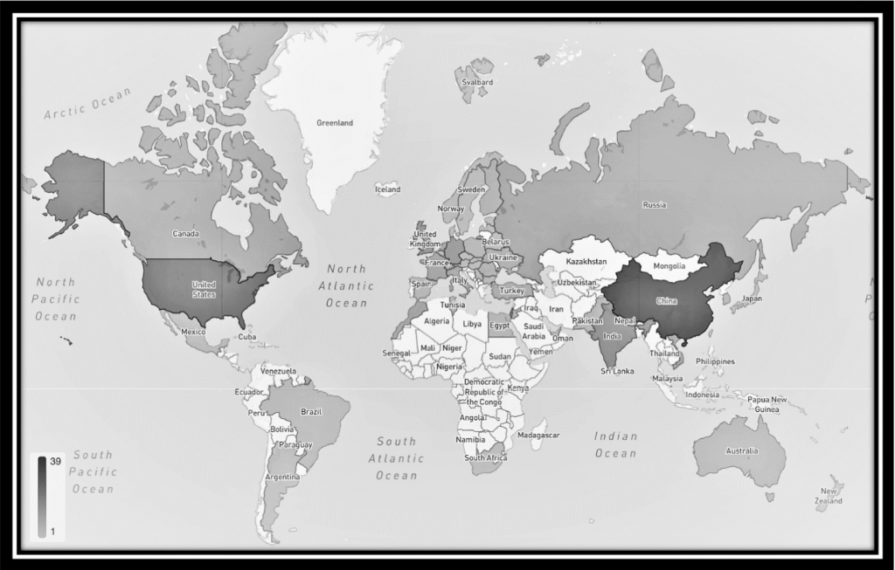

Partnering with the security research community is an important part of Microsoft’s holistic approach to defending against security threats. [Bug bounty programs](https://www.microsoft.com/en-us/msrc/bounty?rtc=1) are one part of this partnership. By discovering and reporting vulnerabilities to Microsoft through [Coordinated Vulnerability Disclosure (CVD)](https://www.microsoft.com/en-us/msrc/cvd), researchers continue to help us secure millions of customers.

Over the past 12 months, Microsoft awarded $13.6M in bug bounties to more than 340 security researchers across 58 countries. The largest award was $200K under the [Hyper-V Bounty Program](https://www.microsoft.com/en-us/msrc/bounty-hyper-v?rtc=1). With an average of more than \$10,000 USD per award across all programs, each of the over 1,200 eligible reports reflect the talent and creativity of the global security research community and their invaluable partnership in addressing the challenges of a constantly changing security environment.

\*Image provided by HackerOne for dates 7/1/2020 to 6/28/2021

### **What has changed in the past year?**

We’re constantly evaluating the threat landscape to evolve our programs and listening to feedback from researchers to help make it easier to share their research. This year, we introduced new challenges and scenarios to award research focused on the highest impact to customer security. These focus areas helped us not only discover and fix risks to customer privacy and security, but also offer researchers top awards for their high-impact work.

### **New and Updated Bug Bounty and Research Programs**

- [Windows Insider Preview Bounty Program](https://msrc-blog.microsoft.com/2020/07/24/updates-to-the-windows-insider-preview-bounty-program/), updated July 2020
- [Researcher Recognition Program](https://www.microsoft.com/en-us/msrc/researcher-recognition-program), updated February 2021
- [Microsoft Applications Bounty Program (Teams Desktop)](https://www.microsoft.com/en-us/msrc/bounty-applications), launched March 2021 NEW
- [SIKE Cryptographic Challenge](https://www.microsoft.com/en-us/msrc/sike-cryptographic-challenge?rtc=1), launched June 2021 NEW

A big THANK YOU to everyone who shared their research with Microsoft this year and for their partnership in securing millions of customers. We look forward to sharing more bounty program updates and improvements in the coming year as we continue to invest in our partnerships with the security research community and award.

Be sure to check back next month for the 2021 Most Valuable Security Researcher announcement!

_Jarek Stanley, Lynn Miyashita, and Madeline Eckert_  
_Microsoft Security Response Center_
