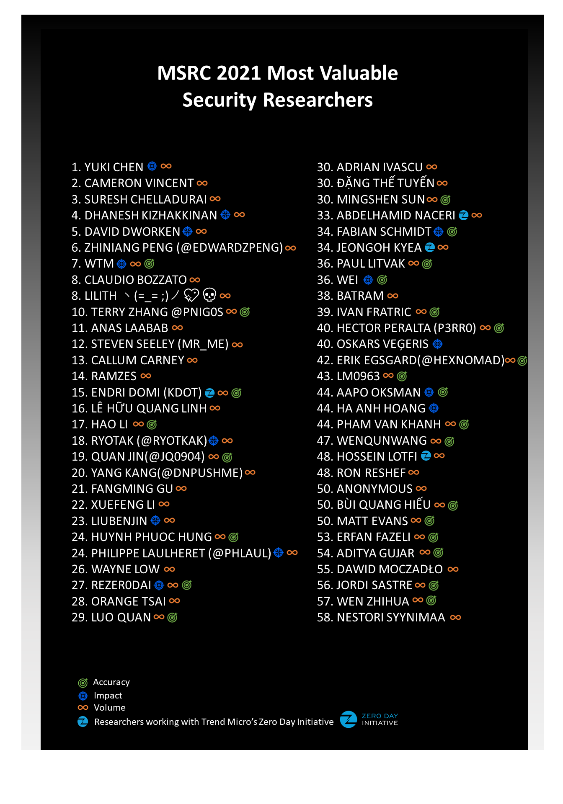

本記事は「[Congratulations to the MSRC 2021 Most Valuable Security Researchers!](https://msrc-blog.microsoft.com/2021/08/04/congratulations-to-the-msrc-2021-most-valuable-security-researchers/)」の日本語抄訳です。

[MSRC 研究者表彰プログラム](https://www.microsoft.com/ja-jp/msrc/researcher-recognition-program)は、[協調的な脆弱性の公開](https://www.microsoft.com/ja-jp/msrc/cvd)に基づくセキュリティの脆弱性の発見と共有を通じてお客様を保護するすることに貢献してくれた研究者に、感謝の意と謝辞を公表します。本日は、各レポートの Impact (影響)、Accuracy (正確性)、Volume (量) に基づいた、今年の最優秀セキュリティ研究者 (MVRs) を表彰します。

2021 年 MSRC 最優秀セキュリティ研究者の皆様、おめでとうございます。

このリストは、2020 年 7 月 1 日から 2021 年 6 月 30 日の間に有効な脆弱性を提出し、2021 年 MSRC 最優秀セキュリティ研究者になるための基準を満たした研究者を表彰しています。2021 年 MSRC 最優秀セキュリティ研究者になるためのパスやプログラムのスコープに関する詳細は、[こちら](https://msrc-blog.microsoft.com/2021/02/10/msrc-security-researcher-recognition-2021/)のブログ記事 (英語情報) を参照してください。MVR ステータスに加えて、研究者には次の成果を表すバッジが授与されます。

 Accuracy – 100% の精度を持つ研究者です。つまり、提出された脆弱性のすべてが有効な報告でした。

 Impact - 影響度の高い報告を表し、有効な脆弱性レポートの平均ポイントが 90 パーセンタイル (60 ポイント) 以上のものです。

 Volume – 報告の多さを表し、有効な脆弱性レポートが 5 本以上必要です。

 もともと All-Star カテゴリがありましたが、研究者からフィードバックをいただき、複数の製品やサービスに渡った調査結果を共有してくださった研究者にインセンティブを与えられないことを認識し、このプログラム期間の All-Star カテゴリをキャンセルしました。

この 1 年間、お客様のセキュリティを強化するために協力してくださったすべての研究者の皆様に感謝申し上げます。皆様の来年の活躍を楽しみにしています。数か月以内に本プログラムのアップデートがありますので、そのアップデートをお待ちください。

Lynn Miyashita、プログラム マネージャー、MSRC
