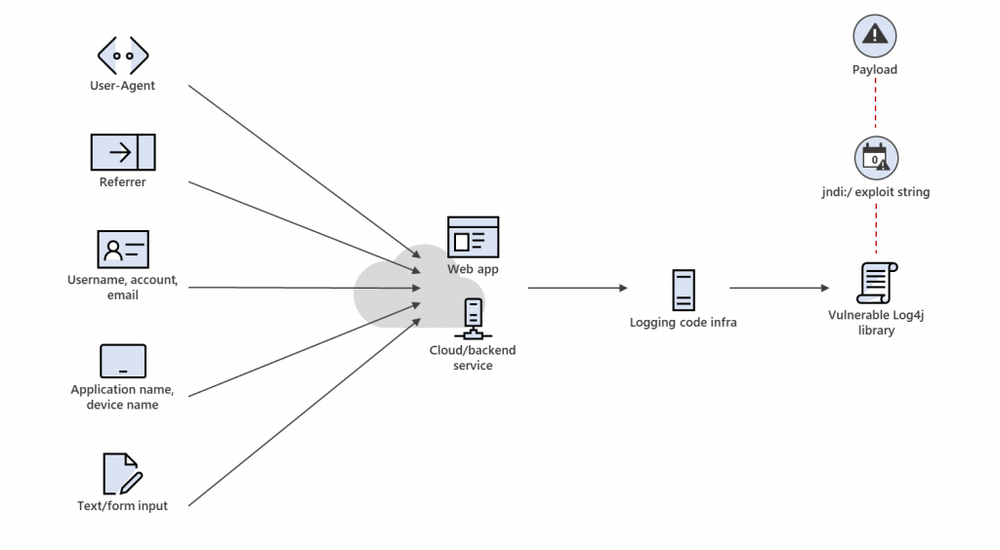
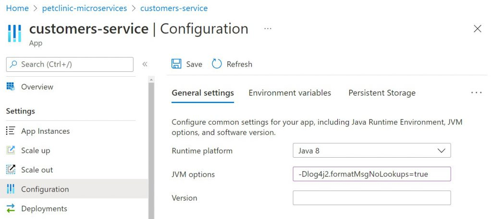
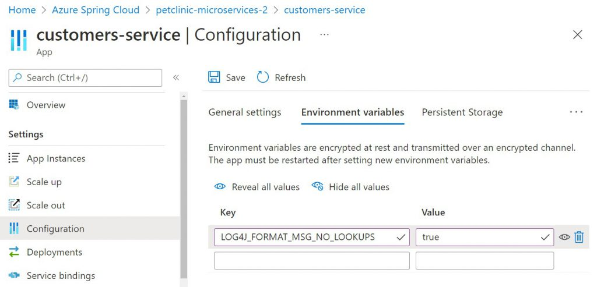
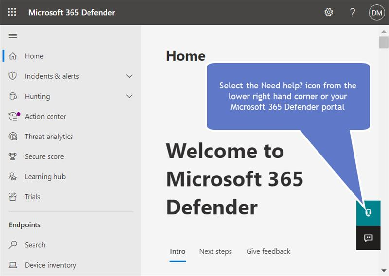

Published on: 2021 Dec 11, updated 2021 Dec 18.

## SUMMARY

Microsoft continues our analysis of the remote code execution vulnerabilities related to Apache Log4j (a logging tool used in many Java-based applications) disclosed on 9 Dec 2021. Currently, Microsoft is not aware of any impact, outside of the initial disclosure involving [Minecraft: Java Edition](https://help.minecraft.net/hc/en-us/articles/4416199399693-Security-Vulnerability-in-Minecraft-Java-Edition), to the security of our enterprise services and has not experienced any degradation in availability of those services as a result of this vulnerability.

Our security teams have been analyzing our products and services to identify and mitigate any instances of [CVE-2021-44228](https://cve.mitre.org/cgi-bin/cvename.cgi?name=2021-44228) and [CVE-2021-45046](https://cve.mitre.org/cgi-bin/cvename.cgi?name=CVE-2021-45046) in Apache Log4j 2.

Affected Microsoft products requiring customer action have been released in our [Security Update Guide - CVE-2021-44228](https://msrc.microsoft.com/update-guide/vulnerability/CVE-2021-44228). Customers are encouraged to apply these updates as quickly as possible. If you are using any Microsoft services other than those explicitly listed in the CVE, **no action is required by you at this time.** As we continue our investigation, **we will notify affected parties** **if we identify any impact to customer data**.

To help customers protect themselves, we are also providing the following product specific guidance to help customers improve their security posture. Links are provided to jump to the content below:

---

|                                                                                                                                                                                                                                                                |
| -------------------------------------------------------------------------------------------------------------------------------------------------------------------------------------------------------------------------------------------------------------- |
| **Mitigation Guidance for Microsoft Services**                                                                                                                                                                                                                 |
| [Azure Arc-enabled Data Services](#Azure-Arc-enabled-Data-Services)                                                                                                                                                                                            |
| [Azure App Service (Windows and Linux and Containers)](<#Azure-App-Service-(Windows-and-Linux)>)                                                                                                                                                               |
| [Azure Application Gateway, Azure Front Door, and Azure WAF](#Azure-Application-Gateway,-Azure-Front-Door,-and-Azure-WAF)                                                                                                                                      |
| [Azure Databricks](#Azure_Databricks)                                                                                                                                                                                                                          |
| [Azure Functions](#Azure-Functions)                                                                                                                                                                                                                            |
| [Azure HDInsight](#Azure-HDInsights)                                                                                                                                                                                                                           |
| [Azure Spring Cloud](#Azure-Spring-Cloud)                                                                                                                                                                                                                      |
| [Cosmos DB SDKs](#Cosmos-DB-SDKs)                                                                                                                                                                                                                              |
| [Cosmos DB Spring Connector](#Cosmos-DB-Spring-Connector)                                                                                                                                                                                                      |
| [Cosmos DB Spark Connector](#Cosmos-DB-Spark-Connector)                                                                                                                                                                                                        |
| [Microsoft Azure AD](#Microsoft-Azure-AD)                                                                                                                                                                                                                      |
| [Minecraft: Java Edition](#Minecraft_Java_Edition)                                                                                                                                                                                                             |
| [SQL Server (on Windows) - all editions](#SQL-Server-on-windows-all-ed)                                                                                                                                                                                        |
| [SQL Server (on Linux) - all editions](#SQL-Server-on-Linux-all-ed)                                                                                                                                                                                            |
| [SQL Server 2019 Big Data Clusters](#SQL-Server-2019-Big-Data-Clusters)                                                                                                                                                                                        |
| [SQL Server on Azure VM/IaaS](#SQL-Server-on-Azure-VM-IaaS)                                                                                                                                                                                                    |
| [Information for Security Operations and Hunters](<#Azure-App-Service-(Windows-and-Linux)-Azure-App-Service-for-Containers-Azure-Application-Gateway,-Azure-Front-Door,-and-Azure-WAF--Azure-Functions-Azure-HDInsight-Azure-Spring-Cloud-Microsoft-Azure-AD>) |

## Apply the Latest Security Updates

To address these vulnerabilities, Microsoft recommends customers apply the latest security updates. Please review the Apache CVEs and the Apache security advisory for further details:

- Apache Log4j 2.x CVEs: [CVE-2021-44228](https://cve.mitre.org/cgi-bin/cvename.cgi?name=2021-44228) and [CVE-2021-45046](https://cve.mitre.org/cgi-bin/cvename.cgi?name=CVE-2021-45046)
- Apache security advisory: [Apache Log4j Security Vulnerabilities](https://logging.apache.org/log4j/2.x/security.html)

All systems, including those that are not internet facing, are potentially vulnerable to these vulnerabilities, so backend systems and microservices should also be upgraded. No Java version can mitigate these vulnerabilities. The recommended action is to update Apache Log4j 2. An application restart will be required.

- **Java 8 or newer: update Log4j to 2.16.0** **or later**
- **Java 7: update to Log4j 2.12.2 or later**

Systems that have already been updated to 2.15.0 should move to 2.16.0 or later as soon as possible for extra protection against other potential vulnerabilities described in [CVE-2021-45046](https://cve.mitre.org/cgi-bin/cvename.cgi?name=CVE-2021-45046).

Systems running on Log4j 1.x are not impacted by these vulnerabilities. In 2015, Apache announced Log4j 1.x has reached end-of-life. Microsoft recommends customers to upgrade to Log4j 2.16.0 or later for the latest security updates.

- Apache Announcement: [Log4j 1.x End of Life](https://blogs.apache.org/foundation/entry/apache_logging_services_project_announces)
- Apache Log4j 1.x vulnerability - 1.2 up to 1.2.17: [CVE-2019-17571](https://www.cvedetails.com/cve/CVE-2019-17571/)

## Workarounds

To help mitigate the risk of these vulnerabilities in Log4j 2.x until the more complete security update can be applied, customers should consider the following mitigations steps for all releases of Log4j 2.x – except releases 2.16.0 or later and 2.12.2. These workarounds should not be considered a complete solution to resolve these vulnerabilities:

- For all releases of Log4j 2.x prior to 2.16.0, the most effective mitigation, besides a security update, is to prevent the JndiLookup.class file from being loaded in the applications’s classpath.

  - Customers can do this by deleting the class from affected JAR files. For example:  
    \$ zip -q -d log4j-core-\*.jar org/apache/logging/log4j/core/lookup/JndiLookup.class
  - Log4j may also be present in other files as a bundle or as a shaded library. Microsoft advises customers to do an extensive search beyond log4j-core-\*.jar files.

- In case the Log4j 2 vulnerable component cannot be updated, Log4j versions 2.10 to 2.14.1 support the parameter log4j2.formatMsgNoLookups to be set to ‘true’, to disable the vulnerable feature. Ensure this parameter is configured in the startup scripts of the Java Virtual Machine:  
  -Dlog4j2.formatMsgNoLookups=true.

- Alternatively, customers using Log4j 2.10 to 2.14.1 may set the LOG4J_FORMAT_MSG_NO_LOOKUPS=”true” environment variable to force this change.

- Kubernetes administrators may use “kubectl set env” to set the LOG4J_FORMAT_MSG_NO_LOOKUPS=”true” environment variable to apply the mitigation across Kubernetes clusters where the Java applications are running Log4j 2.10 to 2.14.1, effectively reflecting on all pods and containers automatically.

- An application restart will be required for these changes to take effect.

## Background of Log4j

The vulnerabilities, tracked as [CVE-2021-44228](https://cve.mitre.org/cgi-bin/cvename.cgi?name=2021-44228) and [CVE-2021-45046](https://cve.mitre.org/cgi-bin/cvename.cgi?name=CVE-2021-45046) and referred to as “Log4Shell,” affects Java-based applications that use Log4j 2 versions 2.0 through 2.15.0. [Log4j 2](https://logging.apache.org/log4j/2.x/) is a Java-based logging library that is widely used in business system development, included in various open-source libraries, and directly embedded in major software applications. The scope of impact has expanded to thousands of products and devices, including Apache products such as Struts 2, Solr, Druid, Flink, Swift, Karaf, and others.

Because these vulnerabilities are in a Java library, the cross-platform nature of Java means the vulnerabilities are exploitable on many platforms, including Windows, macOS, and Linux. As many Java-based applications can leverage Log4j 2 directly or indirectly, organizations should contact application vendors or ensure their Java applications are running the latest up-to-date version. Developers using Log4j 2 should ensure that they are incorporating the latest version of Log4j into their applications as soon as possible to protect users and organizations.

## Analysis of the vulnerabilities

The vulnerabilities allow remote code execution by an unauthenticated attacker to gain complete access to a target system. It can be triggered when a specially crafted string is parsed and processed by the vulnerable Log4j 2 component. This could happen through any user provided input.

Successful exploitation allows for arbitrary code execution in the targeted application. Attackers do not need prior access to the system to log the string and can remotely cause the logging event by using commands like curl against a target system to log the malicious string in the application log. When processing the log, the vulnerable system reads the string and executes it, which in current attacks is used to execute the code from the malicious domain. Doing so can grant the attacker full access and control of the affected application.

Given the fact that logging code and functionalities in applications and services are typically designed to process a variety of external input data coming from upper layers and from many possible vectors, the biggest risk factor of these vulnerabilities is predicting whether an application has a viable attack vector path that will allow the malformed exploit string to reach the vulnerable Log4j 2 code and trigger the attack. A common pattern of exploitation risk, for example, is a web application with code designed to process usernames, referrer, or user-agent strings in logs. These strings are provided as external input (e.g., a web application built with Apache Struts). An attacker can send a malformed username or set user-agent with the crafted exploit string hoping that this external input will be processed at some point by the vulnerable Log4j 2 code and trigger code execution.



_Figure 1. CVE-2021-44228 and CE-2021-45046 exploit vectors and attack chain_

## Mitigation Guidance for Microsoft Services

After further analysis of our services and products, below are a few mitigation strategies given by various Microsoft services.

The mitigation based on disabling message lookup functionality – through enabling the system property log4j2.formatMsgNoLookups or the environment variable LOG4J_FORMAT_MSG_NO_LOOKUPS – does not cover all risks related to these vulnerabilities. Customers should still apply the latest security updates or apply other documented mitigation steps such as the removal of the JndiLookup.class file from the application classpath.

## Azure Arc-enabled Data Services

SQL Arc-enabled data services include includes Elasticsearch, which uses Log4j. Microsoft recommends that all Customers upgrade to [December 2021 release](https://docs.microsoft.com/en-us/azure/azure-arc/data/release-notes#december-2021) which has updated the Log4J library to 2.16.0. Azure Arc-enabled data services us Elasticsearch version 7.9.1 on JDK 11, which is not affected by this vulnerability. For more information, refer to Elastic bulletin: [Apache Log4j2 Remote Code Execution (RCE) Vulnerability – CVE–2021–44228 – ESA–2021–31 – Announcements / Security Announcements – Discuss the Elastic Stack](https://discuss.elastic.co/t/apache-log4j2-remote-code-execution-rce-vulnerability-cve-2021-44228-esa-2021-31/291476).

As a defense in depth measure, Microsoft recommends customers modify the _logsdb statefulset/elasticsearch_ container to set the following environment variable to true.

`LOG4J_FORMAT_MSG_NO_LOOKUPS=true`

### Azure App Service (Windows, Linux and Containers)

Azure App Service and Functions does not distribute Log4J in the managed runtimes such as Tomcat, Java SE, JBoss EAP, or the Functions Runtime. However, your applications may use Log4J and be susceptible to these vulnerabilities.

Customers are recommended to apply the latest Log4j security updates and re-deploy applications.

If you are not able to re-package your application with a newer version of Log4j and you are using Log4j versions 2.10 to 2.14, you can mitigate by creating an application setting for the environment variable **LOG4J_FORMAT_MSG_NO_LOOKUPS** with value **true**, with the Azure CLI as follows:

```

$ az webapp config appsettings set \
 --resource-group <group-name> \
 --name <app-name> \
 --settings LOG4J_FORMAT_MSG_NO_LOOKUPS=true
```

Note that this command will also restart your App Service hosted application.

### Azure Application Gateway, Azure Front Door, and Azure WAF

In our investigation so far, we have not found any evidence that these services are vulnerable however customer applications running behind these services might be vulnerable to this exploit. We highly recommend customers to follow mitigations and workarounds mentioned in this blog to protect their applications. Additional guidance for Azure WAF is located [here](https://www.microsoft.com/security/blog/2021/12/11/guidance-for-preventing-detecting-and-hunting-for-cve-2021-44228-log4j-2-exploitation/).

### Azure Databricks

Your instance may be vulnerable if you have installed an affected version of Log4j or have installed services that transitively depend on an affected version. For more information on checking for vulnerable Log4j 2 instances installed, please see the following Microsoft Document: [Verify the version of Log4j on your cluster](https://docs.microsoft.com/en-us/azure/databricks/kb/libraries/verify-log4j-version).

### Azure Functions

Customers are recommended to apply the latest Log4j security updates and re-deploy applications. If you are not able to and you are using Log4j versions 2.10 to 2.14.1, configuring the environment variable or system property will depend on your choice of hosting option: dedicated, premium or consumption.

- **Dedicated and Premium Functions**: Create two application settings:

  1. LOG4J_FORMAT_MSG_NO_LOOKUPS with value =true
  2. WEBSITE_USE_PLACEHOLDER with value =0

- This can be done with the following Azure CLI command:

`$ az functionapp config appsettings set \ --subscription \ --name \ --resource-group \ --settings "LOG4J_FORMAT_MSG_NO_LOOKUPS=true" "WEBSITE_USE_PLACEHOLDER=0"`

- **Consumption Functions:**

  - **Linux**: Create an application setting named “languageWorkers\_\_java\_\_arguments” with a value of “-Dlog4j2.formatMsgNoLookups=true”.
  - **Windows**: Create an application setting named “languageWorkers:java:arguments” with a value of “-Dlog4j2.formatMsgNoLookups=true”.

Note that these application settings will restart your Function apps, and it will no longer use warm workers which will impact future cold-start performance.

### Azure HDInsight

All Azure HDInsight clusters created prior to 16 Dec 2021 at 01:15 UTC have been patched and rebooted to mitigate the Log4j vulnerability as described in [Microsoft’s Response to CVE-2021-44228 Apache Log4j 2](https://msrc-blog.microsoft.com/2021/12/11/microsofts-response-to-cve-2021-44228-apache-log4j2/), unless customer configurations prevented the updates. All Azure HDInsight 5.0, 4.0, and 3.6 clusters for [currently supported components](https://docs.microsoft.com/en-us/azure/hdinsight/hdinsight-40-component-versioning) were patched.

Any HDI 4.0 clusters created post 27 Dec 2021 00:00 UTC are created with an updated version of the image which mitigates the log4j vulnerabilities. Hence, customers need not patch/reboot these clusters.

#### Action recommended

For new clusters created using HDI 4.0 between 16 Dec 2021 at 01:15 UTC and 27 Dec 202100:00 UTC, HDI 3.6 or in pinned subscriptions after 16 Dec 2021 the patch is auto applied within the hour in which the cluster is created, however customers must then reboot their nodes for the patching to complete (except for Kafka Management nodes, which are automatically rebooted).

The following node types require a reboot after the patch is applied:

| **Cluster Type**                     | **Node Types that should be rebooted** |
| ------------------------------------ | -------------------------------------- |
| Kafka & HBase                        | Head Nodes                             |
| Hadoop, Spark, Interactive Hive/LLAP | Head Nodes & Worker Nodes              |

If you regularly delete and recreate clusters, or if your configurations prevent Microsoft from making updates to your clusters, it is required that you run the <https://hdiconfigactions.blob.core.windows.net/patch-log4j-cve/patch-log4j-cve-2021-44228-all-rev2.sh> patch as part of the [cluster creation process](https://docs.microsoft.com/en-us/azure/hdinsight/hdinsight-hadoop-customize-cluster-linux#script-action-during-cluster-creation) as a persisted script action, and then immediately schedule a reboot on the node types listed above. Jobs should only be executed after the patch has been applied and the impacted nodes have been rebooted to ensure that the vulnerability has been fixed.

The patch should be run on each new cluster as a persisted script action until a new HDInsight image is available that incorporates the patch.

### Azure Spring Cloud

Applications deployed to Azure Spring Cloud may use Log4j and be susceptible to this vulnerability. Log4j usage may originate from:

- Your application sources.
- Application Performance Monitoring tools activated for the application.

#### Spring Boot Applications

Spring Boot applications are only affected if they have switched the default logging framework to Log4j _2_. The _log4j-to-slf4j_ and _log4j-api_ jar files that are included in _spring-boot-starter-logging_ cannot be exploited on their own. Only applications using _log4j-core_ are vulnerable. If your application is impacted and you can redeploy the application, we recommend that you upgrade your application with the latest security updates for Log4j, and redeploy to Azure Spring Cloud – see more details at [_Log4j 2_ vulnerability and Spring Boot](https://spring.io/blog/2021/12/10/log4j2-vulnerability-and-spring-boot).

If you are not able to re-deploy, you may mitigate impacted applications that are using Log4j 2.10 to 2.14.1 by setting the _log4j2.formatMsgNoLookups_ system property to _true \_OR by setting the environment variable \_LOG4J_FORMAT_MSG_NO_LOOKUPS_ to _true_. You can set the system property or environment variable using:

- Azure Portal
- Azure CLI
- ARM Template
- Bicep or
- Terraform.

##### **For Example** – set the system property _log4j2.formatMsgNoLookups_ via the Azure Portal or CLI

In the Azure Portal, navigate to your application in Azure Spring Cloud and change the configuration as illustrated below:



You can set the _log4j2.formatMsgNoLookups_ system property to _true_ using the Azure CLI:

`$ az spring-cloud app update -s ${SERVICE_NAME} \ -n ${APP_NAME} -d ${DEPLOYMENT_NAME} -g ${RESOURCE_GROUP} \ --jvm-options='-Dlog4j2.formatMsgNoLookups=true'`

##### **For Example** – set the _LOG4J_FORMAT_MSG_NO_LOOKUPS_ environment variable via the Azure Portal or CLI

In the Azure Portal, navigate to your application in Azure Spring Cloud and change the configuration as illustrated below:



You can set the _LOG4J_FORMAT_MSG_NO_LOOKUPS_ environment variable to _true_ using the Azure CLI:

_`$ az spring-cloud app update -s ${SERVICE_NAME} \`  
`-n ${APP_NAME} -d ${DEPLOYMENT_NAME} -g ${RESOURCE_GROUP} \`  
`--env 'LOG4J_FORMAT_MSG_NO_LOOKUPS=true'`_

#### Application Performance Monitoring tools activated by your application

Applications in Azure Spring Cloud are only impacted by the Log4j vulnerability if users activated New Relic and AppDynamics Java Agents. Applications monitored by Application Insights or Dynatrace Java Agents do not carry any potential risk associated with the Log4j vulnerability.

We already patched-in updated [New Relic](https://discuss.newrelic.com/t/log4j-zero-day-vulnerability-and-the-new-relic-java-agent/170322) and [AppDynamics](https://docs.appdynamics.com/display/PAA/Security+Advisory%3A+Apache+Log4j+Vulnerability) Java Agents. If you activated New Relic or AppDynamics Agents for your applications, we recommend that you restart your applications. Azure Spring Cloud will take steps to automatically protect customers and auto-restart any application with activated New Relic or AppDynamics Java Agents by Tuesday, December 21st, 2021 to ensure the latest fixes take effect.

### Cosmos DB SDKs

Cosmos DB SDKs do not have dependency on Log4j 2 and allow customers to independently bring their own logging technologies. If customers independently decide to use Log4j 2 they should ensure to use Log4j 2.16.0 or above

### Cosmos DB Spring Connector

Cosmos DB Spring Connector does not have dependency on Log4j 2 and is not impacted. If customers rely on spring boots defaults and use Log4j2, they should ensure they use proper version of Log4j2 (>= 2.16.0).

### Cosmos DB Spark Connector

Cosmos DB Spark Connector does not have runtime dependency on Log4j 2. Cosmos DB Spark Connector utilizes underlying spark offering logging technologies.

### Microsoft Azure AD

While the industry is determining and mitigating overall exposure, attackers are probing all endpoints for vulnerabilities. Applying rigorous least privilege access policies to all resources in your environment is critical. If you use Azure Active Directory for single-sign on in your environment, we recommend you do the following with a special focus on applications you deploy or manage directly (SaaS apps, including those deployed by Microsoft, must be secured by their vendors). Note that log4j2 usage may be pre-auth for some of your applications, but these steps will help prevent post-authentication exploitation. [Templates and examples](https://docs.microsoft.com/en-us/azure/active-directory/conditional-access/concept-conditional-access-policy-common) for these policies are built in to facilitate deployment:

- To facilitate these steps and minimize business impact, you may wish to use [application tagging capabilities](https://techcommunity.microsoft.com/t5/azure-active-directory-identity/more-control-and-better-insights-for-your-zero-trust-deployments/ba-p/2365684) to identify those applications which you haven’t validated as patched and [target stricter policies to them](https://docs.microsoft.com/en-us/azure/active-directory/conditional-access/concept-conditional-access-cloud-apps).
- [Enable MFA for all access to these resources](https://docs.microsoft.com/en-us/azure/active-directory/conditional-access/howto-conditional-access-policy-all-users-mfa) to prevent probing using accounts with compromised passwords.
- If you are using Azure AD Identity Protection, [enable blocking on risky logins](https://docs.microsoft.com/en-us/azure/active-directory/conditional-access/howto-conditional-access-policy-risk) (we recommend blocking on medium or higher). This will prevent access via ToR exit nodes and anonymizing VPNs.
- If you use Azure AD Conditional Access, [restrict access to your resources to known/trusted locations or networks](https://docs.microsoft.com/en-us/azure/active-directory/conditional-access/howto-conditional-access-policy-location).
- [Require Azure AD joined or better, MDM managed devices](https://docs.microsoft.com/en-us/azure/active-directory/conditional-access/howto-conditional-access-policy-compliant-device) to access these resources.
- Monitor the risky sign in reports or use the risk workbook to track anomalous logins to your applications to help focus your investigations.
- While ADFS, as a Windows service, does not use the impacted libraries, other federation providers do. If you use a non-Microsoft federation provider (for example, for SAML 2.0), watch for token anomalies which indicate compromise of those systems.

For key guidance on securing your identity deployment, see <https://aka.ms/securitysteps>.

### Minecraft: Java Edition

We’ve taken steps to keep our Minecraft customers safe and protected, which included rolling out a fix that blocks this issue for Minecraft Java Edition 1.18.1. Minecraft customers running their own servers are encouraged to deploy the latest Minecraft server update to protect their users. More information is available at [Security Vulnerability in Minecraft: Java Edition](https://help.minecraft.net/hc/en-us/articles/4416199399693-Security-Vulnerability-in-Minecraft-Java-Edition).

## SQL Server (on Windows) - all editions

**Note**: If a customer installs Java support and deploys Java Archives (JARs) that depend on the Log4j 2 library, they are advised to upgrade to the latest version or remove the Java Archives (JARs) that require the dependency.

## SQL Server (on Linux) - all editions

**Note**: If a customer installs Java support and deploys Java Archives (JARs) that depend on the Log4j 2 library, they are advised to upgrade to the latest version or remove the Java Archives (JARs) that require the dependency.

## SQL Server 2019 Big Data Clusters

SQL Server 2019 Big Data Clusters includes Elasticsearch, which uses Log4j. Microsoft recommends that all Customers upgrade to Cumulative Update (CU) 9 or higher. CU 9 for SQL Server Big Data Cluster ships with Elasticsearch version 7.9.1 on JDK 11, which is not affected by this vulnerability ([SQL Server Big Data Clusters cumulative updates history](https://docs.microsoft.com/sql/big-data-cluster/release-notes-cumulative-updates-history#cu9)). For more information, refer to Elastic bulletin: [Apache Log4j2 Remote Code Execution (RCE) Vulnerability – CVE–2021–44228 – ESA–2021–31 – Announcements / Security Announcements – Discuss the Elastic Stack](https://discuss.elastic.co/t/apache-log4j2-remote-code-execution-rce-vulnerability-cve-2021-44228-esa-2021-31/291476).

As a defense in depth measure, Microsoft recommends customers modify the _logsdb statefulset/elasticsearch_ container to set the following environment variable to true.

`LOG4J_FORMAT_MSG_NO_LOOKUPS=true`

**Note**: While the Elasticsearch version that ships with SQL Server 2019 Big Data Clusters CU9 is not impacted due to the use of Java Security Manager, an affected version of the Log4j library is still present. Microsoft will release an update for SQL Server 2019 Big Data Clusters that updates the Log4j library to 2.16.0 as soon as possible.

## SQL Server on Azure VM/IaaS

**Note**: If an application in the VM uses Log4j, it may be susceptible to this vulnerability. Please follow mitigation guidance published [here](https://www.microsoft.com/security/blog/2021/12/11/guidance-for-preventing-detecting-and-hunting-for-cve-2021-44228-log4j-2-exploitation/).

### Information for Security Operations and Hunters

Microsoft security teams have put together the following guidance and resources to help customers understand these vulnerabilities and to help detect and hunt for exploits:

- Microsoft Security blog describing the nature of current attacks Microsoft is observing. The blog also contains guidance on how to use Microsoft security products to detect and hunt for malicious activity, and apply protections: [Guidance for preventing, detecting, and hunting for CVE-2021-44228 Log4j 2 exploitation](https://www.microsoft.com/security/blog/2021/12/11/guidance-for-preventing-detecting-and-hunting-for-cve-2021-44228-log4j-2-exploitation/)

- RiskIQ (acquired by Microsoft in August 2021) published threat intelligence article to the community portal with information about these vulnerabilities and exploitation of them, as well as detections and mitigations: [CVE-2021-44228 Apache Log4j Remote Code Execution Vulnerability](https://community.riskiq.com/article/505098fc)

- Microsoft 365 Defender threat analytics article with detection information and potential impacts to customer environments: [CVE-2021-44228 Log4j active exploitation](https://sip.security.microsoft.com/threatanalytics3/a41971d4-cf8b-4fcf-946e-bd042229e8fa/overview) (sign in is required)

  - **NOTE**: Microsoft 365 Defender customers can click **Need help?** in the portal to open up a search widget. Customers can key in Log4j terms to search for in-portal resource to check if their network is affected, and work on corresponding actionable items to mitigate them.



The MSRC Team

We will further update this guidance as we continue to learn from our investigation.

Revision History:  
12/20/2021 - Added information about three Cosmos products: Cosmos DB SDKs, Cosmos DB Spring Connector, and Cosmos DB Spark Connector.  
12/18/2021 - Update to indicate releases 2.16.0 or later  
12/17/2021 - Update based on new findings related to CVE-2021-45046 impacting Log4j 2.15.0, Released guidance for Azure Arc-enabled Data Services, SQL Server for Windows and Linux, SQL Server 2019 Big Data Clusters, and SQL Server on Azure VM/IaaS.  
12/16/2021 - Clarified customer guidance in the summary and linked to affected software in the security update guide.  
12/15/2021 - Clarified guidance on Azure service. Added guidance for Java 7. Added guidance on Azure libraries for Java.  
12/14/2021 - Added HDInsights guidance, updated guidance for CVE-2021-45046, and updated workaround guidance.  
12/13/2021 - Added table to index guidance, added additional guidance for Azure WAF and Azure Spring Cloud.  
12/11/2021 - Initial publication.
