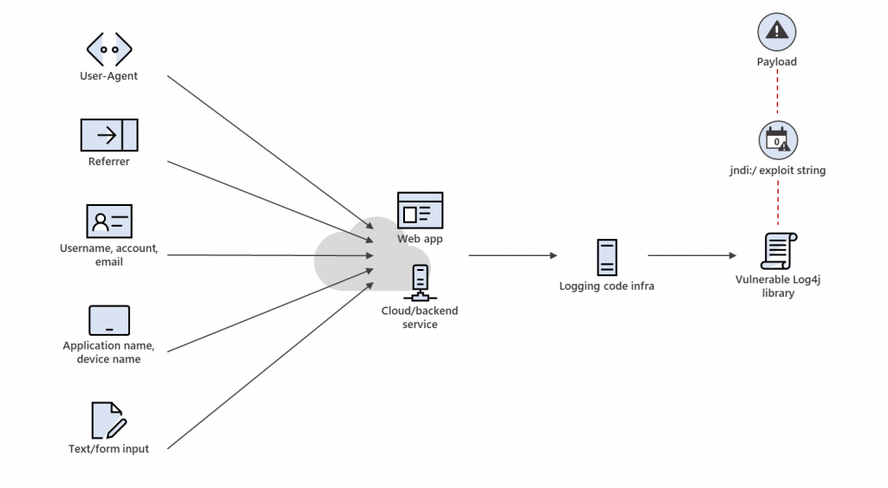
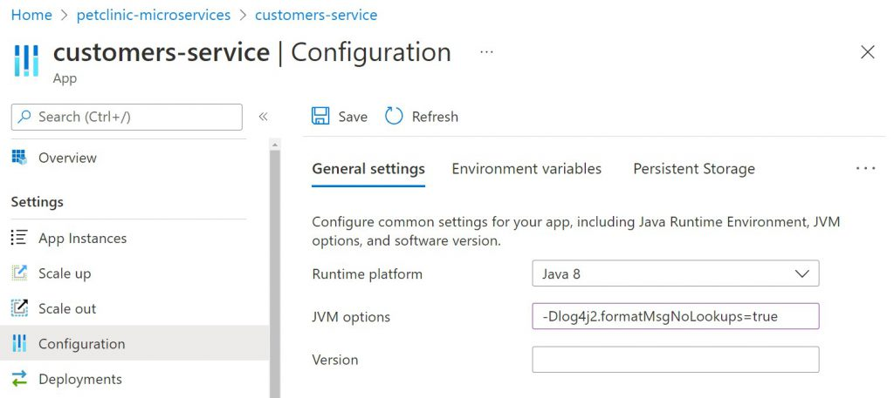
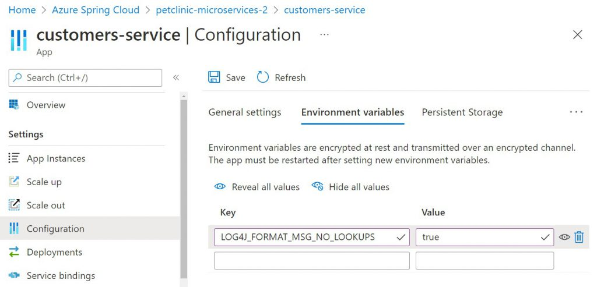
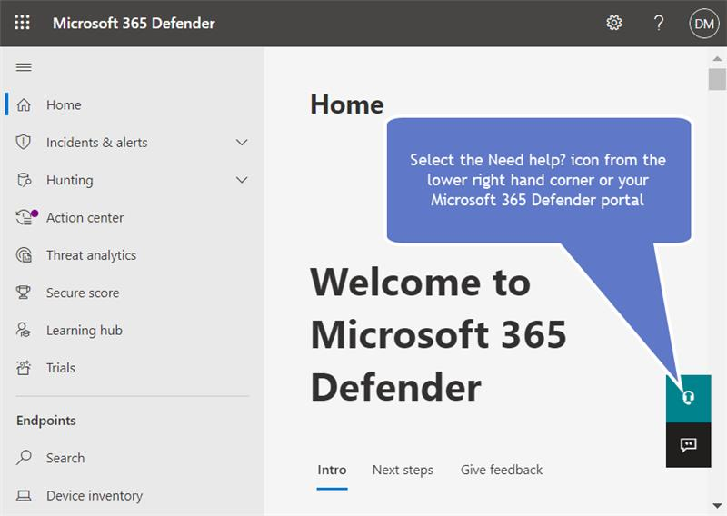

<!-- wp:paragraph -->

**本ブログは、[Microsoft’s Response to CVE-2021-44228 Apache Log4j 2](https://msrc-blog.microsoft.com/2021/12/11/microsofts-response-to-cve-2021-44228-apache-log4j2/) の抄訳版です。最新の情報は、元記事を参照してください。**

<!-- /wp:paragraph -->

<!-- wp:paragraph -->

公開日: 2021 年 12 月 11 日 (米国太平洋標準時間) , 更新日: 2021 年 12 月 18 日 (米国太平洋標準時間)

<!-- /wp:paragraph -->

<!-- wp:heading -->

## 概要

<!-- /wp:heading -->

<!-- wp:paragraph -->

マイクロソフトは、2021 年 12 月 9 日に公開された Apache Log4j (多くの Java ベースのアプリケーションで使用されるログ ツール) に関連するリモートでコードが実行される脆弱性の分析を継続しています。現在、マイクロソフトは、[Minecraft: Java Edition](https://help.minecraft.net/hc/en-us/articles/4416199399693-Security-Vulnerability-in-Minecraft-Java-Edition) に関する最初の開示以外で、エンタープライズ サービスのセキュリティに対する影響は確認されていません。また、この脆弱性に起因するサービスの可用性低下は確認されていません。

<!-- /wp:paragraph -->

<!-- wp:paragraph -->

マイクロソフトのセキュリティ チームは、Apache Log4j 2 の [CVE-2021-4428](https://cve.mitre.org/cgi-bin/cvename.cgi?name=2021-44228) および [CVE-2021-45046](https://cve.mitre.org/cgi-bin/cvename.cgi?name=CVE-2021-45046) のインスタンスを特定し緩和するために、マイクロソフト製品およびサービスの分析を実施しています。

<!-- /wp:paragraph -->

<!-- wp:paragraph -->

お客様にて作業が必要な影響を受ける Microsoft 製品は、[セキュリティ更新プログラム ガイド CVE-2021-44228](https://msrc.microsoft.com/update-guide/vulnerability/CVE-2021-44228) で公開しています。早期に必要な更新を適用することを推奨しています。CVE に明記されているサービス以外の Microsoft サービスを使用している場合は、**現時点で必要な作業はありません**。調査を継続し、**お客様のデータへの影響を特定した場合は、影響を受ける当事者に通知します**。

<!-- /wp:paragraph -->

<!-- wp:paragraph -->

お客様が自組織を保護し、セキュリティ能勢 (セキュリティ ポスチャー) を向上させるために役立てていただけるよう、製品固有のガイダンスも提供しています。以下が各項目の目次リンクです：

<!-- /wp:paragraph -->

<!-- wp:paragraph -->

<!-- /wp:paragraph -->

<!-- wp:table -->

|                                                                                                                                                                                                        |
| ------------------------------------------------------------------------------------------------------------------------------------------------------------------------------------------------------ |
| Microsoft サービスの緩和策ガイダンス                                                                                                                                                                   |
| [Azure Arc-enabled Data ](https://msrc-blog.microsoft.com/2021/12/11/microsofts-response-to-cve-2021-44228-apache-log4j2/#Azure-Arc-enabled-Data-Services)[Services](#Azure-Arc-enabled-Data-Services) |
| [Azure App Service (Windows および Linux および Containers)](#AzureAppService)                                                                                                                         |
| [Azure Application Gateway、Azure Front Door、および Azure WAF](#WAF)                                                                                                                                  |
| [Azure](https://msrc-blog.microsoft.com/2021/12/11/microsofts-response-to-cve-2021-44228-apache-log4j2/#Azure_Databricks)[ Databricks](#Azure_Databricks)                                              |
| [Azure Functions](#AzureFunctions)                                                                                                                                                                     |
| [Azure HDInsights](#HDInsights)                                                                                                                                                                        |
| [Azure Spring Cloud](#AzureSpringCloud)                                                                                                                                                                |
| [Cosmos DB SDKs](#Cosmos-DB-SDKs)                                                                                                                                                                      |
| [Cosmos DB Spring Connector](#Cosmos-DB-Spring-Connector)                                                                                                                                              |
| [Co](https://msrc-blog.microsoft.com/2021/12/11/microsofts-response-to-cve-2021-44228-apache-log4j2/#Cosmos-DB-Spark-Connector)[smos DB Spark Connector](#Cosmos-DB-Spark-Connector)                   |
| [Microsoft Azure AD](#AzureAD)                                                                                                                                                                         |
| [Minecraft: Java Edition](#Minecraft)                                                                                                                                                                  |
| [SQL Server (on Windows) – all editions](#SQL-Server-on-windows-all-ed)                                                                                                                                |
| [SQL Server (on Linux) – all editions](#SQL-Server-on-Linux-all-ed)                                                                                                                                    |
| [SQL Server 2019 Big Data Clusters](#SQL-Server-2019-Big-Data-Clusters)                                                                                                                                |
| [SQL Server on Azure VM/IaaS](#SQL-Server-on-Azure-VM-IaaS)                                                                                                                                            |
| [セキュリティ オペレーションとハンターのための情報](#Info)                                                                                                                                             |

<!-- /wp:table -->

<!-- wp:heading -->

## 最新のセキュリティ更新プログラムを適用する

<!-- /wp:heading -->

<!-- wp:paragraph -->

マイクロソフトは、これら脆弱性を解決するために、最新のセキュリティ更新プログラムを適用することをお勧めします。詳細については、Apache CVE と Apache セキュリティ アドバイザリを参照してください。

<!-- /wp:paragraph -->

<!-- wp:list -->

- Apache Log4j 2.x CVEs: [CVE-2021-44228](https://cve.mitre.org/cgi-bin/cvename.cgi?name=2021-44228) および [CVE-2021-45046](https://cve.mitre.org/cgi-bin/cvename.cgi?name=CVE-2021-45046)
- Apache security advisory: [Apache Log4j Security Vulnerabilities](https://logging.apache.org/log4j/2.x/security.html)

<!-- /wp:list -->

<!-- wp:paragraph -->

インターネットに接していないシステムを含め、すべてのシステムがこれらの脆弱性に脆弱である可能性があるため、バックエンド システムとマイクロサービスもアップグレードする必要があります。どの Java バージョンでもこれらの脆弱性を緩和できません。推奨される操作は、Apache Log4j 2 を 更新します。アプリケーションの再起動が必要です。

<!-- /wp:paragraph -->

<!-- wp:list -->

- Java 8 以降 : Log4j を 2.16.0 以降に更新
- Java 7: Log4j 2.12.2 以降に更新

<!-- /wp:list -->

<!-- wp:paragraph -->

既に 2.15.0 に更新済みのシステムは、[CVE-2021-45046](https://cve.mitre.org/cgi-bin/cvename.cgi?name=CVE-2021-45046) で説明されているように、他の脆弱性に対する保護を強化するために、できるだけ早く 2.16.0 以降に移行する必要があります。

<!-- /wp:paragraph -->

<!-- wp:paragraph -->

Log4j 1.x で実行されているシステムは、これらの脆弱性の影響を受けません。2015 年、Apache は Log4j 1.x のサポート終了を発表しました。マイクロソフトは、最新のセキュリティ更新プログラムのために Log4j 2.16.0 以降にアップグレードすることをお勧めします。

<!-- /wp:paragraph -->

<!-- wp:list -->

- Apache Announcement: [Log4j 1.x End of Life](https://blogs.apache.org/foundation/entry/apache_logging_services_project_announces)
- Apache Log4j 1.x vulnerability – 1.2 up to 1.2.17: [CVE-2019-17571](https://www.cvedetails.com/cve/CVE-2019-17571/)

<!-- /wp:list -->

<!-- wp:heading -->

## 回避策

<!-- /wp:heading -->

<!-- wp:paragraph -->

より完全なセキュリティ更新プログラムを適用できるようになるまでの間、Log4j2.x の脆弱性のリスクを軽減するには、すべてのリリースの Log4j 2.x (リリース 2.16.0 以降および 2.12.2 を除く) は、次の緩和策の手順を検討する必要があります。これらの回避策は、これらの脆弱性を解決するための完全な解決策とは見なされません。

<!-- /wp:paragraph -->

<!-- wp:list -->

- 2.16.0 より前のすべてのリリースの Log4j 2.x では、セキュリティ更新プログラム以外にも最も効果的な緩和策は、アプリケーションのクラスパスに JndiLookup.class ファイルが読み込まれないようにすることです。

  - お客様は、影響を受ける JAR ファイルからクラスを削除することでこれを行うことができます。例えば：\$ zip -q -d log4j-core-\*.jar org/apache/logging/log4j/core/lookup/JndiLookup.class
  - Log4j は、バンドルまたは網掛けライブラリとして他のファイルに存在する場合もあります。マイクロソフトは、log4j-core-\*.jar ファイル以外の広範な検索を実行することをお勧めします。

- Log4j 2 の脆弱なコンポーネントを更新できない場合、Log4J 2 バージョン 2.10 から 2.14.1 では、パラメーター log4j2.formatMsgNoLookups を 'true' に設定して脆弱な機能を無効にできます。Java 仮想マシンのスタートアップ スクリプトでこのパラメーターが構成されていることを確認します。

<!-- /wp:list -->

<!-- wp:paragraph -->

\-Dlog4j2.formatMsgNoLookups=true

<!-- /wp:paragraph -->

<!-- wp:list -->

- または、Log4j 2.10 から 2.14.1 を使用しているお客様は、LOG4J_FORMAT_MSG_NO_LOOKUPS="true" 環境変数を設定してこの変更を強制することもできます。
- Kubernetes 管理者は、"kubectl set env" を使用して LOG4J_FORMAT_MSG_NO_LOOKUPS="true" 環境変数を設定して、Java アプリケーションが Log4j 2.10 から 2.14.1 を実行している Kubernetes クラスター全体に緩和策を適用できます。この場合、すべてのポッドとコンテナーに効果的に反映されます。
- これらの変更を有効にするには、アプリケーションの再起動が必要です。

<!-- /wp:list -->

<!-- wp:heading -->

## Log4j の背景

<!-- /wp:heading -->

<!-- wp:paragraph -->

これらの[ CVE-2021-44228 ](https://cve.mitre.org/cgi-bin/cvename.cgi?name=2021-44228)および [CVE-2021-45046](https://cve.mitre.org/cgi-bin/cvename.cgi?name=CVE-2021-45046) として追跡されている脆弱性は、「Log4Shell」とも呼ばれ、Log4j バージョン 2.0 から 2.15.0 を使用する Java ベースのアプリケーションに影響します。[Log4j 2](https://logging.apache.org/log4j/2.x/) は、ビジネス システム開発で広く使用され、さまざまなオープン ソース ライブラリに含まれ、主要なソフトウェア アプリケーションに直接埋め込まれている Java ベースのログ ライブラリです。影響の範囲は、数千もの製品とデバイスにまで拡大しています。これには、Struts 2, Solr, Druid, Flink, Swift, Karaf などの Apache が含まれます。これらの脆弱性は Java ライブラリ内に存在するため、Java のクロスプラットフォームの性質は、Windows, macOS, Linux を含む多くのプラットフォームでこれらの脆弱性が悪用可能であることを意味します。多くの Java ベースのアプリケーションが Log4j 2 を、直接的または間接的に利用できるため、組織はアプリケーション ベンダーに問い合わせるか、Java アプリケーションが最新バージョンを実行していることを確認する必要があります。Log4j 2 を使用する開発者は、ユーザーと組織を保護するために、できるだけ早く最新バージョンの Log4j をアプリケーションに組み込む必要があります。

<!-- /wp:paragraph -->

<!-- wp:heading -->

## 脆弱性の分析

<!-- /wp:heading -->

<!-- wp:paragraph -->

これらの脆弱性はリモートでコードが実行される脆弱性で、認証されていない攻撃者が標的のシステムに完全にアクセスできる可能性があります。これらの脆弱性は、特別に細工された文字列が脆弱な Log4j 2 コンポーネントによって解析および処理される際に，トリガーされる可能性があります。これは、ユーザーが提供するあらゆる入力によって発生する可能性があります。

<!-- /wp:paragraph -->

<!-- wp:paragraph -->

悪用に成功すると、標的のアプリケーションで任意のコードが実行される可能性があります。攻撃者は、文字列を記録するためにシステムに事前にアクセスする必要はありません。また、標的のシステムに対して curl などのコマンドを使用してアプリケーション ログに悪意のある文字列を記録することで、ログ イベントをリモートで引き起こす可能性があります。ログを処理する際、脆弱なシステムが文字列を読み込んで実行します。現在の攻撃では、悪意のあるドメインからコードを実行するために使用されます。これが実行されると、影響を受けるアプリケーションに対するフル アクセスと制御が攻撃者に付与される可能性があります。

<!-- /wp:paragraph -->

<!-- wp:paragraph -->

アプリケーションおよびサービスのロギング コードと機能は、通常、上位層からくる様々な外部入力データや、多くの可能なベクターからくるデータを処理するように設計されていることを考えると、この脆弱性の最大のリスク要因は、不正な悪用文字列が脆弱な Log4j 2 のコードに到達して攻撃をトリガーするような攻撃ベクターのパスを、アプリケーションが持っているかどうかを予測することです。

<!-- /wp:paragraph -->

<!-- wp:paragraph -->

悪用リスクの一般的なパターンは、例えば、ログ内のユーザー名、リファラー、またはユーザーエージェントの文字列を処理するように設計されたコードを持つ Web アプリケーションです。これらの文字列は、外部入力として提供されます (例：Apache Struts を使用して構築された Web アプリケーションなど)。攻撃者は、この外部入力が脆弱な Log4j 2 コードによってある時点で処理され、コードの実行がトリガーされることを期待して、不正な形式のユーザー名を送信したり、細工された悪用文字列を設定したユーザー エージェントを設定したりする可能性があります。

<!-- /wp:paragraph -->

<!-- wp:image {"id":13576,"sizeSlug":"large","linkDestination":"none"} -->



<!-- /wp:image -->

<!-- wp:paragraph {"align":"center"} -->

図 1:CVE-2021-44228 の悪用方法と攻撃チェーン

<!-- /wp:paragraph -->

<!-- wp:heading -->

## Microsoft サービスの緩和策ガイダンス

<!-- /wp:heading -->

<!-- wp:paragraph -->

マイクロソフトのサービスと製品について詳細に分析した結果、さまざまな Microsoft サービスで提供しているいくつかの緩和策を以下に示します。

<!-- /wp:paragraph -->

<!-- wp:paragraph -->

システム プロパティ log4j2.formatMsgNoLookups または環境変数 LOG4J_FORMAT_MSG_NO_LOOKUPS を有効にすることで、メッセージ検索機能を無効にすることに基づく緩和策は、これらの脆弱性に関連するすべてのリスクをカバーするわけではありません。お客様は、引き続き最新のセキュリティ更新プログラムを適用するか、アプリケーション クラスパスから JndiLookup.class ファイルを削除するなど、記載されている他の軽減手順を適用する必要があります。

<!-- /wp:paragraph -->

<!-- wp:heading -->

## Azure Arc-enabled Data Services

<!-- /wp:heading -->

<!-- wp:paragraph -->

SQL Arc 対応データ サービスには、Log4j を使用する Elasticsearch が含まれています。すべてのお客様は、Log4J ライブラリを 2.16.0 に更新した [2021 年 12 月のリリース](https://docs.microsoft.com/en-us/azure/azure-arc/data/release-notes#december-2021)にアップグレードすることをお勧めします。Azure Arc 対応データ サービスは、この脆弱性の影響を受けない、CVEK 11 上の Elasticsearch バージョン 7.9.1 を提供しています。詳細については、Elastic セキュリティ情報を参照してください。[Apache Log4j2 Remote Code Execution (RCE) Vulnerability – CVE–2021–44228 – ESA–2021–31 – Announcements / Security Announcements – Discuss the Elastic Stack](https://discuss.elastic.co/t/apache-log4j2-remote-code-execution-rce-vulnerability-cve-2021-44228-esa-2021-31/291476).

<!-- /wp:paragraph -->

<!-- wp:paragraph -->

多層防御策として、Microsoft は logsdb statefulset/elasticsearch コンテナーを変更して、次の環境変数を true に設定することをお勧めします。

<!-- /wp:paragraph -->

<!-- wp:paragraph -->

LOG4J_FORMAT_MSG_NO_LOOKUPS=true

<!-- /wp:paragraph -->

<!-- wp:heading -->

## Azure App Service (Windows, Linux, および Containers)

<!-- /wp:heading -->

<!-- wp:paragraph -->

Azure App Service and Functions は、Log4J を、Java SE、JBoss EAP、Functions Runtime などのマネージ ランタイムに配布しません。ただし、お客様のアプリケーションが Log4J を使用しておりこれらの脆弱性の影響を受ける可能性があります。

<!-- /wp:paragraph -->

<!-- wp:paragraph -->

最新の Log4j セキュリティ更新プログラムを適用し、アプリケーションを再展開することをお勧めします。

<!-- /wp:paragraph -->

<!-- wp:paragraph -->

新しいバージョンの Log4j でアプリケーションを再パッケージ化できず、Log4j バージョン 2.10 から 2.14 を使用している場合は、次のように Azure CLI で値が true の環境変数 LOG4J_FORMAT_MSG_NO_LOOKUPS のアプリケーション設定を作成することで、緩和できます。

<!-- /wp:paragraph -->

<!-- wp:columns -->

<!-- wp:column {"width":"100%"} -->

<!-- wp:code -->

```
$ az webapp config appsettings set \
 --resource-group <group-name> \
 --name <app-name> \
 --settings LOG4J_FORMAT_MSG_NO_LOOKUPS=true
```

<!-- /wp:code -->

<!-- /wp:column -->

<!-- /wp:columns -->

<!-- wp:paragraph -->

このコマンドを実行すると、App Service も再起動されます。

<!-- /wp:paragraph -->

<!-- wp:heading -->

## Azure Databricks

<!-- /wp:heading -->

<!-- wp:paragraph -->

影響を受けるバージョンの Log4j をインストールしたか、影響を受けるバージョンに推移的に依存するサービスをインストールしている場合、インスタンスは脆弱である可能性があります。インストールされている脆弱な Log4j 2 インスタンスの確認の詳細については、次のマイクロソフト ドキュメントを参照してください。[Verify the version of Log4j on your cluster](https://docs.microsoft.com/en-us/azure/databricks/kb/libraries/verify-log4j-version).

<!-- /wp:paragraph -->

<!-- wp:heading -->

## Azure Application Gateway、Azure Front Door、Azure WAF

<!-- /wp:heading -->

<!-- wp:paragraph -->

これまでの調査では、これらのサービスが脆弱であるという証拠は見つかりませんでしたが、これらのサービスの背後で実行されているお客様のアプリケーションがこの悪用に対して脆弱である可能性があります。アプリケーションを保護するために、このブログに記載されている緩和策と回避策に従うことを強くお勧めします。Azure WAF の追加ガイダンスについては、[こちら](https://www.microsoft.com/security/blog/2021/12/11/guidance-for-preventing-detecting-and-hunting-for-cve-2021-44228-log4j-2-exploitation/)を参照してください。

<!-- /wp:paragraph -->

<!-- wp:heading -->

## Azure Functions

<!-- /wp:heading -->

<!-- wp:paragraph -->

最新の Log4j セキュリティ更新プログラムを適用し、アプリケーションを再展開することをお勧めします。使用できない場合で、Log4j バージョン 2.10 から 2.14.1 を使用している場合は、環境変数またはシステム プロパティを構成する方法は、ホスティング オプション (専用、プレミアム、または使用) の選択によって異なります。

<!-- /wp:paragraph -->

<!-- wp:list -->

- **専用プランと Premium プランの Functions:** 2 つのアプリ設定を作成します。

  1. LOG4J_FORMAT_MSG_NO_LOOKUPS with value =true
  2. WEBSITE_USE_PLACEHOLDER with value =0

<!-- /wp:list -->

<!-- wp:paragraph -->

これは、次の Azure CLI コマンドで実行できます。

<!-- /wp:paragraph -->

<!-- wp:paragraph -->

\$ az functionapp config appsettings set \\  
--subscription \\  
--name \\  
--resource-group \\  
--settings "LOG4J_FORMAT_MSG_NO_LOOKUPS=true" "WEBSITE_USE_PLACEHOLDER=0"

<!-- /wp:paragraph -->

<!-- wp:list -->

- **従量課金プラン の Functions:**

  - **Linux**: "-Dlog4j2.formatMsgNoLookups=true" の値を持つ "languageWorkers\_\_java\_\_arguments" という名前のアプリケーション設定を作成します。

  - **Windows**: "-Dlog4j2.formatMsgNoLookups=true" の値を持つ "languageWorkers:java:arguments" という名前のアプリケーション設定を作成します。

<!-- /wp:list -->

<!-- wp:paragraph -->

これらのアプリケーション設定は Function アプリを再起動し、今後のコールドスタートパフォーマンスに影響するウォームワーカーを使用しなくなります。

<!-- /wp:paragraph -->

<!-- wp:heading -->

## Azure HDInsights

<!-- /wp:heading -->

<!-- wp:paragraph -->

2021 年 12 月 16 日の 01:15 UTC より前に作成されたすべての Azure HDInsight クラスターは、お客様の構成により更新プログラムが禁止されていない限り、[Microsoft’s Response to CVE-2021-44228 Apache Log4j 2](https://msrc-blog.microsoft.com/2021/12/11/microsofts-response-to-cve-2021-44228-apache-log4j2/) で説明されているように、Log4j の脆弱性を緩和するために修正プログラムが適用され、再起動されました。[現在サポートされているコンポーネント](https://docs.microsoft.com/en-us/azure/hdinsight/hdinsight-40-component-versioning)のすべての Azure HDInsight 5.0、4.0、および 3.6 クラスターに修正プログラムが適用されました。

<!-- /wp:paragraph -->

<!-- wp:paragraph -->

推奨するアクション

<!-- /wp:paragraph -->

<!-- wp:paragraph -->

2021 年 12 月 16 日 （米国時間）以降に 2021 年 15 月 15 日 UTC に作成されたクラスターの場合、クラスターが作成されてから 1 時間以内にパッチが自動的に適用されます。ただし、パッチ適用が完了するにはノードを再起動する必要があります (Kafka Management ノードは自動的に再起動されます)。緩和策を完了するために、できるだけ早く[再起動をスケジュールする](https://docs.microsoft.com/en-us/azure/hdinsight/hdinsight-os-patching#restart-nodes)ことをお勧めします。

<!-- /wp:paragraph -->

<!-- wp:paragraph -->

次のノードタイプでは、パッチの適用後に再起動が必要です。

<!-- /wp:paragraph -->

<!-- wp:table -->

| **クラスタータイプ**                 | **再起動する必要があるノードの種類** |
| ------------------------------------ | ------------------------------------ |
| Kafka & HBase                        | Head Nodes                           |
| Hadoop, Spark, Interactive Hive/LLAP | Head Nodes & Worker Nodes            |

<!-- /wp:table -->

<!-- wp:paragraph -->

クラスターを定期的に削除して再作成する場合、または構成によって Microsoft がクラスターに更新プログラムを適用できない場合は、[クラスター作成プロセス](https://docs.microsoft.com/en-us/azure/hdinsight/hdinsight-hadoop-customize-cluster-linux#script-action-during-cluster-creation)の一部として <https://hdiconfigactions.blob.core.windows.net/patch-log4j-cve/patch-log4j-cve-2021-44228-all-rev2.sh> パッチを永続的なスクリプトアクションとして実行し、上記のノードタイプで再起動を直ちにスケジュールする必要があります。ジョブは、パッチが適用され、影響を受けるノードが再起動され、脆弱性が修正された後にのみ実行する必要があります。

<!-- /wp:paragraph -->

<!-- wp:paragraph -->

修正プログラムを組み込んだ新しい HDInsight イメージが利用可能になるまで、この更新プログラムは保持スクリプト アクションとして新しいクラスターごとに実行する必要があります。

<!-- /wp:paragraph -->

<!-- wp:paragraph -->

注: この更新プログラムは[リリース ノート](https://docs.microsoft.com/en-us/azure/hdinsight/hdinsight-release-notes)で発表および公開され、パッチを組み込んだ新しい HDInsight イメージが利用可能になったときに Azure サービス正常性通知が送信されます。

<!-- /wp:paragraph -->

<!-- wp:heading -->

## Azure Spring Cloud

<!-- /wp:heading -->

<!-- wp:paragraph -->

Azure Spring Cloud にデプロイされたアプリケーションは Log4j を使用する可能性があり、この脆弱性の影響を受ける可能性があります。Log4j は次に起因して利用されている可能性があります：

<!-- /wp:paragraph -->

<!-- wp:list -->

- お客様のアプリケーションのソース
- アプリケーション用にアクティベートされたアプリケーション パフォーマンス モニタリング ツール

<!-- /wp:list -->

<!-- wp:heading {"fontSize":"medium"} -->

## Spring Boot Applications

<!-- /wp:heading -->

<!-- wp:paragraph -->

Spring Boot アプリケーションは、既定のログ フレームワークを Log4j 2 に切り替えた場合にのみ影響を受けます。spring-boot-starter-logging に含まれる log4j-to-slf4j および log4j-api jar ファイルは、単独で悪用することはできません。log4j-core を使用しているアプリケーションのみが脆弱です。影響を受けるアプリケーションでアプリケーションを再デプロイできる場合は、Log4j の最新のセキュリティアップデートでアップグレードし、Azure Spring Cloud に再デプロイすることをお勧めします。詳細については、 [_Log4j 2_ vulnerability and Spring Boot](https://spring.io/blog/2021/12/10/log4j2-vulnerability-and-spring-boot)を参照してください。

<!-- /wp:paragraph -->

<!-- wp:paragraph -->

影響を受けるアプリケーションを再デプロイできない場合は、log4j2.formatMsgNoLookups システム プロパティを true に設定するか、環境変数 LOG4J_FORMAT_MSG_NO_LOOKUPS を true に設定してアプリを緩和することをお勧めします。システム プロパティまたは環境変数は、次の方法で設定できます。

<!-- /wp:paragraph -->

<!-- wp:list -->

- Azure Portal
- Azure CLI
- ARM Template
- Bicep or
- Terraform

<!-- /wp:list -->

<!-- wp:paragraph -->

**例：**Azure Portal または CLI を使用してシステム プロパティ log4j2.formatMsgNoLookups を設定します。

<!-- /wp:paragraph -->

<!-- wp:paragraph -->

Azure Portal で、Azure Spring Cloud でアプリケーションに移動し、次に示すように構成を変更します。

<!-- /wp:paragraph -->

<!-- wp:image {"id":13618,"sizeSlug":"large","linkDestination":"none"} -->



<!-- /wp:image -->

<!-- wp:paragraph -->

Azure CLI を使用して log4j2.formatMsgNoLookups システム プロパティを true に設定できます。

<!-- /wp:paragraph -->

<!-- wp:paragraph -->

**`$ az spring-cloud app update -s ${SERVICE_NAME} \`  
`-n ${APP_NAME} -d ${DEPLOYMENT_NAME} -g ${RESOURCE_GROUP} \`  
`--jvm-options='-Dlog4j2.formatMsgNoLookups=true'`**

<!-- /wp:paragraph -->

<!-- wp:paragraph -->

**例：**Azure Portal または CLI を使用して LOG4J_FORMAT_MSG_NO_LOOKUPS 環境変数を設定します。

<!-- /wp:paragraph -->

<!-- wp:paragraph -->

Azure Portal で、Azure Spring Cloud でアプリケーションに移動し、次に示すように構成を変更します。

<!-- /wp:paragraph -->

<!-- wp:image {"id":13619,"sizeSlug":"large","linkDestination":"none"} -->



<!-- /wp:image -->

<!-- wp:paragraph -->

Azure CLI を使用して、LOG4J_FORMAT_MSG_NO_LOOKUPS 環境変数を true に設定できます。

<!-- /wp:paragraph -->

<!-- wp:paragraph -->

**`$ az spring-cloud app update -s ${SERVICE_NAME} \`  
`-n ${APP_NAME} -d ${DEPLOYMENT_NAME} -g ${RESOURCE_GROUP} \`  
`--env 'LOG4J_FORMAT_MSG_NO_LOOKUPS=true'`**

<!-- /wp:paragraph -->

<!-- wp:heading {"fontSize":"medium"} -->

## アプリケーション用にアクティベートされたアプリケーション パフォーマンス モニタリング ツール

<!-- /wp:heading -->

<!-- wp:paragraph -->

Azure Spring Cloud のアプリケーションは、ユーザーが New Relic および AppDynamics Java Agents をアクティブ化した場合にのみ、Log4j の脆弱性の影響を受けます。Application Insights または Dynatrace Java Agents によって監視されるアプリケーションには、Log4j の脆弱性に関連する潜在的なリスクはありません。

<!-- /wp:paragraph -->

<!-- wp:paragraph -->

New Relic および AppDynamics Java Agents は修正プログラムが既に適用されています。お客様のアプリケーション用に New Relic または AppDynamics Agenets をアクティブ化している場合は、アプリケーションを再起動することをお勧めします。Azure Spring Cloud では、お客様を自動的に保護し、最新の修正を確実に有効にするために、2021 年 12 月 21 日水曜日 (米国時間) までに、New Relic および AppDynamics Java Agents を使用するすべてのアプリケーションを自動的に再起動する措置を講じます。

<!-- /wp:paragraph -->

<!-- wp:heading -->

## Cosmos DB SDKs

<!-- /wp:heading -->

<!-- wp:paragraph -->

Cosmos DB SDK は Log4j 2 に依存しておらず、お客様はログ テクノロジを独自に利用できます。お客様が独自に Log4j 2 を使用している場合は、Log4j 2.16.0 以降を使用していることを確認する必要があります。

<!-- /wp:paragraph -->

<!-- wp:heading -->

## Cosmos DB Spring Connector

<!-- /wp:heading -->

<!-- wp:paragraph -->

Cosmos DB Spring Connector は Log4j 2 に依存していないため、影響を受けません。お客様が spring のブートの既定値に依存し、Log4j2 を使用している場合は、適切なバージョンの Log4j2 (>= 2.16.0) を使用していることを確認する必要があります。

<!-- /wp:paragraph -->

<!-- wp:heading -->

## Cosmos DB Spark Connector

<!-- /wp:heading -->

<!-- wp:paragraph -->

Cosmos DB Spark Connector は、Log4j 2 に対するランタイム依存関係がありません。Cosmos DB Spark Connector は、ベースになっている Spark オファリング ログ テクノロジを利用します。

<!-- /wp:paragraph -->

<!-- wp:heading -->

## Microsoft Azure AD

<!-- /wp:heading -->

<!-- wp:paragraph -->

業界が全体的なエクスポージャーを決定し軽減している一方で、攻撃者はすべてのエンドポイントの脆弱性を調査しています。環境内のすべてのリソースに、厳格な最小限の特権アクセス ポリシーを適用することは非常に重要です。環境内でのシングル サインオンに Azure Active Directory を使用する場合は、直接展開または管理しているアプリケーションに特に焦点を当てて以下の手順を実行することをお勧めします (マイクロソフトが展開するアプリケーションを含む SaaS アプリは、ベンダーによるセキュリティ保護が必要です)。一部のアプリケーションでは log4j2 の使用が事前認証されている場合がありますが、これらの手順は認証後の悪用を防ぐのに役立ちます。これらの[ポリシーのテンプレートと例](https://docs.microsoft.com/en-us/azure/active-directory/conditional-access/concept-conditional-access-policy-common)は、展開を容易にするために組み込まれています。

<!-- /wp:paragraph -->

<!-- wp:list -->

- これらの手順を容易にし、ビジネスへの影響を最小限に抑えるには、[アプリケーションのタグ付け機能](https://techcommunity.microsoft.com/t5/azure-active-directory-identity/more-control-and-better-insights-for-your-zero-trust-deployments/ba-p/2365684)を使用して、パッチが適用されたとして検証していないアプリケーションを特定し、[より厳格なポリシーをターゲットにする](https://docs.microsoft.com/en-us/azure/active-directory/conditional-access/concept-conditional-access-cloud-apps)ことが必要な場合があります。
- [これらのリソースへのすべてのアクセスに対して MFA を有効](https://docs.microsoft.com/en-us/azure/active-directory/conditional-access/howto-conditional-access-policy-all-users-mfa)にして、侵害されたパスワードを持つアカウントを使用したプローブを防ぎます。
- Azure AD Identity Protection を使用している場合は、[危険なログインのブロック](https://docs.microsoft.com/en-us/azure/active-directory/conditional-access/howto-conditional-access-policy-risk)を有効にします (中 または 高 のブロックをお勧めします)。これにより、ToR exit ノードと匿名 VPN を介したアクセスができなくなります。
- Azure AD 条件付きアクセスを使用する場合は、[リソースへのアクセスを既知または信頼できる場所またはネットワークに制限](https://docs.microsoft.com/en-us/azure/active-directory/conditional-access/howto-conditional-access-policy-location)します。
- リソースにアクセスするために、[Azure AD 参加またはそれ以上の MDM 管理対象デバイスが必要](https://docs.microsoft.com/en-us/azure/active-directory/conditional-access/howto-conditional-access-policy-compliant-device)にします。
- 危険なサインイン レポートを監視したり、リスク ワークブックを使用してアプリケーションへの異常なログインを追跡することで、調査の焦点を当てるのに役立ちます。
- ADFS は Windows サービスとして影響を受けるライブラリを使用しませんが、他のフェデレーション プロバイダーは使用します。Microsoft 以外のフェデレーション プロバイダー (SAML 2.0 など) を使用する場合は、これらのシステムの侵害を示すトークンの異常を監視します。

<!-- /wp:list -->

<!-- wp:paragraph -->

ID 展開のセキュリティ保護に関する主なガイダンスについては、<https://aka.ms/securitysteps> を参照してください。

<!-- /wp:paragraph -->

<!-- wp:heading -->

## Minecraft: Java Edition

<!-- /wp:heading -->

<!-- wp:paragraph -->

Minecraft のお客様を安全かつ保護するための措置を講じました。これには、Minecraft Java Edition 1.18.1 のこの問題をブロックする修正プログラムの公開が含まれています。独自のサーバーを実行している Minecraft のお客様は、ユーザーを保護するために最新の Minecraft サーバー更新プログラムを展開することをお勧めします。詳細については、「[Minecraft のセキュリティの脆弱性: Java Edition](https://help.minecraft.net/hc/en-us/articles/4416199399693-Security-Vulnerability-in-Minecraft-Java-Edition)」を参照してください。

<!-- /wp:paragraph -->

<!-- wp:heading -->

## SQL Server (on Windows) – all editions

<!-- /wp:heading -->

<!-- wp:paragraph -->

注: お客様が Java サポートをインストールし、Log4j 2 ライブラリに依存する Java アーカイブ (JAR) を展開する場合は、最新バージョンにアップグレードするか、依存関係を必要とする Java アーカイブ (JAR) を削除することをお勧めします。

<!-- /wp:paragraph -->

<!-- wp:heading -->

## SQL Server (on Linux) – all editions

<!-- /wp:heading -->

<!-- wp:paragraph -->

注: お客様が Java サポートをインストールし、Log4j 2 ライブラリに依存する Java アーカイブ (JAR) を展開する場合は、最新バージョンにアップグレードするか、依存関係を必要とする Java アーカイブ (JAR) を削除することをお勧めします。

<!-- /wp:paragraph -->

<!-- wp:heading -->

## SQL Server 2019 Big Data Clusters

<!-- /wp:heading -->

<!-- wp:paragraph -->

SQL Server 2019 ビッグ データ クラスターには、Log4j を使用する Elasticsearch が含まれています。マイクロソフトは、すべてのお客様が累積的な更新プログラム (CU) 9 以降にアップグレードすることをお勧めします。SQL Server ビッグ データ クラスターの CU 9 には、この脆弱性の影響を受けない CVEK 11 の Elasticsearch バージョン 7.9.1 が付属しています [(SQL Server Big Data Clusters の累積的な更新履歴](https://docs.microsoft.com/sql/big-data-cluster/release-notes-cumulative-updates-history#cu9))。詳細については、「[Apache Log4j2 Remote Code Execution (RCE) Vulnerability – CVE–2021–44228 – ESA–2021–31 – Announcements / Security Announcements – Discuss the Elastic Stack](https://discuss.elastic.co/t/apache-log4j2-remote-code-execution-rce-vulnerability-cve-2021-44228-esa-2021-31/291476).」を参照してください。

<!-- /wp:paragraph -->

<!-- wp:paragraph -->

多層防御策として、Microsoft は logsdb statefulset/elasticsearch コンテナーを変更して、次の環境変数を true に設定することをお勧めします。

<!-- /wp:paragraph -->

<!-- wp:paragraph -->

`LOG4J_FORMAT_MSG_NO_LOOKUPS=true`

<!-- /wp:paragraph -->

<!-- wp:paragraph -->

注: SQL Server 2019 Big Data Clusters CU9 に付属している Elasticsearch バージョンは、Java Security Manager の使用により影響を受けませんが、影響を受けるバージョンの Log4j ライブラリはまだ存在します。マイクロソフトは、できるだけ早く Log4j ライブラリを 2.16.0 に更新する SQL Server 2019 ビッグ データ クラスターの更新プログラムをリリースする予定です。

<!-- /wp:paragraph -->

<!-- wp:heading -->

## SQL Server on Azure VM/IaaS

<!-- /wp:heading -->

<!-- wp:paragraph -->

注: VM 内のアプリケーションが Log4j を使用している場合、この脆弱性の影響を受ける可能性があります。[こちら](https://www.microsoft.com/security/blog/2021/12/11/guidance-for-preventing-detecting-and-hunting-for-cve-2021-44228-log4j-2-exploitation/)に公開されている緩和策のガイダンスに従ってください。

<!-- /wp:paragraph -->

<!-- wp:heading -->

## セキュリティ オペレーションとハンターのための情報

<!-- /wp:heading -->

<!-- wp:paragraph -->

マイクロソフト セキュリティ チームは、お客様がこれらの脆弱性を理解し、悪用の検出と調査を支援するために、次のガイダンスとリソースを提供しています。

<!-- /wp:paragraph -->

<!-- wp:list -->

- マイクロソフトが現在行っている攻撃の性質を説明するマイクロソフト セキュリティ ブログこのブログには、Microsoft セキュリティ製品を使用して悪意のあるアクティビティを検出して検索し、保護を適用する方法に関するガイダンスも含まれています：[Guidance for preventing, detecting, and hunting for CVE-2021-44228 Log4j 2 exploitation](https://www.microsoft.com/security/blog/2021/12/11/guidance-for-preventing-detecting-and-hunting-for-cve-2021-44228-log4j-2-exploitation/)

- RiskIQ (2021 年 8 月にマイクロソフトにより買収) は、脆弱性と悪用に関する情報と、検出と緩和策 CVE-2021-44228 Apache Log4j のリモートでコードが実行される脆弱性に関する情報を含む脅威インテリジェンスの記事をコミュニティ ポータルに公開しました：[CVE-2021-44228 Apache Log4j Remote Code Execution Vulnerability](https://community.riskiq.com/article/505098fc)

- 検出情報と顧客環境への潜在的な影響を含む Microsoft 365 Defender 脅威分析レポート[Threat Insights: CVE-2021-44228 Log4j active exploitation](https://sip.security.microsoft.com/threatanalytics3/a41971d4-cf8b-4fcf-946e-bd042229e8fa/overview) (サインインが必要)

  - 注: Microsoft 365 Defender をご利用の場合は、\[ヘルプが必要ですか? をクリックして検索ウィジェットを開きます。お客様は、Log4j の用語にキーを入力してポータル内のリソースを検索し、ネットワークが影響を受けているかどうかを確認し、対応する実行可能な項目に取り組んで緩和することができます。

<!-- /wp:list -->

<!-- wp:image {"id":13769,"sizeSlug":"large","linkDestination":"none"} -->



<!-- /wp:image -->

<!-- wp:paragraph -->

私たちはさらなる調査の結果を基に、このガイダンスをさらに更新する予定です。

<!-- /wp:paragraph -->

<!-- wp:paragraph -->

The MSRC Team

<!-- /wp:paragraph -->

<!-- wp:paragraph -->

改訂履歴 (米国太平洋標準時間):  
2021/12/20 – Cosmos DB SDK、Cosmos DB Spring Connector、Cosmos DB Spark Connector の 3 つの Cosmos 製品に関する情報を追加しました。  
2021/12/18 – リリース 2.16.0 以降を示す更新プログラム  
2021 年 12 月 17 日 – Log4j 2.15.0 に影響を及ぼす CVE-2021-45046 に関連する新しい所見に基づく更新プログラム、Azure Arc 対応データ サービス、SQL Server for Windows および Linux、SQL Server 2019 Big Data Clusters、および AZURE VM/IaaS 上の SQL Server 向けにリリースされたガイダンス。  
2021/12/16 – 概要でお客様のガイダンスを明確にし、セキュリティ更新プログラム ガイドの影響を受けるソフトウェアにリンクしました。  
2021/12/15 – Azure サービスに関するガイダンスを明確にしました。Java 7 のガイダンスを追加しました。Java 用 Azure ライブラリに関するガイダンスを追加しました。  
2021 年 12 月 14 日、HDInsights ガイダンス、CVE-2021-45046 のガイダンスの更新、および回避策のガイダンスの更新を追加しました。  
2021 年 12 月 13 日: インデックス ガイダンスの表を追加し、Azure WAF と Azure Spring Cloud のガイダンスを追加しました。  
2021 年 12 月 11 日: 初回公開。

<!-- /wp:paragraph -->

<!-- wp:paragraph -->

<!-- /wp:paragraph -->

<!-- wp:paragraph -->

<!-- /wp:paragraph -->

<!-- wp:paragraph -->

<!-- /wp:paragraph -->
