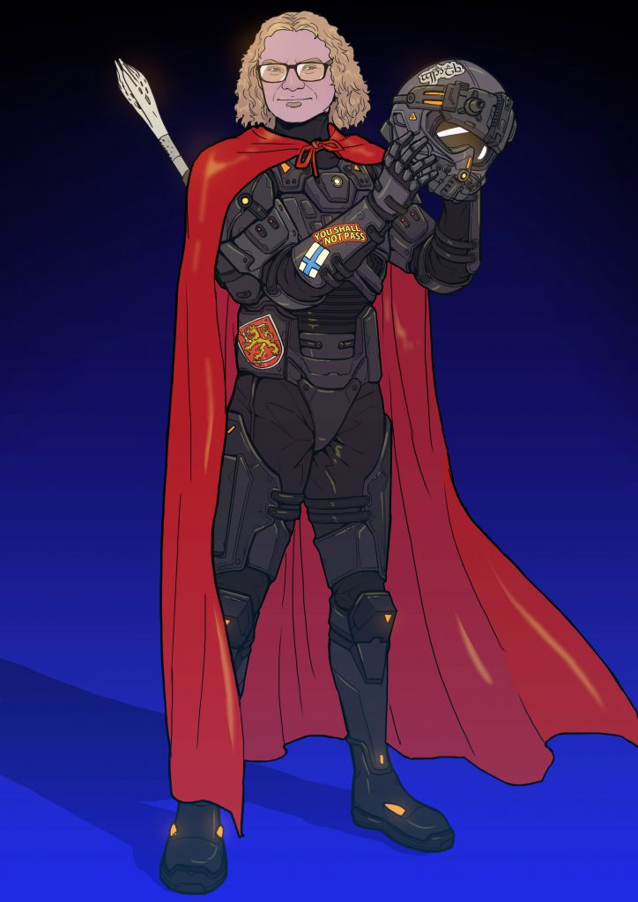

_"When you find the things I find, they really matter. They affect everybody’s security.”_

**Currently streaming**: The Expanse and Lost in Space on Netflix

**Currently listening to**: Amorphis, Architects, and Killswitch Engage

**Currently running**: 130 kilometers (or ~80 miles) a month

**Currently playing**: Floorball (a type of floor hockey with five players and a goalkeeper)

**Currently proud of**: The volume of Microsoft MVPs hailing from Finland

It’s negative 20 centigrade and dark outside in Tampere, Finland. Seemingly unphased by the frigid air, Dr. Nestori Syynimaa kicks off his daily routine with a morning run. Contrary to what you might think, he isn’t listening to security podcasts or technical audiobooks, but rather detaching from work to gear up for his day ahead. This time is just for him. His local radio station and heavy metal music get him home through his front door as his extremities begin to thaw. With a clear head, he sits down at his battle-ready workstation. Nestori begins to work uncovering new ways to understand the relationship between identity systems and the cloud, in aid of making the internet more robust and secure.

Before becoming a security researcher, Nestori started his career in IT. In early 2000, IT was where it was at. Desperate for computer technicians, he says companies hired anyone who knew what “I-T” was. He laughs now because in his opinion, the bar was very low. While others were spending their first paychecks on mopeds, Nestori invested in a boxed copy of Microsoft Visual C++. Without any training he taught himself how to program, quickly rising through the ranks in the IT space.

Nestori wouldn’t stop there. He went back to school to get the education he felt he should have had, prior to starting on the job. While in school, he was teaching at an IT training organization working his way up to CIO for a large telecom provider in Finland. A friend from the company told him the cloud was going to be the “next big thing” in tech and they would need a trainer. Nestori embraced the challenge and took the opportunity.

During his time as a trainer, course attendees would ask a lot about security. Forget on-premises firewalls, this was the untitled space we now know as “the cloud”. Security frameworks were nascent and so your best bet was to protect your credentials and identity systems. It was clear to Nestori identity security was what was drawing the attention of his customers and students. There was a need for expertise in this new field and so Nestori decided to step forward and of his own volition, fill the void for his clients and the industry. He did all this while maintaining his afterhours work which included building AADInternals, his Azure Active Directory toolkit, which he eventually published. And he completed his PhD!

Last December, Nestori was awarded [Microsoft MVP](https://mvp.microsoft.com/en-us/PublicProfile/5004066?fullName=Nestori%20Syynimaa) status for his work in security. He paused and realized there was a chance for him to ditch the 16-hour workdays to become a full-time researcher. This was a pivotal moment for him. Nestori’s robust skillset is one that is highly sought after. He began reaching out to see what opportunities might exist for full-time security research and was very quickly snapped up by Secureworks who recognized the immense value he could bring to their company and customers. Now, his after-hours hobby has become his full-time job!

Nestori is not in it for the money. He truly enjoys fixing things and keeping the world safe. When he identifies a vulnerability or some business logic that could be exploited, he doesn’t jump out of his chair pumping his fists. Rather, his thoughts go immediately to the potential implications for customers, should a less ethically minded hacker stumble upon the same discovery. Despite this fact, the rush of the find keeps him searching for more, never stressing about the things he cannot control. Nestori’s constant curiosities have helped him to become one of the most prolific bug bounty hunters of the 2021 calendar year.

When he reflects on the work he does, Nestori believes to be a solid researcher you must be a person who likes uncovering things with an analytical mindset. When asked how he handles failure his response, with a wink and smile is: “I don’t know what that means.” His colleagues, recognizing his unique talents at reverse-engineering communication protocols and finding the flaws in token exchanges, refer to him as “a wizard”. And just like the wizard Gandalf, Nestori continues to maintain his curiosity and technical prowess to block the proverbial Balrog, warning, “You shall not pass.”

You don’t need to risk hypothermia to follow along with Nestori. You can follow his journey on Twitter ([@DrAzureAD](https://twitter.com/drazuread)), [AADInternals](https://github.com/Gerenios/AADInternals) on GitHub, and his blog at [https://o365blog.com](https://o365blog.com/).
