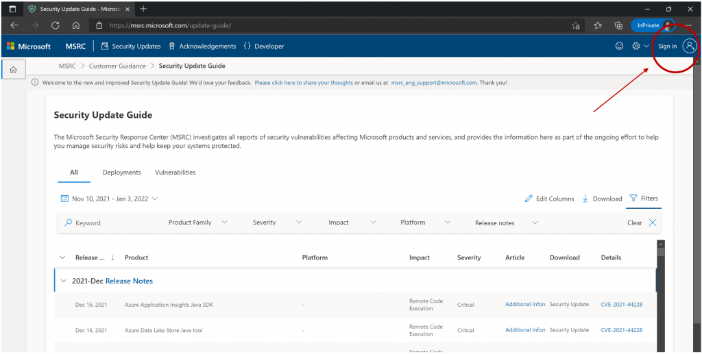
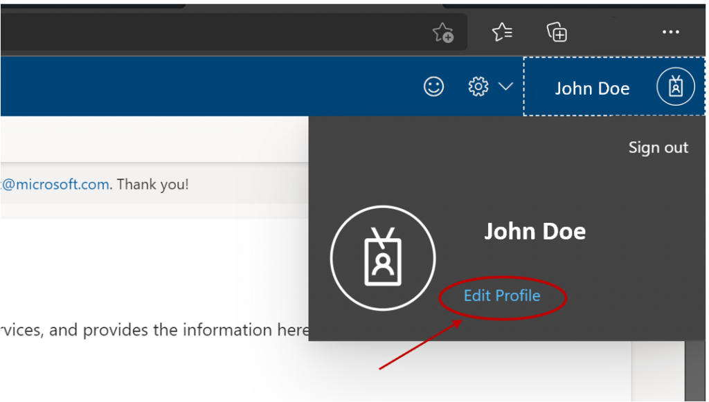
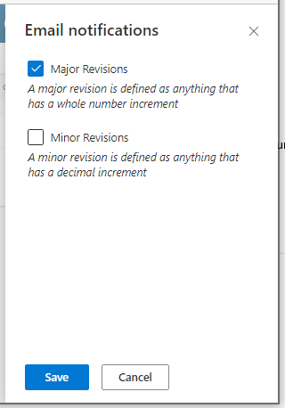

<!-- wp:separator -->

---

<!-- /wp:separator -->

<!-- wp:paragraph -->

Sharing information through the [Security Update Guide](https://msrc.microsoft.com/update-guide) is an important part of our ongoing effort to help customers manage security risks and keep systems protected. Based on your feedback we have been working to make signing up for and receiving Security Update Guide notifications easier. We are excited to share that starting today, you can sign up with any email address that you want and receive notifications at that email address. There is no longer a requirement that the email be a Live ID, and now you can manage your settings right inside the Security Update Guide itself. Notifications will be more automated and streamlined. The new system will be launched in three phases:

<!-- /wp:paragraph -->

<!-- wp:list -->

- Phase One – Create a Profile and Sign-up for the new notifications
- Phase Two – Notifications sent from new system and old system
- Phase Three – Notifications cease from old system

<!-- /wp:list -->

<!-- wp:heading {"level":3} -->

### First things first – create your Security Update Guide profile

<!-- /wp:heading -->

<!-- wp:paragraph -->

Creating a profile on the Security Update Guide will allow you to specify to which email address you wish the notifications be delivered and what types of notifications you want to receive.

<!-- /wp:paragraph -->

<!-- wp:paragraph -->

You can create a SUG Profile by clicking **Sign in** at the top right corner of the [Security Update Guide](https://msrc.microsoft.com/update-guide).

<!-- /wp:paragraph -->

<!-- wp:image {"align":"center","id":13782,"sizeSlug":"large","linkDestination":"none"} -->

<!-- /wp:image -->

<!-- wp:paragraph -->

You can use any email and password here. We no longer require a Live ID to receive notifications! If this is your first time signing in, a validation email will be sent with steps to verify that you have entered a valid email address.

<!-- /wp:paragraph -->

<!-- wp:heading {"level":3} -->

### Sign up for the new notifications

<!-- /wp:heading -->

<!-- wp:paragraph -->

Notifications are sent when information is added or changed in the Security Update Guide. You can sign up for the new notification system today so that when we reach Phase Two, you will receive them at the email address of your choice. Just like existing notification system, there are two types of notifications - major updates and all updates. Major updates include new CVEs that are published and existing CVEs that are republished due to a change in software updates in the Security Updates table. Major updates, or Revisions, are marked with an incremented initial number such as **1.0, 2.0**, etc. Minor updates are changes to FAQs or Acknowledgements or other informational type revisions. These types of revisions are marked with an incremented final number such as **1.1, 3.2**, etc.

<!-- /wp:paragraph -->

<!-- wp:list -->

- To sign up for notifications, click the **Profile** and sign in. You will know you have successfully signed in when your Profile name is displayed.
- To opt into notifications, click on your Profile name and then select **Edit Profile** in the pop-up menu.

<!-- /wp:list -->

<!-- wp:image {"align":"center","id":13783,"sizeSlug":"large","linkDestination":"none"} -->

<!-- /wp:image -->

<!-- wp:list -->

- Click **Edit **on the Email notifications column to select the type of notifications you would like to receive.
- In the panel that is displayed on the right-hand side, select the types of notifications you want to receive. If you select **Major Revisions**, you will receive only notifications for major updates. If you select **Minor Revisions**, you will receive all notifications for both major and minor updates. Click **Save** when you're finished.

<!-- /wp:list -->

<!-- wp:image {"align":"center","id":13784,"sizeSlug":"large","linkDestination":"none"} -->

<!-- /wp:image -->

<!-- wp:heading {"level":3} -->

### Timing of the Phases

<!-- /wp:heading -->

<!-- wp:paragraph -->

Phase One, the Sign-Up phase is already underway. Feel free to create your profile and sign up for notifications. Phase Two will begin next month. If you have signed up, you will start receiving notifications from the new system to the email of your choice. If you are currently getting notifications to a Live ID those emails will continue to be sent as well. When we reach a critical mass of people receiving the new notifications, we will discontinue sending from the old system.

<!-- /wp:paragraph -->

<!-- wp:paragraph -->

As always, we encourage and appreciate your feedback on the Security Update Guide.

<!-- /wp:paragraph -->

<!-- wp:heading {"level":3} -->

### Questions or Feedback

<!-- /wp:heading -->

<!-- wp:paragraph -->

To submit questions or feedback, please send an email to msrc_eng_support@microsoft.com or submit feedback through our feedback form.

<!-- /wp:paragraph -->

<!-- wp:paragraph -->

\_Lisa Olson, Senior Security Program Manager, \_Microsoft Security Response Center\_\_

<!-- /wp:paragraph -->
