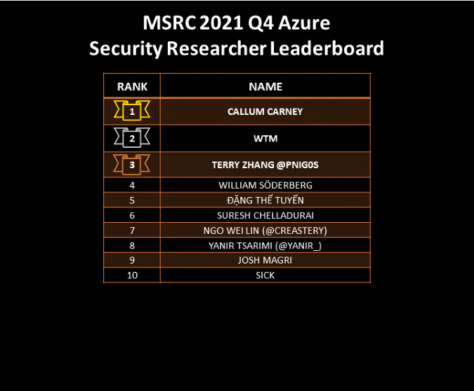

Congratulations to all the researchers recognized in this quarter’s [Microsoft Researcher Recognition Program](https://www.microsoft.com/en-us/msrc/researcher-recognition-program) leaderboard! Thank you to everyone for your hard work and continued partnership to secure customers.

The top three researchers of the 2021 Q4 Security Researcher Leaderboard are: **rezer0dai (780 points)**, **Callum Carney (750 points)**, and **wtm (615 points)**!

![RANK, NAME, TOTAL POINTS; 1, REZER0DAI, 780; 2, CALLUM CARNEY, 750; 3, WTM, 615; 4, MOHAMMAD DEILAMY(MDM), 520; 5, ZHINIANG PENG (@EDWARDZPENG), 435; 6, ĐẶNG THẾ TUYẾN, 405; 7, TERRY ZHANG @PNIG0S, 340; 8, DAVID ERCEG, 320; 9, JARVIS_1OOP, 300; 9, WILLIAM SÖDERBERG, 300; 11, RAMZES, 285; 12, LIUBENJIN, 255; 12, SURESH CHELLADURAI, 255; 14, SINA KHEIRKHAH (@SIN_KHE), 245; 15, DHANESH KIZHAKKINAN, 240; 16, BEE13OY, 200; 17, HÀ ANH HOÀNG, 190; 18, AZUREYANG, 180; 18, NGO WEI LIN (@CREASTERY) , 180; 18, ZESEN YE, 180; 21, RYELV, 165; 21, YANIR TSARIMI (@YANIR_), 165; 23, QUAN JIN(@JQ0904), 160; 24, XUEFENG LI, 150; 25, ADRIAN IVASCU, 145; 26, ANONYMOUS, 135; 26, MEAREG HUNEGNAW, 135; 28, ANONYMOUS, 125; 29, ANONYMOUS, 120; 29, BUGHUNTER011 (@CYBERKUNLUN), 120; 29, CHEN COHEN, 120; 29, JOSH MAGRI, 120; 29, SHILONGAN, 120; 29, SICK, 120; 35, ANONYMOUS, 90; 35, BATRAM, 90; 35, DR NESTORI SYYNIMAA (@DRAZUREAD), 90; 35, KRISHNA CHAITANYA GOPISETTY, 90; 39, ANONYMOUS, 85; 39, YUHAO WENG, 85; 41, BEN CHINOY, 82.5; 42, ANONYMOUS, 80; 42, FABIAN SCHMIDT, 80; 42, JAANUS KÄÄP, 80; 45, FELIX B, 77.5; 46, HYUNGSEOK HAN, 75; 46, JORDI SASTRE, 75; 46, RAIDH ĤERE, 75; 49, GUNDA SHIVAKUMAR, 70; 49, ISMAIL, 70.](./img/wp-content-uploads-2022-01-2021-Q4-Leaderboard-1-50.png)

![RANK, NAME, TOTAL POINTS; 51, AYANSH SINHA (CYBERDAD), 65; 51, KEQI HU, 65; 51, RODRIGO RAMOS DA SILVEIRA, 65; 51, ZIMING ZHANG, 65; 55, ANONYMOUS, 60; 55, ANONYMOUS, 60; 55, ANONYMOUS, 60; 55, ANONYMOUS, 60; 55, ANONYMOUS, 60; 55, ANONYMOUS, 60; 55, ANONYMOUS, 60; 55, ANONYMOUS, 60; 55, ANONYMOUS, 60; 55, ANONYMOUS, 60; 55, DIMITRIOS TSAGKARAKIS, 60; 55, DYLAN RYAN-ZILAVY, 60; 55, HP, 60; 55, K0SHL, 60; 55, KARL FOSAAEN, 60; 55, SOORAJ K S (@SOORAJKS), 60; 55, SUMON (@BUGXPLOIT), 60; 55, WANGJUNJIE ZHANG (@HILLSTONE_LAB), 60; 55, WENYUE LI (@HILLSTONE_LAB), 60; 55, YISHENG HE (@HILLSTONE_LAB), 60; 55, ZACH, 60; 76, KIRA, 55; 77, SZYMON HEIDRICH, 50; 78, ABDELHAMID NACERI, 45; 78, AIDIL ARIEF, 45; 78, ANONYMOUS, 45; 78, ANONYMOUS, 45; 78, ANONYMOUS, 45; 78, ANONYMOUS, 45; 78, ANONYMOUS, 45; 78, ANONYMOUS, 45; 78, SAKTHIPRIYAN, 45; 78, SHIR, 45; 78, YAOKANG TAN, 45; 89, ANONYMOUS, 40; 89, ANONYMOUS, 40; 89, ANONYMOUS, 40; 89, ANONYMOUS, 40; 89, ANONYMOUS, 40; 89, ANONYMOUS, 40; 89, CHINMOY MUKHERJEE, 40; 89, JAEHENG YOON(@ONNOVEATH), 40; 89, LÊ NGỌC LINH, 40; 89, LEWIS(@LEWISLEE53), 40; 89, NKATIYARLIVE, 40; 89, SHANGJI PANG, 40.](./img/wp-content-uploads-2022-01-2021-Q4-Leaderboard-51-100.png)

![RANK, NAME, TOTAL POINTS; 89, SIGIT SETIAWAN, 40; 89, T0, 40; 89, UNCODABLE, 40; 89, VER(@VER0759), 40; 89, WAYNE LOW, 40; 89, ZAHRA IZADI AMIRI, 40; 107, ANONYMOUS, 37.5; 108, MENGCHEN CAO (@YHZX_2013), 35; 108, WALIED ASSAR, 35; 110, ANONYMOUS, 30; 110, ANONYMOUS, 30; 110, ANONYMOUS, 30; 110, ANONYMOUS, 30; 110, ANONYMOUS, 30; 110, ANONYMOUS, 30; 110, ANONYMOUS, 30; 110, ANONYMOUS, 30; 110, ANONYMOUS, 30; 110, AQIB SHAH, 30; 110, ASTROUNDER, 30; 110, BRANDON CHONG WEE KIAT, 30; 110, BRUNO BELVEDERE, 30; 110, HARISH, 30; 110, HARRYSUZ, 30; 110, HECTOR PERALTA (P3RR0), 30; 110, MILAN KYSELICA, 30; 110, NITRAX, 30; 110, PONTUS PERSSON, 30; 110, Q5CA, 30; 110, RAFAEL R MACHADO, 30; 110, S1R1US, 30; 110, YOUSSEF ABYAA, 30; 110, YYJB, 30; 134, DILIPKUMAR, 22.5; 134, IMAN GURUNG, 22.5.](./img/wp-content-uploads-2022-01-2021-Q4-Leaderboard-101-135.png)

In addition to our regular leaderboard, we are introducing new, research area-specific leaderboards to recognize researchers who have submitted high impact vulnerabilities in particular product areas.

Congratulations to the top Azure researchers this quarter: **Callum Carney**, **wtm**, and **Terry Zhang @pnig0s**!

Congratulations to the top Office researchers this quarter: **ramzes**, **Đặng Thế Tuyến**, and **ShiLongan**!

Congratulations to the top Windows researchers this quarter: **rezer0dai**, **Zhiniang Peng (@edwardzpeng)**, and **Jarvis_1oop**!

This 2021 Q4 leaderboard reflects point values for cases that are:

- Submitted and assessed by the MSRC team between October 1, 2021, and December 31, 2021
- Submitted between July 1, 2021, and September 30, 2021 ([last program period](https://msrc-blog.microsoft.com/2021/10/14/congratulations-to-the-top-msrc-2021-q3-security-researchers/)), but assessed after October 1, 2021

Past MSRC Quarterly Leaderboards:

- 2021-10: [MSRC 2021 Q3 Security Researcher Leaderboard](https://msrc-blog.microsoft.com/2021/10/14/congratulations-to-the-top-msrc-2021-q3-security-researchers/)
- 2021-07: [MSRC 2021 Q2 Security Researcher Leaderboard](https://msrc-blog.microsoft.com/2021/07/15/announcing-the-top-msrc-2021-q2-security-researchers-congratulations/)
- 2021-04: [MSRC 2021 Q1 Security Researcher Leaderboard](https://msrc-blog.microsoft.com/2021/04/15/congratulating-our-top-msrc-2021-q1-security-researchers/)
- 2021-01: [MSRC 2020 Q4 Security Researcher Leaderboard](https://msrc-blog.microsoft.com/2021/01/14/top-msrc-2020-q4-security-researchers--congratulations/)

Keep up the awesome work and we look forward to seeing you next quarter!

_Lynn Miyashita, MSRC_
